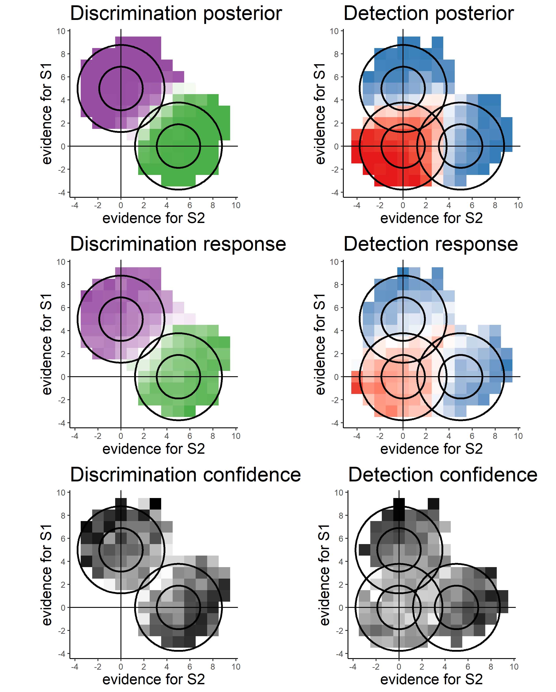

# Evidence weighting in confidence judgments for detection and discrimination
### Matan Mazor, Lucie Charles, Roni Maimon-Mor & Stephen M. Fleming

## Data
Raw data from all three experiments is available on the project's OSF repository: [https://osf.io/7a4fm/](https://osf.io/7a4fm/)

## Analysis Scripts
Analysis scripts (in R) are available in the ['docs'](https://github.com/matanmazor/reverseCorrelation/blob/main/docs/reverseCorrelationPaper.Rmd) subdirectory. 

## Experiment demos

You can try Experiment 2 by clicking [here](https://matanmazor.github.io/reverseCorrelation/experiments/demos/Experiment2/)

You can try Experiment 3 by clicking [here](https://matanmazor.github.io/reverseCorrelation/experiments/demos/Experiment3/)

