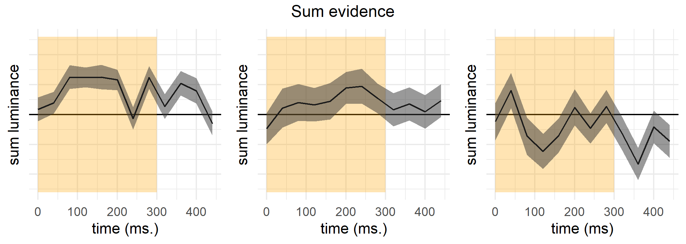
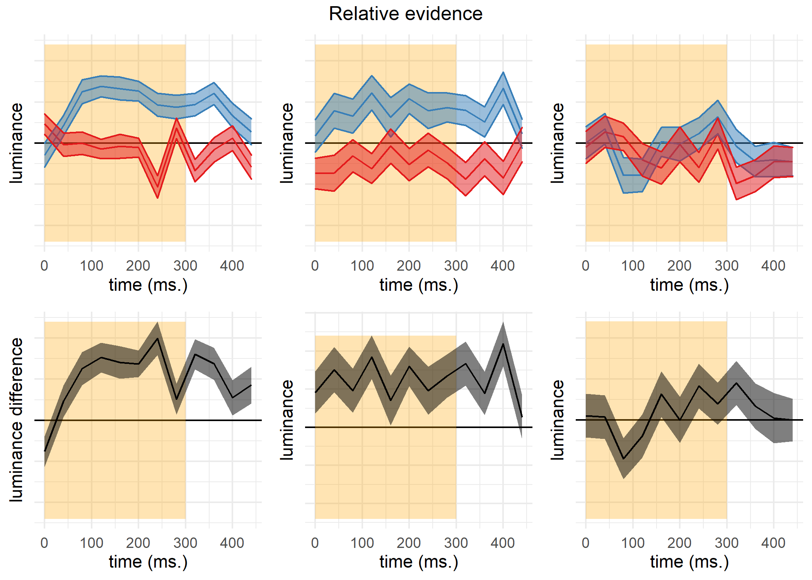

```{r appendix-setup, include=FALSE} 
knitr::opts_chunk$set(warning = FALSE, message = FALSE) 
```

\appendix


# Additional analyses: Exp. 1

## Response time, confidence, and metacognitive sensitivity differences {#appRC:asymmetries1}

In detection, participants were generally slower to deliver 'no' responses compared to 'yes' responses (median difference: `r e1$detection_stats$contrast_responses%>%pull(RT)%>%median()%>%abs()%>%printnum()` ms, `r e1$detection_stats$contrast_responses%>%pull(logRT)%>%t.test()%>%apa_print()%>%'$'(statistic)` for a t-test on the log-transformed response times). No significant difference in response times was observed for the discrimination task (median difference: `r e1$discrimination_stats$contrast_responses%>%pull(RT)%>%mean()%>%abs()%>%printnum()` ms, `r e1$discrimination_stats$contrast_responses%>%pull(logRT)%>%t.test()%>%apa_print()%>%'$'(statistic)`).

Confidence in detection was generally higher than in discrimination (`r t.test(e1$task_stats%>%filter(detection==1)%>%pull(confidence), e1$task_stats%>%filter(detection==0)%>%pull(confidence), paired=TRUE)%>%apa_print()%>%'$'(full_result)`). Within detection, confidence in 'yes' responses was generally higher than confidence in 'no' responses (`r e1$detection_stats$contrast_responses$confidence%>%t.test()%>%apa_print()%>%'$'(full_result)`). No difference in average confidence levels was found between the two discrimination responses (`r e1$discrimination_stats$contrast_responses$confidence%>%t.test()%>%apa_print()%>%'$'(full_result)`).

Following @meuwese2014subjective, we extracted response-conditional type-2 ROC (rc-ROC) curves for the two tasks. Unlike traditional type-I ROC curves that provide a summary of subjects' ability to distinguish between two external world states, type 2 ROC curves represent their ability to track the accuracy of one's own responses. The area under the response-conditional ROC curve (auROC2) is a measure of metacognitive sensitivity, with higher values corresponding to more accurate metacognitive monitoring. 

Mean response-conditional ROC curves for the two responses in the discrimination task closely matched (`r e1$AUC%>%filter(detection==0)%>%pull(metacognitive_asymmetry)%>%t.test()%>%apa_print()%>%'$'(full_result)`), indicating that on average, participants had similar metacognitive insight into the accuracy of the two discrimination responses. In contrast, auROC2 estimates for ‘yes’ responses were significantly higher than for 'no' responses, indicating a metacognitive asymmetry between the two detection responses (group difference in auROC2: `r e1$AUC%>%filter(detection==1)%>%pull(metacognitive_asymmetry)%>%t.test()%>%apa_print()%>%'$'(full_result)`). 

## zROC curves

A difference in response-conditional auROC estimates can emerge from higher-order differences in metacognitive monitoring for the two responses and/or from lower-level differences in the perceptual representations of signal and noise [such as in first-order signal detection models where the signal variance is higher; @maniscalco2014signal]. Importantly, a difference can also emerge in first-order signal-detection models that assume equal variance, in the presence of a response bias or insufficient variance in confidence ratings [@mazor2021stage]. To test if the metacognitive asymmetry between 'yes' and 'no' responses could be accounted for by an equal-variance SDT model, we simulated data that was identical to our empirical data except for confidence ratings in correct responses, which were chosen to perfectly agree with the assumptions of an equal-variance SDT model given participants' decision criterion, sensitivity, and their confidence in incorrect responses. We then compared subject-wise differences between the response-conditional auROCs with the differences in this simulated dataset [@mazor2021stage]. The difference in differences was significant, indicating that the observed metacognitive asymmetry could not be accounted for by a first-order equal-variance SDT model (`r e1$AUC%>%filter(detection==1)%>%pull(metacognitive_asymmetry_control)%>%t.test()%>%apa_print()%>%'$'(full_result)`).

An asymmetry in metacognitive sensitivity for 'yes' and 'no' responses is also predicted by unequal-variance Signal Detection Theory (*uvSDT*). Specifically, if the signal distribution is wider than the noise distribution, the overlap between the distributions will be more pronounced for misses and correct rejections than for hits and false alarms, making metacognitive judgments for 'no' responses objectively more difficult. Unequal-variance SDT predicts that plotting the type-1 ROC curve in z-space (taking the inverse cumulative distribution of the confidence rating histogram) will result in a straight line with a slope equal to $\frac{\sigma_{noise}}{\sigma_{signal}}$. Because the variance of the signal distribution is higher than that of the noise distribution, zROC slopes are typically shallow, with slopes below 1.

We used linear regression to estimate the slope of the zROC curve. To control for underestimation of the slope due to regression to the mean [@wickens2002elementary, 56], we fitted two regression models for the task data of each participant: one predicting $Z(h)$ based on $Z(f)$ (slope $s_1$) and one predicting $Z(f)$ based on $Z(h)$ (slope $s_2$). We then used $\frac{log(s_1)-log(s2)}{2}$ as a bias-free measure of the zROC slope. In equal-variance SDT, this value is predicted to be 0, corresponding to a slope of 1.

Indeed, slopes were generally shallower than 1 for detection zROC curves (as predicted by an unequal-variance SDT model; `r  e1$detection_zROC%>%pull(logslope)%>%t.test%>%apa_print()%>%'$'(full_result)`), and not significantly different from 1 for discrimination zROC curves (as predicted by equal-variance SDT; `r e1$discrimination_zROC%>%pull(logslope)%>%t.test%>%apa_print()%>%'$'(full_result)`).

These results support a difference in the variance-structure of the representation of signal and noise, such that the representation of signal is more variable across trials. However, it is still possible that some of the metacognitive asymmetry in detection (the difference in auROC between 'yes' and 'no' responses) reflects additional higher-order processes that cannot be captured by a first-order signal-detection model. If this was the case, zROC curves for detection should not only be shallower, but also less linear than for discrimination, reflecting poorer fit of the signal-detection model to detection. To test if this was the case, we compared the subject-wise $R^2$ values for the detection and discrimination zROC regression lines. $R^2$ values reflect the goodness of fit of a linear model to the data. These values were similar for the two tasks (`r t.test(e1$detection_zROC$r.squared,e1$discrimination_zROC$r.squared, paired=TRUE)%>%apa_print%>%'$'(full_result)`), suggesting that a first-order SDT model accounted equally well for the data from both tasks.

## Confidence-RT correlations

```{r RC-conf-RT, echo=FALSE, message=FALSE, include=FALSE}

e1$RT_conf_cor <- e1$trial_df %>%
  group_by(subj_id,detection,response) %>%
  summarise(cor=cor(RT,confidence,method='spearman'))

```


Following our pre-registered analysis plan, we extracted a Spearman correlation coefficient between confidence and response times separately for the two tasks and four responses. We find a negative correlation in all four cases (discrimination responses: `r e1$RT_conf_cor%>%filter(detection==0&response==0)%>%pull(cor)%>%mean()%>%printnum()` and `r e1$RT_conf_cor%>%filter(detection==0&response==1)%>%pull(cor)%>%mean()%>%printnum()`, detection 'yes': `r e1$RT_conf_cor%>%filter(detection==1&response==1)%>%pull(cor)%>%mean()%>%printnum()`, detection 'no': `r e1$RT_conf_cor%>%filter(detection==1&response==0)%>%pull(cor)%>%mean()%>%printnum()`). As hypothesized, this negative correlation was significantly attenuated in detection 'no' responses compared to detection 'yes' responses (tested with a one-tailed t-test: `r apa_print(t.test(e1$RT_conf_cor%>%filter(detection==1&response==1)%>%pull(cor),e1$RT_conf_cor%>%filter(detection==1&response==0)%>%pull(cor),paired=1,alternative='less'))$statistic`). The difference in correlation strength between detection 'no' responses and discrimination responses was only marginally significant (`r apa_print(t.test(e1$RT_conf_cor%>%filter(detection==0)%>%group_by(subj_id)%>%summarise(cor=mean(cor))%>%pull(cor),e1$RT_conf_cor%>%filter(detection==1&response==0)%>%pull(cor),paired=1,alternative='less'))$statistic`).

## Global metacognitive estimates {#global}

```{r RC-global, echo=FALSE, message=FALSE, include=FALSE}

e1$global_df <- read_csv('../experiments/Experiment1/data/global_estimates.csv') %>%
  mutate(estimates = as.numeric(estimates))%>%
  filter(!is.na(estimates));

e1$global_df_per_subj <- e1$global_df %>%
  group_by(subj_id,detection) %>%
  summarise(estimates = mean(estimates)/100) %>%
  spread(detection,estimates,sep='_') %>%
  mutate(diff=detection_0-detection_1);

e1$global_df_per_subj <- e1$global_df %>%
  filter(block_number>3)%>% 
  group_by(subj_id,detection) %>%
  summarise(estimates = mean(estimates)/100) %>%
  spread(detection,estimates,sep='_') %>%
  mutate(diff=detection_0-detection_1);

```

At the end of each 100-trial block, participants estimated their block-wise accuracy. Mean estimated accuracy was `r e1$global_df_per_subj%>%pull(detection_0)%>%mean()%>%printnum()` for discrimination and `r e1$global_df_per_subj%>%pull(detection_1)%>%mean()%>%printnum()`. These figures are close to true correct response rates:  `r e1$task_stats_unfiltered%>%filter(detection==0)%>%pull(acc)%>%mean()%>%printnum()` in discrimination and `r e1$task_stats_unfiltered%>%filter(detection==1)%>%pull(acc)%>%mean()%>%printnum()` in detection. 

A difference of `r e1$global_df_per_subj%>%pull(diff)%>%mean()%>%printnum()` between mean accuracy estimates for discrimination and detection was not significant at the group level (`r apa_print(e1$global_df_per_subj%>%pull(diff)%>%t.test())$statistic`).


# Additional analyses: Exp. 2

## Response time, confidence, and metacognitive sensitivity differences {#appRC:asymmetries2}

Participants were slower to deliver 'no' responses compared to 'yes' responses (median difference: `r e2$detection_stats$contrast_responses%>%pull(RT)%>%median()%>%abs()%>%printnum()` ms, `r e2$detection_stats$contrast_responses%>%pull(logRT)%>%t.test()%>%apa_print()%>%'$'(statistic)` for a t-test on the log-transformed response times). No significant difference in response times was observed for the discrimination task (median difference: `r e2$discrimination_stats$contrast_responses%>%pull(RT)%>%mean()%>%abs()%>%printnum()` ms, `r e2$discrimination_stats$contrast_responses%>%pull(logRT)%>%t.test()%>%apa_print()%>%'$'(statistic)`).

Confidence in detection was generally lower than in discrimination, consistent with lower accuracy in this task (`r t.test(e2$task_stats%>%filter(detection==1)%>%pull(confidence), e2$task_stats%>%filter(detection==0)%>%pull(confidence), paired=TRUE)%>%apa_print()%>%'$'(full_result)`). Within detection, confidence in 'yes' responses was generally higher than confidence in 'no' responses (`r e2$detection_stats$contrast_responses$confidence%>%t.test()%>%apa_print()%>%'$'(full_result)`). No difference in average confidence levels was observed between the two discrimination responses (`r e2$discrimination_stats$contrast_responses$confidence%>%t.test()%>%apa_print()%>%'$'(full_result)`).

In contrast to the results of Exp. 1, auROC2 values for 'yes' and 'no' responses were not significantly different (group difference in area under the response-conditional curve, auROC2: `r e2$AUC%>%filter(detection==1)%>%pull(metacognitive_asymmetry)%>%t.test()%>%apa_print()%>%'$'(full_result)`), first and second rows). auROC2s were also not significantly different when controlling for type-1 response and confidence biases (`r e2$AUC%>%filter(detection==1)%>%pull(metacognitive_asymmetry_control)%>%t.test()%>%apa_print()%>%'$'(full_result)`). 

## zROC curves
Unlike in Experiment 1, detection zROC slopes were not significantly different from 1  (`r e2$detection_zROC%>%pull(logslope)%>%t.test%>%apa_print()%>%'$'(full_result)`), whereas discrimination zROC slopes were significantly shallower than 1 (`r e2$discrimination_zROC%>%pull(logslope)%>%t.test%>%apa_print()%>%'$'(full_result)`). This unexpected result indicates equal variance for the signal and noise distributions, but higher variance for targets presented on the right than on the left. Furthermore, a first-order SDT model fitted the data significantly better for the detection task than for the discrimination (difference in $R^2$ for the two tasks: `r e2$zROC_contast_rsquare%>%pull(fit_diff)%>%t.test()%>%apa_print()%>%'$'(full_result)`). 


# Additional analyses: Exp. 3

## Response time, confidence, and metacognitive sensitivity differences {#appRC:asymmetries3}

Participants were slower to deliver 'no' responses compared to 'yes' responses (median difference: `r e3$detection_stats$contrast_responses%>%pull(RT)%>%median()%>%abs()%>%printnum()` ms, `r e3$detection_stats$contrast_responses%>%pull(logRT)%>%t.test()%>%apa_print()%>%'$'(statistic)` for a t-test on the log-transformed response times). No significant difference in response times was observed for the discrimination task (median difference: `r e3$discrimination_stats$contrast_responses%>%pull(RT)%>%mean()%>%abs()%>%printnum()` ms, `r e3$discrimination_stats$contrast_responses%>%pull(logRT)%>%t.test()%>%apa_print()%>%'$'(statistic)`).

Confidence in detection was generally lower than in discrimination, consistent with lower accuracy in this task (`r t.test(e3$task_stats%>%filter(detection==1)%>%pull(confidence), e3$task_stats%>%filter(detection==0)%>%pull(confidence), paired=TRUE)%>%apa_print()%>%'$'(full_result)`). Within detection, confidence in 'yes' responses was generally higher than confidence in 'no' responses (`r e3$detection_stats$contrast_responses$confidence%>%t.test()%>%apa_print()%>%'$'(full_result)`). No difference in average confidence levels was observed between the two discrimination responses (`r e3$discrimination_stats$contrast_responses$confidence%>%t.test()%>%apa_print()%>%'$'(full_result)`).


## Reverse correlation analysis of standard trials only {#appRC:standardonly}

In the following, we repeat the reverse correlation analysis reported for Exp. 3, but here restricted to the subset of "standard" trials where luminance was not increased by 2/255.

### Discrimination decisions {-}

```{r RC-exp3-no-boost-discrimination, echo=FALSE, message=FALSE}

e3$no_boost$df <- e3$df %>%
  filter(brightness_boost==0);

e3$no_boost$demeaned_df <- e3$no_boost$df %>%
  mutate(luminance=ifelse(signal==1 & side==bright_side,
                          luminance-133,
                          luminance-128),
         time=(timepoint-1)*40);

e3$no_boost$discRCdf <- e3$no_boost$demeaned_df %>%
  filter(detection==0) %>%
  mutate(obj_side=factor(ifelse(side==bright_side,
                                'true',
                                'opposite'),levels=c('true','opposite')),
         side = factor(ifelse(response==side,
                              'chosen',
                              'unchosen'),
                       levels=c('chosen','unchosen'))) %>%
  dplyr::select(subj_id,timepoint,obj_side,side,eccentricity,confidence, trial,luminance, time, correct) %>%
  group_by(subj_id) %>%
  mutate(median_confidence=median(confidence)) %>%
  ungroup() %>%
  mutate(
    binaryconf = ifelse(confidence>=median_confidence, 1, 0),
  );


e3$no_boost$discrimination_decision_kernel <- e3$no_boost$discRCdf %>%
  group_by (subj_id,side,time,eccentricity) %>%
  summarise(luminance=mean(luminance)) 

e3$no_boost$discrimination_objective_decision_kernel <- e3$no_boost$discRCdf %>%
  drop_na()%>%
  group_by (subj_id,obj_side,time,eccentricity,correct) %>%
  summarise(luminance=mean(luminance)) %>%
  group_by(subj_id,obj_side,time,eccentricity) %>%
  summarise(luminance=luminance[correct==1]-luminance[correct==0])

e3$no_boost$discrimination_confidence_kernel <- e3$no_boost$discRCdf %>%
  group_by (subj_id,side,time,eccentricity,binaryconf) %>%
  summarise(luminance=mean(luminance)) %>%
  group_by (subj_id,side,time,eccentricity) %>%
  summarise(diff = luminance[binaryconf==1]-luminance[binaryconf==0])

e3$no_boost$RC = list();

e3$no_boost$RC$decision300 <- e3$no_boost$discrimination_decision_kernel %>%
  filter(time<300)%>%
  group_by(subj_id) %>%
  summarise(diff=mean(luminance[side=='chosen'])-mean(luminance[side=='unchosen'])); 

e3$no_boost$RC$accuracy300 <- e3$no_boost$discrimination_objective_decision_kernel %>%
  filter(time<300)%>%
  group_by(subj_id) %>%
  summarise(diff=mean(luminance[obj_side=='true'])-mean(luminance[obj_side=='opposite'])); 

e3$no_boost$RC$decisionPEB300 <- e3$no_boost$discrimination_objective_decision_kernel %>%
  filter(time<300)%>%
  group_by(subj_id) %>%
  summarise(diff=mean(luminance[obj_side=='true'])+mean(luminance[obj_side=='opposite'])); 

e3$no_boost$RC$confidence300 <- e3$no_boost$discrimination_confidence_kernel %>%
  filter(time<300)%>%
  group_by(subj_id) %>%
  summarise(diff=mean(diff[side=='chosen'])-mean(diff[side=='unchosen']));

e3$no_boost$RC$PEB300 <- e3$no_boost$discrimination_confidence_kernel %>%
  filter(time<300)%>%
  group_by(subj_id) %>%
  summarise(diff=mean(diff[side=='chosen'])+mean(diff[side=='unchosen']));

```

 Discrimination decisions were sensitive to fluctuations in luminance during the first 300 milliseconds of the trial (`r e3$no_boost$RC$decision300%>%pull(diff)%>%t.test()%>%apa_print()%>%'$'(statistic)`). We found no evidence for a positive evidence bias in discrimination decisions, even when grouping evidence based on the location of the true signal rather than subjects' decisions (`r e3$no_boost$RC$decisionPEB300%>%pull(diff)%>%t.test()%>%apa_print()%>%'$'(statistic)`). 


### Discrimination confidence {-}

Luminance within the first 300 milliseconds had a significant effect on confidence ratings (`r e3$no_boost$RC$confidence300%>%pull(diff)%>%t.test()%>%apa_print()%>%'$'(statistic)`; see Fig. \@ref(fig:RC-exp3-no-boost-discrimination-RC), right panels). A positive evidence bias in discrimination confidence was not significant in this sample (`r e3$no_boost$RC$PEB300%>%pull(diff)%>%t.test()%>%apa_print()%>%'$'(statistic)`). 

(ref:exp3-no-boost-discrimination-RC) Decision and confidence discrimination kernels, Experiment 3, standard trials only.

```{r RC-exp3-no-boost-discrimination-RC, echo=FALSE, message=FALSE, warning=FALSE, fig.cap="(ref:exp3-no-boost-discrimination-RC)", fig.scap="Decision kernels in discrimination, Exp. 3"}
  
p1 <- ggplot(e3$no_boost$discrimination_decision_kernel%>%
    group_by(side,time,eccentricity) %>%
    summarise(se=se(luminance),
              luminance=mean(luminance)) %>%
      mutate(position=ifelse(side=='unchosen',
                             eccentricity,
                             5-eccentricity),
             sig=pt(-abs(luminance/se),101)<0.05/48,
             side=factor(side,levels=c('unchosen','chosen'))),
    aes(x=position,y=time,fill=luminance)) +
  geom_tile(size=1) +
  geom_tile(aes(color=sig),alpha=0,size=1,show.legend = FALSE)+
  scale_y_reverse() +
  scale_fill_gradient2(low='#984ea3',mid='white',high='#4daf4a', midpoint=0)+
scale_colour_manual(values = c("#00000000", "#000000")) +
  theme_classic()+
  theme(axis.title.x=element_blank(),
        axis.text.x=element_blank(),
        axis.ticks.x=element_blank(),
        axis.text.y=element_blank(),
        axis.ticks.y=element_blank(),
        line = element_blank()) +
  facet_wrap(~side)+
  ggtitle('Decision kernel: discrimination')

e3$no_boost$discrimination_confidence_kernel <- e3$no_boost$discRCdf %>%
  group_by (subj_id,side,time,eccentricity,binaryconf) %>%
  summarise(luminance=mean(luminance)) %>%
  group_by (subj_id,side,time,eccentricity) %>%
  summarise(diff = luminance[binaryconf==1]-luminance[binaryconf==0])

p2 <- ggplot(e3$no_boost$discrimination_confidence_kernel%>%
               group_by(side,time,eccentricity) %>%
               summarise(se=se(diff),
                         luminance=mean(diff)) %>%
               mutate(position=ifelse(side=='unchosen',
                                      eccentricity,
                                      5-eccentricity),
                      sig=pt(-abs(luminance/se),101)<0.05/48,
                      side=factor(side,levels=c('unchosen','chosen'))),
             aes(x=position,y=time,fill=luminance)) +
  geom_tile(size=1) +
  geom_tile(aes(color=sig),alpha=0,size=1,show.legend = FALSE)+
  scale_y_reverse() +
  scale_fill_gradient2(low='#984ea3',mid='white',high='#4daf4a', midpoint=0)+
  scale_colour_manual(values = c("#00000000", "#000000")) +
  theme_classic()+
  theme(axis.title.x=element_blank(),
        axis.text.x=element_blank(),
        axis.ticks.x=element_blank(),
        axis.text.y=element_blank(),
        axis.ticks.y=element_blank(),
        line = element_blank()) +
  facet_wrap(~side)+
  ggtitle('Confidence kernel: discrimination');

p3 <- ggplot(e3$no_boost$discrimination_decision_kernel%>%
               group_by(side,time, subj_id) %>%
               summarise(luminance=mean(luminance)) %>%
               group_by(side,time)%>%
               summarise(se=se(luminance),
                         luminance=mean(luminance)),aes(x=time,y=luminance,color=side)) +
  geom_hline(yintercept=0)  +
  annotate(geom = "rect", xmin=0, xmax=300, ymin=-0.5,ymax=0.5, 
           color="transparent", fill="orange", alpha=0.3) +
  geom_line() +
  geom_ribbon(aes(ymin = luminance-se, ymax = luminance+se, fill=side),alpha=0.5) +
  scale_color_manual(values=discrimination_colors)+
  scale_fill_manual(values=discrimination_colors) + 
  theme_minimal()+theme(
    axis.text.y=element_blank(),
    axis.ticks.y=element_blank()) +
  labs(y='luminance', 
       x='time (ms.)')+
  theme(legend.position = 'none');

p4 <- ggplot(e3$no_boost$discrimination_confidence_kernel%>%
               group_by(side,time, subj_id) %>%
               summarise(luminance=mean(diff)) %>%
               group_by(side,time)%>%
               summarise(se=se(luminance),
                         luminance=mean(luminance)),aes(x=time,y=luminance,color=side)) +
  geom_hline(yintercept=0)  +
  annotate(geom = "rect", xmin=0, xmax=300, ymin=-0.8,ymax=0.8, 
           color="transparent", fill="orange", alpha=0.3) +
  geom_line() +
  geom_ribbon(aes(ymin = luminance-se, ymax = luminance+se, fill=side),alpha=0.5) +
  scale_color_manual(values=discrimination_colors)+
  scale_fill_manual(values=discrimination_colors) + 
  theme_minimal()+theme(
    axis.text.y=element_blank(),
    axis.ticks.y=element_blank()) +
  labs(y='luminance', 
       x='time (ms.)')+
  theme(legend.position = 'none')

p5 <- ggplot(e3$no_boost$discrimination_decision_kernel%>%
               group_by(time, subj_id) %>%
               summarise(luminance=mean(luminance[side=='chosen'])-mean(luminance[side=='unchosen'])) %>%
               group_by(time)%>%
               summarise(se=se(luminance),
                         luminance=mean(luminance)),aes(x=time,y=luminance)) +
  geom_hline(yintercept=0)  +
  annotate(geom = "rect", xmin=0, xmax=300, ymin=-0.8,ymax=1.5, 
           color="transparent", fill="orange", alpha=0.3) +
  geom_line() +
  geom_ribbon(aes(ymin = luminance-se, ymax = luminance+se),alpha=0.5, color='black') +
  scale_color_manual(values=discrimination_colors)+
  scale_fill_manual(values=discrimination_colors) + 
  theme_minimal()+theme(
    axis.text.y=element_blank(),
    axis.ticks.y=element_blank()) +
  labs(y='luminance difference', 
       x='time (ms.)')+
  theme(legend.position = 'none');

p6 <- ggplot(e3$no_boost$discrimination_confidence_kernel%>%
               group_by(time, subj_id) %>%
               summarise(luminance=mean(diff[side=='chosen'])-mean(diff[side=='unchosen'])) %>%
               group_by(time)%>%
               summarise(se=se(luminance),
                         luminance=mean(luminance)),aes(x=time,y=luminance)) +
  geom_hline(yintercept=0)  +
  annotate(geom = "rect", xmin=0, xmax=300, ymin=-0.8,ymax=1.5, 
           color="transparent", fill="orange", alpha=0.3) +
  geom_line() +
  geom_ribbon(aes(ymin = luminance-se, ymax = luminance+se),alpha=0.5,fill='black') +
  scale_color_manual(values=discrimination_colors)+
  scale_fill_manual(values=discrimination_colors) + 
  theme_minimal()+theme(
    axis.text.y=element_blank(),
    axis.ticks.y=element_blank()) +
  labs(y='luminance difference', 
       x='time (ms.)')+
  theme(legend.position = 'none')

# p<- grid.arrange(p3, p4, p5, p6, ncol=2, heights=c(1,1))
# ggsave('figures/RC-exp3-no-boost-discrimination-RC.png',p,width=7, height=5);


```

### Detection

```{r RC-exp3-no-boost-detection-RC, echo=FALSE, message=FALSE, warning=FALSE}


e3$no_boost$detRCdf <- e3$no_boost$demeaned_df %>%
  filter(detection==1) %>%
  group_by(subj_id,time,eccentricity,confidence, trial,response) %>%
  summarise(luminance=luminance[side==0]+luminance[side==1]) %>%
  group_by(subj_id) %>%
  mutate(median_confidence=median(confidence)) %>%
  ungroup() %>%
  mutate(
    binaryconf = ifelse(confidence>=median_confidence, 1, 0)
  );

e3$no_boost$detection_decision_kernel <- e3$no_boost$detRCdf %>%
  group_by (subj_id,response,time,eccentricity) %>%
  summarise(luminance=mean(luminance)) %>%
  group_by(subj_id,time,eccentricity) %>%
  summarise(diff=luminance[response==1]-luminance[response==0]);


e3$no_boost$detection_confidence_kernel <- e3$no_boost$detRCdf %>%
  group_by (subj_id,response,time,eccentricity, binaryconf) %>%
  summarise(luminance=mean(luminance)) %>%
  group_by(subj_id,time,eccentricity,response) %>%
  summarise(diff=luminance[binaryconf==1]-luminance[binaryconf==0]);


e3$no_boost$RC$detectionDecision300 <- e3$no_boost$detection_decision_kernel %>%
  filter(time<300) %>%
  group_by(subj_id) %>%
  summarise(diff=mean(diff)); 


e3$no_boost$RC$detectionConfidenceYes300 <- e3$no_boost$detection_confidence_kernel %>%
  filter(time<300) %>%
  filter(response==1)%>%
  group_by(subj_id) %>%
  summarise(diff=mean(diff)); 

e3$no_boost$RC$detectionConfidenceNo300 <- e3$no_boost$detection_confidence_kernel %>%
  filter(time<300) %>%
  filter(response==0)%>%
  group_by(subj_id) %>%
  summarise(diff=mean(diff));

```

Similar to Exp. 2, sum luminance had a significant effect on participants' detection responses during the first 300 milliseconds (`r e3$no_boost$RC$detectionDecision300%>%pull(diff)%>%t.test()%>%apa_print()%>%'$'(statistic)`; see Fig. \@ref(fig:RC-exp3-no-boost-detection-RC-figure), left panel). Sum luminance also had a significant positive effect on decision confidence when reporting target presence ('yes' responses; `r e3$no_boost$RC$detectionConfidenceYes300%>%pull(diff)%>%t.test()%>%apa_print()%>%'$'(statistic)`). In contrast, a negative effect on confidence when reporting target absence was not significant (`r e3$no_boost$RC$detectionConfidenceNo300%>%pull(diff)%>%t.test()%>%apa_print()%>%'$'(statistic)`;  see Fig. \@ref(fig:RC-exp3-no-boost-detection-RC-figure), middle and right panels).

(ref:exp3-no-boost-detection) Decision and confidence sum luminance detection kernels, Experiment 3, standard trials.

``` {r RC-exp3-no-boost-detection-RC-figure, echo=FALSE, message=FALSE, warning=FALSE, fig.cap="(ref:exp3-no-boost-detection)", fig.scap="Decision kernels in detection, Exp. 3"}

p1 <- ggplot(e3$no_boost$detection_decision_kernel%>%
               group_by(time,eccentricity) %>%
               summarise(se=se(diff),
                         luminance=mean(diff)) %>%
               mutate(sig=pt(-abs(luminance/se),101)<0.05/48),
             aes(x=eccentricity,y=time,fill=luminance)) +
  geom_tile(size=1) +
  geom_tile(aes(color=sig),alpha=0,size=1,show.legend = FALSE)+
  scale_y_reverse() +
  scale_fill_gradient2(low=detection_colors[2],mid='white',high=detection_colors[1], midpoint=0)+
  scale_colour_manual(values = c("#00000000", "#000000")) +
  theme_classic()+
  theme(axis.title.x=element_blank(),
        axis.text.x=element_blank(),
        axis.ticks.x=element_blank(),
        axis.text.y=element_blank(),
        axis.ticks.y=element_blank(),
        line = element_blank()) +
  ggtitle('Decision: detection');


## confidence in 'yes' responses
p2 <- ggplot(e3$no_boost$detection_confidence_kernel%>%
               filter(response==1)%>%
               group_by(time,eccentricity) %>%
               summarise(se=se(diff),
                         luminance=mean(diff)) %>%
               mutate(sig=pt(-abs(luminance/se),101)<0.05/48),
             aes(x=eccentricity,y=time,fill=luminance)) +
  geom_tile(size=1) +
  geom_tile(aes(color=sig),alpha=0,size=1,show.legend = FALSE)+
  scale_y_reverse() +
  scale_fill_gradient2(low=detection_colors[2],mid='white',high=detection_colors[1], midpoint=0)+
  scale_colour_manual(values = c("#00000000", "#000000")) +
  theme_classic()+
  theme(axis.title.x=element_blank(),
        axis.text.x=element_blank(),
        axis.ticks.x=element_blank(),
        axis.text.y=element_blank(),
        axis.ticks.y=element_blank(),
        line = element_blank()) +
  ggtitle('Confidence: \'yes\'');

## confidence in 'no' responses
p3 <- ggplot(e3$no_boost$detection_confidence_kernel%>%
               filter(response==0)%>%
               group_by(time,eccentricity) %>%
               summarise(se=se(diff),
                         luminance=mean(diff)) %>%
               mutate(sig=pt(-abs(luminance/se),101)<0.05/48),
             aes(x=eccentricity,y=time,fill=luminance)) +
  geom_tile(size=1) +
  geom_tile(aes(color=sig),alpha=0,size=1,show.legend = FALSE)+
  scale_y_reverse() +
  scale_fill_gradient2(low=detection_colors[2],mid='white',high=detection_colors[1], midpoint=0)+
  scale_colour_manual(values = c("#00000000", "#000000")) +
  theme_classic()+
  theme(axis.title.x=element_blank(),
        axis.text.x=element_blank(),
        axis.ticks.x=element_blank(),
        axis.text.y=element_blank(),
        axis.ticks.y=element_blank(),
        line = element_blank()) +
  ggtitle('Confidence: \'no\'');


p4 <- ggplot(e3$no_boost$detection_decision_kernel%>%
               group_by(time, subj_id) %>%
               summarise(diff=mean(diff)) %>%
               group_by(time)%>%
               summarise(se=se(diff),
                         luminance=mean(diff)),aes(x=time,y=luminance)) +
  geom_hline(yintercept=0)  +
  annotate(geom = "rect", xmin=0, xmax=300, ymin=-1.3,ymax=1.3, 
           color="transparent", fill="orange", alpha=0.3) +
  geom_line() +
  geom_line() +
  geom_ribbon(aes(ymin = luminance-se, ymax = luminance+se),alpha=0.5) +
  theme_minimal()+theme(
    axis.text.y=element_blank(),
    axis.ticks.y=element_blank()) +
  labs(y='sum luminance', 
       x='time (ms.)')+
  theme(legend.position = 'none');

p5 <- ggplot(e3$no_boost$detection_confidence_kernel%>%
               filter(response==1)%>%
               group_by(time, subj_id) %>%
               summarise(diff=mean(diff)) %>%
               group_by(time)%>%
               summarise(se=se(diff),
                         luminance=mean(diff)),aes(x=time,y=luminance)) +
  geom_hline(yintercept=0)  +
  annotate(geom = "rect", xmin=0, xmax=300, ymin=-1.3,ymax=1.3, 
           color="transparent", fill="orange", alpha=0.3) +
  geom_line() +
  geom_ribbon(aes(ymin = luminance-se, ymax = luminance+se),alpha=0.5) +
  theme_minimal()+theme(
    axis.text.y=element_blank(),
    axis.ticks.y=element_blank()) +
  labs(y='sum luminance', 
       x='time (ms.)')+
  theme(legend.position = 'none');

p6 <- ggplot(e3$no_boost$detection_confidence_kernel%>%
               filter(response==0)%>%
               group_by(time, subj_id) %>%
               summarise(diff=mean(diff)) %>%
               group_by(time)%>%
               summarise(se=se(diff),
                         luminance=mean(diff)),aes(x=time,y=luminance)) +
  geom_hline(yintercept=0)  +
  annotate(geom = "rect", xmin=0, xmax=300, ymin=-1.3,ymax=1.3, 
           color="transparent", fill="orange", alpha=0.3) +
  geom_line() +
  geom_ribbon(aes(ymin = luminance-se, ymax = luminance+se),alpha=0.5) +
  theme_minimal()+theme(
    axis.text.y=element_blank(),
    axis.ticks.y=element_blank()) +
  labs(y='sum luminance', 
       x='time (ms)')+
  theme(legend.position = 'none');


# p<- grid.arrange(p4, p5, p6, ncol=3, top='Sum evidence')
# ggsave('figures/RC-exp3-no-boost-detection-RC.png',p, width=7, height=2.5);
;
```


```{r RC-exp3-no-boostsignal-RC, echo=FALSE, message=FALSE, warning=FALSE, fig.cap="Decision and confidence kernels for detection signal trials, Experiment 3, standard trials only.", fig.scap="Decision kernels in detection signal trials, Exp. 3"}

e3$no_boost$signalRCdf <- e3$no_boost$demeaned_df %>%
  filter(detection==1) %>%
  mutate(side = factor(ifelse(side==bright_side,
                              'target',
                              'foil'),
                       levels=c('target','foil'))) %>%
  dplyr::select(subj_id,time,side,eccentricity,confidence, trial,luminance, response) %>%
  group_by(subj_id, response) %>%
  mutate(median_confidence=median(confidence)) %>%
  ungroup() %>%
  mutate(
    binaryconf = ifelse(confidence>=median_confidence, 1, 0)
  );

e3$no_boost$signal_decision_kernel <- e3$no_boost$signalRCdf %>%
  group_by (subj_id,side,time,eccentricity, response) %>%
  summarise(luminance=mean(luminance)) %>%
  group_by(subj_id,side,time,eccentricity) %>%
  summarise(luminance=luminance[response==1]-luminance[response==0])


p1 <- ggplot(e3$no_boost$signal_decision_kernel%>%
               group_by(side,time,eccentricity) %>%
               summarise(se=se(luminance),
                         luminance=mean(luminance)) %>%
               mutate(position=ifelse(side=='target',
                                      eccentricity,
                                      5-eccentricity),
                      sig=pt(-abs(luminance/se),101)<0.05/48,
                      side=factor(side,levels=c('foil','target'))),
             aes(x=position,y=time,fill=luminance)) +
  geom_tile(size=1) +
  geom_tile(aes(color=sig),alpha=0,size=1,show.legend = FALSE)+
  scale_y_reverse() +
  scale_fill_gradient2(low=detection_colors[2],mid='white',high=detection_colors[1], midpoint=0, limits=c(-1.8,1.8))+
  scale_colour_manual(values = c("#00000000", "#000000")) +
  theme_classic()+
  theme(axis.title.x=element_blank(),
        axis.text.x=element_blank(),
        axis.ticks.x=element_blank(),
        axis.text.y=element_blank(),
        axis.ticks.y=element_blank(),
        line = element_blank()) +
  facet_wrap(~side)+
  ggtitle('Decision: detection')+
  theme(legend.position = 'none');

e3$no_boost$signal_confidence_kernel <- e3$no_boost$signalRCdf %>%
  group_by (subj_id,side,time,eccentricity,binaryconf,response) %>%
  summarise(luminance=mean(luminance)) %>%
  group_by (subj_id,side,time,eccentricity,response) %>%
  summarise(diff = luminance[binaryconf==1]-luminance[binaryconf==0])

p2 <- ggplot(e3$no_boost$signal_confidence_kernel%>%
               filter(response==1)%>%
               group_by(side,time,eccentricity) %>%
               summarise(se=se(diff),
                         luminance=mean(diff)) %>%
               mutate(position=ifelse(side=='target',
                                      eccentricity,
                                      5-eccentricity),
                      sig=pt(-abs(luminance/se),101)<0.05/48,
                      side=factor(side,levels=c('foil','target'))),
             aes(x=position,y=time,fill=luminance)) +
  geom_tile(size=1) +
  geom_tile(aes(color=sig),alpha=0,size=1,show.legend = FALSE)+
  scale_y_reverse() +
  scale_fill_gradient2(low=detection_colors[2],mid='white',high=detection_colors[1], midpoint=0, limits=c(-1.8,1.8))+
  scale_colour_manual(values = c("#00000000", "#000000")) +
  theme_classic()+
  theme(axis.title.x=element_blank(),
        axis.text.x=element_blank(),
        axis.ticks.x=element_blank(),
        axis.text.y=element_blank(),
        axis.ticks.y=element_blank(),
        line = element_blank()) +
  facet_wrap(~side)+
  ggtitle('Confidence: "yes"')+
  theme(legend.position = 'none');

p3 <- ggplot(e3$no_boost$signal_confidence_kernel%>%
               filter(response==0)%>%
               group_by(side,time,eccentricity) %>%
               summarise(se=se(diff),
                         luminance=mean(diff)) %>%
               mutate(position=ifelse(side=='target',
                                      eccentricity,
                                      5-eccentricity),
                      sig=pt(-abs(luminance/se),101)<0.05/48,
                      side=factor(side,levels=c('foil','target'))),
             aes(x=position,y=time,fill=luminance)) +
  geom_tile(size=1) +
  geom_tile(aes(color=sig),alpha=0,size=1,show.legend = FALSE)+
  scale_y_reverse() +
  scale_fill_gradient2(low=detection_colors[2],mid='white',high=detection_colors[1], midpoint=0, limits=c(-1.8,1.8))+
  scale_colour_manual(values = c("#00000000", "#000000")) +
  theme_classic()+
  theme(axis.title.x=element_blank(),
        axis.text.x=element_blank(),
        axis.ticks.x=element_blank(),
        axis.text.y=element_blank(),
        axis.ticks.y=element_blank(),
        line = element_blank()) +
  facet_wrap(~side)+
  ggtitle('Confidence: "no"')+
  theme(legend.position = 'none');

p4 <- ggplot(e3$no_boost$signal_decision_kernel%>%
               group_by(side,time, subj_id) %>%
               summarise(luminance=mean(luminance)) %>%
               group_by(side,time)%>%
               summarise(se=se(luminance),
                         luminance=mean(luminance)),aes(x=time,y=luminance,color=side)) +
  geom_hline(yintercept=0)  +
  annotate(geom = "rect", xmin=0, xmax=300, ymin=-1.2,ymax=1.2, 
           color="transparent", fill="orange", alpha=0.3) +
  geom_line() +
  geom_ribbon(aes(ymin = luminance-se, ymax = luminance+se, fill=side),alpha=0.5) +
  scale_color_manual(values=detection_colors)+
  scale_fill_manual(values=detection_colors) + 
  theme_minimal()+theme(
    axis.text.y=element_blank(),
    axis.ticks.y=element_blank()) +
  labs(y='luminance', 
       x='time (ms.)',
       fill= 'side',
       color='side')+
  theme(legend.position = 'none');

p5 <- ggplot(e3$no_boost$signal_confidence_kernel%>%
               filter(response==1)%>%
               group_by(side,time, subj_id) %>%
               summarise(luminance=mean(diff)) %>%
               group_by(side,time)%>%
               summarise(se=se(luminance),
                         luminance=mean(luminance)),aes(x=time,y=luminance,color=side)) +
  geom_hline(yintercept=0)  +
  annotate(geom = "rect", xmin=0, xmax=300, ymin=-1.2,ymax=1.2, 
           color="transparent", fill="orange", alpha=0.3) +
  geom_line() +
  geom_ribbon(aes(ymin = luminance-se, ymax = luminance+se, fill=side),alpha=0.5) +
  scale_color_manual(values=detection_colors)+
  scale_fill_manual(values=detection_colors) + 
  theme_minimal()+theme(
    axis.text.y=element_blank(),
    axis.ticks.y=element_blank()) +
  labs(y='luminance', 
       x='time (ms.)')+
  theme(legend.position = 'none');

p6 <- ggplot(e3$no_boost$signal_confidence_kernel%>%
               filter(response==0)%>%
               group_by(side,time, subj_id) %>%
               summarise(luminance=mean(diff)) %>%
               group_by(side,time)%>%
               summarise(se=se(luminance),
                         luminance=mean(luminance)),aes(x=time,y=luminance,color=side)) +
  geom_hline(yintercept=0)  +
  annotate(geom = "rect", xmin=0, xmax=300, ymin=-1.2,ymax=1.2, 
           color="transparent", fill="orange", alpha=0.3) +
  geom_line() +
  geom_ribbon(aes(ymin = luminance-se, ymax = luminance+se, fill=side),alpha=0.5) +
  scale_color_manual(values=detection_colors)+
  scale_fill_manual(values=detection_colors) + 
  theme_minimal()+theme(
    axis.text.y=element_blank(),
    axis.ticks.y=element_blank()) +
  labs(y='luminance', 
       x='time (ms.)')+
  theme(legend.position = 'none');

p7 <- ggplot(e3$no_boost$signal_decision_kernel%>%
               group_by(time, subj_id) %>%
               summarise(luminance=mean(luminance[side=='target']-luminance[side=='foil'])) %>%
               group_by(time)%>%
               summarise(se=se(luminance),
                         luminance=mean(luminance)),aes(x=time,y=luminance)) +
  geom_hline(yintercept=0)  +
  annotate(geom = "rect", xmin=0, xmax=300, ymin=-1.2,ymax=1.2, 
           color="transparent", fill="orange", alpha=0.3) +
  geom_line() +
  geom_ribbon(aes(ymin = luminance-se, ymax = luminance+se),fill='black',alpha=0.5) +
  scale_color_manual(values=detection_colors)+
  scale_fill_manual(values=detection_colors) + 
  theme_minimal()+theme(
    axis.text.y=element_blank(),
    axis.ticks.y=element_blank()) +
  labs(y='luminance difference', 
       x='time (ms.)',
       fill= 'side',
       color='side')+
  theme(legend.position = 'none');


p8 <- ggplot(e3$no_boost$signal_confidence_kernel%>%
               filter(response==1)%>%
               group_by(time, subj_id) %>%
               summarise(luminance=mean(diff[side=='target'])-mean(diff[side=='foil'])) %>%
               group_by(time)%>%
               summarise(se=se(luminance),
                         luminance=mean(luminance)),aes(x=time,y=luminance)) +
  geom_hline(yintercept=0)  +
  annotate(geom = "rect", xmin=0, xmax=300, ymin=-1.2,ymax=1.2, 
           color="transparent", fill="orange", alpha=0.3) +
  geom_line() +
  geom_ribbon(aes(ymin = luminance-se, ymax = luminance+se),fill='black',alpha=0.5) +
  scale_color_manual(values=detection_colors)+
  scale_fill_manual(values=detection_colors) + 
  theme_minimal()+theme(
    axis.text.y=element_blank(),
    axis.ticks.y=element_blank()) +
  labs(y='luminance', 
       x='time (ms.)')+
  theme(legend.position = 'none');

p9 <- ggplot(e3$no_boost$signal_confidence_kernel%>%
               filter(response==0)%>%
               group_by(time, subj_id) %>%
               summarise(luminance=mean(diff[side=='target'])-mean(diff[side=='foil'])) %>%
               group_by(time)%>%
               summarise(se=se(luminance),
                         luminance=mean(luminance)),aes(x=time,y=luminance)) +
  geom_hline(yintercept=0)  +
  annotate(geom = "rect", xmin=0, xmax=300, ymin=-1.2,ymax=1.2, 
           color="transparent", fill="orange", alpha=0.3) +
  geom_line() +
  geom_ribbon(aes(ymin = luminance-se, ymax = luminance+se),fill='black',alpha=0.5) +
  scale_color_manual(values=detection_colors)+
  scale_fill_manual(values=detection_colors) + 
  theme_minimal()+theme(
    axis.text.y=element_blank(),
    axis.ticks.y=element_blank()) +
  labs(y='luminance', 
       x='time (ms.)')+
  theme(legend.position = 'none');

# p<-grid.arrange(p4, p5, p6, p7, p8, p9, ncol=3, top = "Relative evidence")
# ggsave('figures/RC-exp3-no-boost-signal-RC.png',p, width=7, height=5)


e3$no_boost$RC$signal_decision300 <- e3$no_boost$signal_decision_kernel %>%
  filter(time<300)%>%
  group_by(subj_id) %>%
  summarise(diff=mean(luminance[side=='target'])-mean(luminance[side=='foil'])); 

e3$no_boost$RC$signalPEB300 <- e3$no_boost$signal_decision_kernel %>%
  filter(time<300)%>%
  group_by(subj_id) %>%
  summarise(diff=mean(luminance[side=='target'])+mean(luminance[side=='foil'])); 

e3$no_boost$RC$signal_confidenceYes300 <- e3$no_boost$signal_confidence_kernel %>%
  filter(time<300 & response==1)%>%
  group_by(subj_id) %>%
  summarise(diff=mean(diff[side=='target'])-mean(diff[side=='foil']));

e3$no_boost$RC$signal_confidenceNo300 <- e3$no_boost$signal_confidence_kernel %>%
  filter(time<300 & response==0)%>%
  group_by(subj_id) %>%
  summarise(diff=mean(diff[side=='target'])-mean(diff[side=='foil']));

e3$no_boost$RC$signal_confidenceNoTrue300 <- e3$no_boost$signal_confidence_kernel %>%
  filter(time<300 & response==0)%>%
  group_by(subj_id) %>%
  summarise(diff=mean(diff[side=='target']));

e3$no_boost$RC$signal_confidenceNoOpposite300 <- e3$no_boost$signal_confidence_kernel %>%
  filter(time<300 & response==0)%>%
  group_by(subj_id) %>%
  summarise(diff=mean(diff[side=='foil']));

e3$no_boost$RC$signal_PEBYes300 <- e3$no_boost$signal_confidence_kernel %>%
  filter(time<300 & response==1)%>%
  group_by(subj_id) %>%
  summarise(diff=mean(diff[side=='target'])+mean(diff[side=='foil']));

e3$no_boost$RC$signal_PEBNo300 <- e3$no_boost$signal_confidence_kernel %>%
  filter(time<300 & response==0)%>%
  group_by(subj_id) %>%
  summarise(diff=mean(diff[side=='target'])+mean(diff[side=='foil']));


```

### Detection signal trials

When deciding whether one of the two flickering patches was brighter than the background, participants were sensitive to positive noise in the target patch more than to negative noise in the non-target patch (`r e3$no_boost$RC$signalPEB300%>%pull(diff)%>%t.test()%>%apa_print()%>%'$'(statistic)`), consistent with a positive evidence bias in detection decisions and replicating findings from Exps. 1 and 2. Random fluctuations in luminance in the first 300 milliseconds of the trial also contributed to confidence in detection 'yes' responses (hit trials; `r e3$no_boost$RC$signal_confidenceYes300%>%pull(diff)%>%t.test()%>%apa_print()%>%'$'(statistic)`). Importantly, however, and in contrast to the results of Exp. 1 and 2, confidence in 'yes' responses was more sensitive to positive evidence than to conflicting evidence (but only marginally so: `r e3$no_boost$RC$signal_PEBYes300%>%pull(diff)%>%t.test()%>%apa_print()%>%'$'(statistic)`).
Confidence in 'miss' trials was independent of the contrast in luminance between the right and left stimuli (`r e3$no_boost$RC$signal_confidenceNo300%>%pull(diff)%>%t.test()%>%apa_print()%>%'$'(statistic)`) but, as described above, confidence in 'no' responses was sensitive to the overall luminance of the display. This negative effect of luminance on confidence in 'no' responses was not significant either for the non-target stimulus (`r e3$no_boost$RC$signal_confidenceNoOpposite300%>%pull(diff)%>%t.test()%>%apa_print()%>%'$'(statistic)`), or for the target stimulus (`r e3$no_boost$RC$signal_confidenceNoTrue300%>%pull(diff)%>%t.test()%>%apa_print()%>%'$'(statistic)`).


# Pseudo-discrimination analysis {#appRC:PDRC}

```{r all-relevant-code-from-ch2, echo=FALSE, message=FALSE, warning=FALSE}

### THIS THING SHOULD BE WRAPPED IN A PACKAGE!

library("papaja")
r_refs("r-references.bib")
library('reticulate')
library('tidyverse')
library('broom')
library('cowplot')
library('MESS') # for AUCs
library('lsr') # for effect sizes
library('pwr') # for power calculations
library('brms') # for mixed effects modeling
library('BayesFactor') # for Bayesian t test
library('jsonlite') #parsing data from sort_trial
library('thesisdown')
library('knitr')
library('egg')
library('zoo') # for rollapply
library('RColorBrewer')

e1=list()

e1$df <- read_csv('../experiments/Experiment1/data/RC.csv', lazy=FALSE) %>%
  group_by(subj_id, detection) %>%
  mutate(confidence=confidence/1000,
         # in the original coding, 3 is right and 1 is left. 
         # changed to be 0 for right/up and 1 for left/down, to align 
         # with the coding of responses.
         direction = ifelse(direction==3,1,0)); 
 
e1$trial_df_unfiltered <- e1$df %>%
  group_by(subj_id, trial_id) %>%
  summarise(
    detection = detection[timepoint==1],
    direction = direction[timepoint==1],
    signal = signal[timepoint==1],
    response = response[timepoint==1],
    RT = RT[timepoint==1]-700, # stimulus duration
    confidence = confidence[timepoint==1],
    correct = correct[timepoint==1],
    trial_number = trial_number[timepoint==1],
    logRT = log(RT[timepoint==1]),
    conf_bi = ifelse(
        response==1, 
        as.numeric(confidence),
        -1*as.numeric(confidence)))%>%
  group_by(subj_id) %>%
  mutate(
    conf_discrete = ntile(confidence,20) %>%
      factor(levels=1:21))

e1$task_stats_unfiltered <- e1$trial_df_unfiltered %>%
  group_by(subj_id,detection) %>%
  summarise(acc=mean(correct),
            RT = median(RT),
            confidence=mean(confidence));

e1$trial_df <- e1$trial_df_unfiltered %>%
  filter(trial_number>300);

e1$detection_df <- e1$trial_df %>%
  filter(detection==1) %>%
  mutate(stimulus=signal);

e1$discrimination_df <- e1$trial_df %>%
  filter(detection==0) %>%
  mutate(stimulus = direction);

detection_colors = c('#377eb8', '#e41a1c');
discrimination_colors = c('#4daf4a','#984ea3')

e1$PDRCdf <- e1$df %>%
  filter(detection==1 &
           signal ==1  &
           trial_number>300) %>%
  mutate(energyChosen = ifelse((response==1 & direction == 1) | (response==0 & direction==0),
                               energyLeft,
                               energyRight),
         energyUnchosen = ifelse((response==1 & direction == 1) | (response==0 & direction==0),
                                 energyRight,
                                 energyLeft)) %>%
  dplyr::select(subj_id,timepoint,energyChosen,energyUnchosen, confidence, trial_number, response) %>%
  gather('direction','energy',4:5) %>%
  mutate(direction=ifelse(direction=='energyChosen',
                          'chosen',
                          'unchosen'),
         session = round(trial_number/300)) %>%
  group_by(subj_id, session) %>%
  mutate(median_confidence=median(confidence)) %>%
  ungroup() %>%
  mutate(
    binaryconf = ifelse(confidence>=median_confidence, 1, 0)
  );

  e1$PD_decision_kernel <- e1$PDRCdf %>%
    group_by (subj_id,direction,timepoint) %>%
    summarise(energy=mean(energy)) %>%
    group_by(subj_id, direction)%>%
    arrange(timepoint) %>%
    mutate(sm_energy=rollapply(energy,5,mean,align='right',fill=NA),
           time=(timepoint-4)/60*1000)

e1$PD_confidence_kernel <-  e1$PDRCdf %>%
    group_by (subj_id,direction, binaryconf, timepoint) %>%
    summarise(energy=mean(energy)) %>%
    group_by(subj_id, direction, timepoint) %>%
    mutate(conf_effect = energy[binaryconf==1]-energy[binaryconf==0]) %>%
    group_by(subj_id, direction) %>%
    arrange(timepoint) %>%
    mutate(sm_energy=rollapply(conf_effect,5,mean,align='right',fill=NA),
           time=(timepoint-4)/60*1000)

e1$RC$PDdecision300 <- e1$PD_decision_kernel %>%
  filter(timepoint>4 & timepoint<22) %>%
  group_by(subj_id,timepoint) %>%
  summarise(diff=sm_energy[direction=='chosen']-sm_energy[direction=='unchosen']) %>%
  group_by(subj_id) %>%
  summarise(diff=mean(diff));

e1$RC$PDconfidence300 <- e1$PD_confidence_kernel %>%
  filter(timepoint>4 & timepoint<22) %>%
  group_by(subj_id,timepoint) %>%
  summarise(diff=sm_energy[direction=='chosen']-sm_energy[direction=='unchosen']) %>%
  group_by(subj_id) %>%
  summarise(diff=mean(diff));

e1$RC$PDPEB300 <- e1$PD_confidence_kernel %>%
  filter(timepoint>4 & timepoint<22) %>%
  group_by(subj_id,timepoint) %>%
  summarise(diff=sm_energy[direction=='chosen']+sm_energy[direction=='unchosen']) %>%
  group_by(subj_id) %>%
  summarise(diff=mean(diff));

e1$RC$PDconfidenceChosenOnly300 <- e1$PD_confidence_kernel %>%
  filter(timepoint>4 & timepoint<22) %>%
  group_by(subj_id,timepoint) %>%
  summarise(diff=sm_energy[direction=='chosen']) %>%
  group_by(subj_id) %>%
  summarise(diff=mean(diff));

e1$RC$PDconfidenceUnchosenOnly300 <- e1$PD_confidence_kernel %>%
  filter(timepoint>4 & timepoint<22) %>%
  group_by(subj_id,timepoint) %>%
  summarise(diff=sm_energy[direction=='unchosen']) %>%
  group_by(subj_id) %>%
  summarise(diff=mean(diff));

e1$PD_confidence_kernel_by_resp <-  e1$PDRCdf %>%
    group_by (subj_id,direction, binaryconf, timepoint, response) %>%
    summarise(energy=mean(energy)) %>%
    group_by(subj_id, direction, timepoint, response) %>%
    mutate(conf_effect = energy[binaryconf==1]-energy[binaryconf==0]) %>%
    group_by(subj_id, direction, response) %>%
    arrange(timepoint) %>%
    mutate(sm_energy=rollapply(conf_effect,5,mean,align='right',fill=NA),
           time=(timepoint-4)/60*1000)


e1$RC$PDconfidence300_by_resp <- e1$PD_confidence_kernel_by_resp %>%
  filter(timepoint>4 & timepoint<22) %>%
  group_by(subj_id,timepoint,response) %>%
  summarise(diff=sm_energy[direction=='chosen']-sm_energy[direction=='unchosen']) %>%
  group_by(subj_id,response) %>%
  summarise(diff=mean(diff)) %>%
  spread(response, diff,sep='');

e1$RC$PDPEB300_by_resp <- e1$PD_confidence_kernel_by_resp %>%
  filter(timepoint>4 & timepoint<22) %>%
  group_by(subj_id,timepoint,response) %>%
  summarise(diff=sm_energy[direction=='chosen']+sm_energy[direction=='unchosen']) %>%
  group_by(subj_id,response) %>%
  summarise(diff=mean(diff)) %>%
  spread(response, diff,sep='');

e2=list()

e2$df <- read_csv('../experiments/Experiment2/data/Flicker.csv', lazy=FALSE) %>%
  group_by(s,task,trial_index) %>%
  mutate(side=c(rep(0,48),rep(1,48)),
         timepoint=rep(1:12,8), 
         eccentricity = rep(c(rep(1,12),rep(2,12),rep(3,12),rep(4,12)),2)) %>%
  rename(subj_id = s,
         trial_id = trial_index) %>%
  mutate(detection = ifelse(task=='detection',1,0),
         bright_side=ifelse(bright_side=='right',1,0),
         signal=signal_presence,
         detection=as.factor(detection),
         response=as.factor(response),
         correct=as.factor(correct),
         subj_id=as.factor(subj_id)) %>%
  ungroup() %>%
  dplyr::select(subj_id,detection,trial_id,
         RT,signal,correct,bright_side,
         response,conf_RT,confidence,
         luminance,side,timepoint,
         eccentricity,trial)
 
e2$trial_df <- e2$df %>%
  group_by(subj_id, trial_id) %>%
  summarise(
    detection = detection[side==1 & timepoint==1 & eccentricity == 1],
    bright_side = bright_side[side==1 & timepoint==1 & eccentricity == 1],
    signal = signal[side==1 & timepoint==1 & eccentricity == 1],
    response = response[side==1 & timepoint==1 & eccentricity == 1],
    RT = RT[side==1 & timepoint==1 & eccentricity == 1]-480, # stimulus duration
    confidence = confidence[side==1 & timepoint==1 & eccentricity == 1],
    correct = correct[side==1 & timepoint==1 & eccentricity == 1],
    trial_number = trial[side==1 & timepoint==1 & eccentricity == 1],
     conf_bi = ifelse(
        response==1, 
        as.numeric(confidence),
        -1*as.numeric(confidence)))%>%
  group_by(subj_id) %>%
  mutate(
    conf_discrete = ntile(confidence,20) %>%
      factor(levels=1:21),
    logRT=log(RT));

e2$detection_df <- e2$trial_df %>%
  filter(detection==1) %>%
  mutate(stimulus=signal);

e2$discrimination_df <- e2$trial_df %>%
  filter(detection==0) %>%
  mutate(stimulus = bright_side);

e2$demeaned_df <- e2$df %>%
  mutate(luminance=ifelse(signal==1 & side==bright_side,
                luminance-133,
                luminance-128),
         time=(timepoint-1)*40);

```


In our pre-registration document ([https://osf.io/d3vkm/](https://osf.io/d3vkm/)), we specified our plan for *pseudo-discrimination analysis*, where we analyze detection 'signal' trials as if they were discrimination trials:

> In this analysis, we will assume that in the majority of ‘different’ trials, when participants responded ‘yes’ they correctly identified the brighter set. For example, a detection trial in which the brighter set was presented on the right and in which the participant responded ‘yes’ will be treated as a discrimination trial in which the participant responded ‘right’. Conversely, a trial in which the brighter set was presented on the right and in which the participant responded ‘no’ will be treated as a discrimination trial in which the participant responded ‘left’. These hypothetical responses will then be submitted to the same reverse correlation analysis described in the previous section confidence kernels.

We subsequently realized that a much simpler approach is to contrast 'yes' and 'no' responses for the true and opposite direction of motion (or flickering stimuli) in signal trials. This alternative approach does not entail treating 'no' responses as the successful detection of a wrong signal. The results of this analysis mostly agree with the pre-registered pseudo-discrimination analysis. For completeness, we include the pre-registered pseudo-discrimination analysis for both experiments here. 

(ref:caption1) Decision and confidence pseudo-discrimination kernels, Experiment 1. Upper left: motion energy in the "chosen" (green) and "unchosen" (purple) direction as a function of time. Bottom left: a subtraction between energy in the "chosen" and "unchosen" directions. Upper right: confidence effects for motion energy in the "chosen" (green) and "unchosen" (purple) directions. Lower right: a subtraction between confidence effects in the "chosen" and "unchosen" directions. Shaded areas represent the mean +- one standard error. The first 300 milliseconds of the trial are marked in yellow.

## Exp. 1

```{r ch2-exp1-RC-PD-figure, echo=FALSE, message=FALSE, warning=FALSE, fig.cap='(ref:caption1)', fig.scap="Pseudo-discrimination kernels for detection signal trials."}


p1 <- ggplot(e1$PD_decision_kernel%>%
    group_by(direction,time) %>%
    summarise(se=se(sm_energy),
              energy=mean(sm_energy)),aes(x=time,y=energy,color=direction)) +
  geom_hline(yintercept=0) +
  annotate(geom = "rect", xmin=0, xmax=300, ymin=-2600,ymax=2600,
           color="transparent", fill="orange", alpha=0.3) +
  geom_line() +
  geom_ribbon(aes(ymin = energy-se, ymax = energy+se, fill=direction),alpha=0.5) +
  scale_color_manual(values=discrimination_colors)+
  scale_fill_manual(values=discrimination_colors) +
  theme_minimal()+theme(
    axis.text.y=element_blank(),
    axis.ticks.y=element_blank(),
    axis.text.x=element_blank(),
    axis.ticks.x=element_blank(),
    axis.title.x=element_blank()) +
  labs(y='energy',
       x='time (ms.)',
       title='Decision kernel: pseudo-disc.')+
  theme(legend.position = 'none')

p2 <- ggplot(
  data= e1$PD_decision_kernel%>%
    group_by(time,subj_id) %>%
    summarise(diff=sm_energy[direction=='chosen']-sm_energy[direction=='unchosen'])%>%
    group_by(time) %>%
    summarise(se=se(diff),
              diff=mean(diff)),
  aes(x=time,y=diff)) +
  geom_hline(yintercept=0) +
  annotate(geom = "rect", xmin=0, xmax=300, ymin=-2500,ymax=3500,
           color="transparent", fill="orange", alpha=0.3) +
  geom_line() +
  geom_ribbon(aes(ymin = diff-se, ymax = diff+se),alpha=0.5) +
  theme_minimal()+theme(
    axis.text.y=element_blank(),
    axis.ticks.y=element_blank()) +
  labs(title='',
       y='energy difference',
       x='time (ms.)');

p3 <- ggplot(
  data = e1$PD_confidence_kernel %>%
    group_by(direction,time) %>%
    summarise(se=se(sm_energy),
              energy=mean(sm_energy)),
  aes(x=time,y=energy,color=direction)) +
  geom_hline(yintercept=0) +
  annotate(geom = "rect", xmin=0, xmax=300, ymin=-2600,ymax=2600,
           color="transparent", fill="orange", alpha=0.3) +
  geom_line() +
  geom_ribbon(aes(ymin = energy-se, ymax = energy+se, fill=direction),alpha=0.5) +
  scale_color_manual(values=discrimination_colors)+
  scale_fill_manual(values=discrimination_colors) +
  theme_minimal()+theme(
    axis.text.y=element_blank(),
    axis.ticks.y=element_blank(),
    axis.text.x=element_blank(),
    axis.ticks.x=element_blank(),
    axis.title.x=element_blank()) +
  labs(y='energy',
       x='time (ms.)',
       title='Confidence kernel: pseudo-disc.')+
  theme(legend.position = c(0.8, 0.8));

p4 <- ggplot(data= e1$PD_confidence_kernel%>%
    group_by(time,subj_id) %>%
    summarise(diff=sm_energy[direction=='chosen']-sm_energy[direction=='unchosen'])%>%
    group_by(time) %>%
    summarise(se=se(diff),
              diff=mean(diff)),
    aes(x=time,y=diff)) +
  geom_hline(yintercept=0) +
  annotate(geom = "rect", xmin=0, xmax=300, ymin=-2500,ymax=3500,
           color="transparent", fill="orange", alpha=0.3) +
  geom_line() +
  geom_ribbon(aes(ymin = diff-se, ymax = diff+se),alpha=0.5) +
  theme_minimal()+theme(
    axis.text.y=element_blank(),
    axis.ticks.y=element_blank()) +
  labs(title='',
       y='energy difference',
       x='time (ms.)');

# p<- grid.arrange(p1, p3, p2, p4, ncol=2);
# ggsave('figures/RC-exp1-PD-RC.png',p, width=7, height=5)

```


Pseudo-discrimination decision kernels were highly similar to discrimination decision kernels. Here also, motion energy during the first 300 milliseconds of the stimulus had a significant effect on decision (`r e1$RC$PDdecision300%>%pull(diff)%>%t.test()%>%apa_print()%>%'$'(statistic)`) and on decision confidence (`r e1$RC$PDconfidence300%>%pull(diff)%>%t.test()%>%apa_print()%>%'$'(statistic)`). However, unlike in discrimination, where motion energy in the chosen direction influenced decision confidence more than motion energy in the unchosen direction, no such positive evidence bias was observed for detection responses (`r e1$RC$PDPEB300%>%pull(diff)%>%t.test()%>%apa_print()%>%'$'(statistic)`).

While motion energy during the first 300 milliseconds of the trial significantly affected confidence in 'yes' responses (`r e1$RC$PDconfidence300_by_resp %>%pull(response1)%>%t.test()%>%apa_print%>%'$'(statistic)`), it had no significant effect on confidence in 'no' responses (`r e1$RC$PDconfidence300_by_resp %>%pull(response0)%>%t.test()%>%apa_print%>%'$'(statistic)`). However, given that the pseudo-discrimination analysis was performed on signal trials only, confidence kernels for ‘no’ responses were based on fewer trials than confidence kernels for ‘yes’ responses, such that the absence of a significant effect in 'no' responses may reflect insufficient statistical power to detect one. 

## Exp. 2

(ref:caption2) Decision and confidence pseudo-discrimination kernels, Experiment 2. Upper left: luminance in the "chosen" (green) and "unchosen" (purple) stimulus as a function of time and spatial position. Bottom left: decision kernel averaged across the four spatial positions. Upper right: confidence effects for motion energy in the "chosen" (green) and "unchosen" (purple) stimuli. Bottom right: confidence effects averaged across the four spatial positions. Shaded areas represent the the mean $\pm$ one standard error. The first 300 milliseconds of the trial are marked in yellow. 

```{r ch2-exp2-PD-RC, echo=FALSE, message=FALSE, warning=FALSE, fig.cap='(ref:caption2)', fig.scap="Pseudo-discrimination kernels for detection signal trials."}


e2$PDRCdf <- e2$demeaned_df %>%
  filter(detection==1) %>%
  mutate(side = factor(ifelse((response==1 & side==bright_side) |
                               (response==0 & side!=bright_side),
                       'chosen',
                       'unchosen'),
                       levels=c('chosen','unchosen'))) %>%
  dplyr::select(subj_id,time,side,eccentricity,confidence, trial,luminance) %>%
  group_by(subj_id) %>%
  mutate(median_confidence=median(confidence)) %>%
  ungroup() %>%
  mutate(
    binaryconf = ifelse(confidence>=median_confidence, 1, 0)
  );

e2$PD_decision_kernel <- e2$PDRCdf %>%
  group_by (subj_id,side,time,eccentricity) %>%
  summarise(luminance=mean(luminance))


p1 <- ggplot(e2$PD_decision_kernel%>%
    group_by(side,time,eccentricity) %>%
    summarise(se=se(luminance),
              luminance=mean(luminance)) %>%
      mutate(position=ifelse(side=='unchosen',
                             eccentricity,
                             5-eccentricity),
             sig=pt(-abs(luminance/se),101)<0.05/48,
             side=factor(side,levels=c('unchosen','chosen'))),
    aes(x=position,y=time,fill=luminance)) +
  geom_tile(size=1) +
  geom_tile(aes(color=sig),alpha=0,size=1,show.legend = FALSE)+
  scale_y_reverse() +
  scale_fill_gradient2(low='#984ea3',mid='white',high='#4daf4a', midpoint=0)+
  scale_colour_manual(values = c("#00000000", "#000000")) +
  theme_classic()+
  theme(axis.title.x=element_blank(),
        axis.text.x=element_blank(),
        axis.ticks.x=element_blank(),
        axis.text.y=element_blank(),
        axis.ticks.y=element_blank(),
        line = element_blank()) +
  facet_wrap(~side)+
  ggtitle('Decision kernel: pseudo-disc.')

e2$PD_confidence_kernel <- e2$PDRCdf %>%
  group_by (subj_id,side,time,eccentricity,binaryconf) %>%
  summarise(luminance=mean(luminance)) %>%
  group_by (subj_id,side,time,eccentricity) %>%
  summarise(diff = luminance[binaryconf==1]-luminance[binaryconf==0])

p2 <- ggplot(e2$PD_confidence_kernel%>%
    group_by(side,time,eccentricity) %>%
    summarise(se=se(diff),
              luminance=mean(diff)) %>%
      mutate(position=ifelse(side=='unchosen',
                             eccentricity,
                             5-eccentricity),
             sig=pt(-abs(luminance/se),101)<0.05/48,
             side=factor(side,levels=c('unchosen','chosen'))),
    aes(x=position,y=time,fill=luminance)) +
  geom_tile(size=1) +
  geom_tile(aes(color=sig),alpha=0,size=1,show.legend = FALSE)+
  scale_y_reverse() +
  scale_fill_gradient2(low='#984ea3',mid='white',high='#4daf4a', midpoint=0)+
  scale_colour_manual(values = c("#00000000", "#000000")) +
  theme_classic()+
  theme(axis.title.x=element_blank(),
        axis.text.x=element_blank(),
        axis.ticks.x=element_blank(),
        axis.text.y=element_blank(),
        axis.ticks.y=element_blank(),
        line = element_blank()) +
  facet_wrap(~side)+
  ggtitle('Confidence kernel: pseudo-disc.');

p3 <- ggplot(e2$PD_decision_kernel%>%
    group_by(side,time, subj_id) %>%
      summarise(luminance=mean(luminance)) %>%
      group_by(side,time)%>%
       summarise(se=se(luminance),
              luminance=mean(luminance)),aes(x=time,y=luminance,color=side)) +
  geom_hline(yintercept=0)  +
  annotate(geom = "rect", xmin=0, xmax=300, ymin=-0.5,ymax=0.5,
           color="transparent", fill="orange", alpha=0.3) +
  geom_line() +
  geom_ribbon(aes(ymin = luminance-se, ymax = luminance+se, fill=side),alpha=0.5) +
  scale_color_manual(values=discrimination_colors)+
  scale_fill_manual(values=discrimination_colors) +
  theme_minimal()+theme(
    axis.text.y=element_blank(),
    axis.ticks.y=element_blank()) +
  labs(y='luminance',
       x='time (ms.)')+
  theme(legend.position = 'none');

p4 <- ggplot(e2$PD_confidence_kernel%>%
    group_by(side,time, subj_id) %>%
      summarise(luminance=mean(diff)) %>%
      group_by(side,time)%>%
       summarise(se=se(luminance),
              luminance=mean(luminance)),aes(x=time,y=luminance,color=side)) +
  geom_hline(yintercept=0)  +
  annotate(geom = "rect", xmin=0, xmax=300, ymin=-0.5,ymax=0.5,
           color="transparent", fill="orange", alpha=0.3) +
  geom_line() +
  geom_ribbon(aes(ymin = luminance-se, ymax = luminance+se, fill=side),alpha=0.5) +
  scale_color_manual(values=discrimination_colors)+
  scale_fill_manual(values=discrimination_colors) +
  theme_minimal()+theme(
    axis.text.y=element_blank(),
    axis.ticks.y=element_blank()) +
  labs(y='luminance',
       x='time (ms.)')+
  theme(legend.position = c(0.2, 0.9))

p5 <- ggplot(e2$PD_decision_kernel%>%
    group_by(time, subj_id) %>%
      summarise(luminance=mean(luminance[side=='chosen'])-mean(luminance[side=='unchosen'])) %>%
       summarise(se=se(luminance),
              luminance=mean(luminance)),aes(x=time,y=luminance)) +
  geom_hline(yintercept=0)  +
  annotate(geom = "rect", xmin=0, xmax=300, ymin=-0.5,ymax=0.7,
           color="transparent", fill="orange", alpha=0.3) +
  geom_line() +
  geom_ribbon(aes(ymin = luminance-se, ymax = luminance+se),fill='black',alpha=0.5) +
  theme_minimal()+theme(
    axis.text.y=element_blank(),
    axis.ticks.y=element_blank()) +
  labs(y='luminance',
       x='time (ms.)')+
  theme(legend.position = 'none');

p6 <- ggplot(e2$PD_confidence_kernel%>%
    group_by(time, subj_id) %>%
      summarise(luminance=mean(diff[side=='chosen'])-mean(diff[side=='unchosen'])) %>%
       summarise(se=se(luminance),
              luminance=mean(luminance)),aes(x=time,y=luminance)) +
  geom_hline(yintercept=0)  +
  annotate(geom = "rect", xmin=0, xmax=300, ymin=-0.5,ymax=0.7,
           color="transparent", fill="orange", alpha=0.3) +
  geom_line() +
  geom_ribbon(aes(ymin = luminance-se, ymax = luminance+se),fill='black',alpha=0.5) +
  theme_minimal()+theme(
    axis.text.y=element_blank(),
    axis.ticks.y=element_blank()) +
  labs(y='luminance',
       x='time (ms.)')+
  theme(legend.position = 'none');

# p<-grid.arrange(p3, p4, p5, p6, ncol=2)
# ggsave('figures/RC-exp2-PD-RC.png',p, width=7, height=5)


e2$RC$PDdecision300 <- e2$PD_decision_kernel %>%
  filter(time<300)%>%
  group_by(subj_id) %>%
  summarise(diff=mean(luminance[side=='chosen'])-mean(luminance[side=='unchosen']));


e2$RC$PDconfidence300 <- e2$PD_confidence_kernel %>%
  filter(time<300)%>%
  group_by(subj_id) %>%
  summarise(diff=mean(diff[side=='chosen'])-mean(diff[side=='unchosen']));

e2$RC$PDPEB300 <- e2$PD_confidence_kernel %>%
  filter(time<300)%>%
  group_by(subj_id) %>%
  summarise(diff=mean(diff[side=='chosen'])+mean(diff[side=='unchosen']));

e2$RC$PDconfideneChosenOnly300 <- e2$PD_confidence_kernel %>%
  filter(time<300)%>%
  group_by(subj_id) %>%
  summarise(diff=mean(diff[side=='chosen']));

e2$RC$PDconfideneUnchosenOnly300 <- e2$PD_confidence_kernel %>%
  filter(time<300)%>%
  group_by(subj_id) %>%
  summarise(diff=mean(diff[side=='unchosen']));


```

Similar to decision kernels in Exp. 2, random fluctuations in luminance during the first 300 milliseconds of the stimulus had a significant effect on decision (`r e2$RC$PDdecision300%>%pull(diff)%>%t.test()%>%apa_print()%>%'$'(statistic)`). However, in Exp. 2 this anslysis revealed no effect of luminance on decision confidence (`r e2$RC$PDconfidence300%>%pull(diff)%>%t.test()%>%apa_print()%>%'$'(statistic)`), and no positive evidence bias in confidence judgments (`r e2$RC$PDPEB300%>%pull(diff)%>%t.test()%>%apa_print()%>%'$'(statistic)`). 

# Stimulus-dependent noise model { #app2:simulation}

## Discrimination

### Generative model {-}

Stimuli were represented as pairs of numbers, corresponding to the two sensory channels (e.g., right and left motion). One sensory channel transmitted pure noise, and one channel had additional signal in it. The signal channel was chosen randomly for each trial with equal probability.

\begin{equation}
  x^c_t \sim \begin{cases}
    \mathcal{N}(0,1), & \text{if signal}.\\
    \mathcal{N}(1,1), & \text{if noise}.\\
  \end{cases}
\end{equation}

On top of the presented noise, we added perceptual noise to the stimulus. Importantly, this additional noise affected the agent's decisions and confidence ratings, but did not affect the stimulus itself such that trial-wise estimates of stimulus energy were unaffected for the reverse correlation analysis.  The noise was channel specific, and its magnitude dependent on the magnitude of the underlying signal:

\begin{equation}
  \epsilon^c_t \sim \mathcal{N}(0,2^{x^c_t})
\end{equation}

\begin{equation}
 x'^c_t= x^c_t+\epsilon^c_t
\end{equation}


### Inference {-}
The log likelihood ratio is computed to decide whether it is more likely that the signal was in channel 1 or 2. 

\begin{equation}
LLR=log(p([x'^1_t,x'^2_t]|stim=[x^s,x^n])-log(p([x'^1_t,x'^2_t]|stim=[x^n,x^s])
\end{equation}

\begin{equation}
  decision_t=\begin{cases}
   \text{1}, & \text{if } LLR>1.\\
   \text{2}, & \text{else}.
  \end{cases}
\end{equation}

\begin{equation}
confidence_t = |LLR|
\end{equation}

```{python app2-simulation-load-packages, echo=FALSE, message=FALSE, warning=FALSE}
import pandas as pd
import numpy as np
import scipy.stats as stats
from scipy.stats import norm
from scipy.stats import poisson
import statsmodels.formula.api as sm
import warnings
warnings.filterwarnings('ignore')

np.random.seed(1)
```

```{python app2-discrimination-simulation, message=FALSE, warning=FALSE}

class Model:
    def __init__(self, mu, sigma, noise_factor):
        
        self.df = pd.DataFrame()
        self.mu = mu
        self.sigma = sigma
        self.noise_factor = noise_factor
        
        # if noise factor > 0, approximate density function
        # with grid.
        if noise_factor > 0:
        
          X = np.arange(-100,100,0.1)
          Xboundaries = np.arange(-100,100.1,0.1)-0.05
          marginal_signal=[0]*len(X)
          marginal_noise=[0]*len(X)
          
          for x in X:
            conditional = stats.norm(x,self.noise_factor**x).pdf(X);
            prior_noise = stats.norm(self.mu[0],self.sigma[0]).pdf(x)
            prior_signal = stats.norm(self.mu[1],self.sigma[1]).pdf(x)
            marginal_noise = [p+conditional[i]*prior_noise 
                              for i,p in enumerate(marginal_noise)];
            marginal_signal = [p+conditional[i]*prior_signal 
                               for i,p in enumerate(marginal_signal)];

          
          self.signal_dist = stats.rv_histogram(
              (np.array(marginal_signal),Xboundaries));

          self.noise_dist = stats.rv_histogram(
              (np.array(marginal_noise),Xboundaries));

        # else, use normal distributions.
        else:
          self.signal_dist = stats.norm(self.mu[1],self.sigma[1]);
          self.noise_dist = stats.norm(self.mu[0],self.sigma[0])
      
    def runModel(self, num_trials):

        # first, decide which is the true direction in each trial (p=0.5)
        self.df['direction'] = ['r' if flip else 'l' 
                                for flip in np.random.binomial(1,0.5,num_trials)] 

        self.getMotionEnergy()
        
        self.extractLLR()

        self.makeDecision()

        self.rateConfidence()
        
        self.df['correct'] = self.df.apply(lambda row: 
                                           row.direction==row.decision, axis=1)
        
        #energy in chosen direction
        self.df['E_c'] = self.df.apply(lambda row: 
                                       row.E_r if row.decision=='r' 
                                       else row.E_l, axis=1)
        
        #energy in unchosen direction
        self.df['E_u'] = self.df.apply(lambda row: 
                                       row.E_l if row.decision=='r' 
                                       else row.E_r, axis=1)
    
    def runModelForSpecifiedValues(self, specified_values, repetitions=1):

        # no direction here
        self.df['direction'] = ['x']*len(specified_values)**2*repetitions
        
        self.df['E_r'] = specified_values*len(specified_values)*repetitions;
        
        self.df['E_l'] = list(np.repeat(
            specified_values,len(specified_values)))*repetitions;
        
        # how it appears to subjects
        if self.noise_factor>0:
          self.df['E_ra'] = self.df.apply(lambda row: row.E_r +
                        np.random.normal(0, self.noise_factor**row.E_r), 
                        axis=1);

          self.df['E_la'] = self.df.apply(lambda row: row.E_l +
                        np.random.normal(0, self.noise_factor**row.E_l), 
                        axis=1);
        else:
          self.df['E_ra']=self.df['E_r'];
          self.df['E_la']=self.df['E_l'];

        self.extractLLR()

        self.makeDecision()

        self.rateConfidence()
        
        self.df['correct'] = self.df.apply(lambda row: 
                                           row.direction==row.decision, axis=1)
        
        #energy in chosen direction
        self.df['E_c'] = self.df.apply(lambda row: 
                                       row.E_r if row.decision=='r' 
                                       else row.E_l, axis=1)
        
        #energy in unchosen direction
        self.df['E_u'] = self.df.apply(lambda row: 
                                       row.E_l if row.decision=='r' 
                                       else row.E_r, axis=1)
        
    def getMotionEnergy(self):
    # sample the motion energy for left and right as a function of the true direction
        self.df['E_r'] = self.df.apply(lambda row: 
                      np.random.normal(self.mu[1],self.sigma[1]) 
                      if row.direction=='r' 
                      else np.random.normal(self.mu[0],self.sigma[0]),
                      axis=1)

        self.df['E_l'] = self.df.apply(lambda row: 
                      np.random.normal(self.mu[1],self.sigma[1]) 
                      if row.direction=='l' 
                      else np.random.normal(self.mu[0],self.sigma[0]),
                      axis=1)
        
        # how it appears to subjects
        if self.noise_factor>0:
          self.df['E_ra'] = self.df.apply(lambda row: row.E_r +
                        np.random.normal(0, self.noise_factor**row.E_r), 
                        axis=1);
          self.df['E_la'] =  self.df.apply(lambda row: row.E_l +
                        np.random.normal(0, self.noise_factor**row.E_l), 
                        axis=1)
        else:
          self.df['E_ra']=self.df['E_r'];
          self.df['E_la']=self.df['E_l'];
    
    def extractLLR(self):
        
        # extract the Log Likelihood Ratio (LLR) 
        #log(p(Er|r))-log(p(Er|l)) + log(p(El|r))-log(p(El|l))
        self.df['LLR'] = self.df.apply(lambda row: 
                            np.log(self.signal_dist.pdf(row.E_ra))- 
                            np.log(self.noise_dist.pdf(row.E_ra)) + 
                            np.log(self.noise_dist.pdf(row.E_la))- 
                            np.log(self.signal_dist.pdf(row.E_la)), axis=1)
    def makeDecision(self):
        
        # we assume that our participant chooses the direction associated 
        # with higher likelihood
        self.df['decision'] =  self.df.apply(lambda row: 
                                             'r' if row.LLR>0 else 'l', 
                                             axis=1)
        
    def rateConfidence(self):
        
        # and rates their confidence in proportion to the absolute LLR
        self.df['confidence'] = abs(self.df['LLR'])
        
```

## Detection

### Generative model {-}

Similar to discrimination, except that on half of the trials both channels transmitted noise only.

### Inference {-}
The log likelihood ratio is computed to decide whether it is more likely that the signal was present or absent. 

\begin{equation}
LLR=log(0.5 \times p([x'^1_t,x'^2_t]|stim=[x^s,x^n]) + 0.5 \times p([x'^1_t,x'^2_t]|stim=[x^n,x^s])) - log p([x'^1_t,x'^2_t]|stim=[x^n,x^n])
\end{equation}
 
\begin{equation}
  decision_t=\begin{cases}
   \text{1}, & \text{if } LLR>1.\\
   \text{2}, & \text{else}.
  \end{cases}
\end{equation}

\begin{equation}
confidence_t = |LLR|
\end{equation}


```{python app2-detection-simulation, message=FALSE, warning=FALSE}

class DetectionModel(Model):
    
    def runModel(self, num_trials):

        # first, decide which is the true direction in each trial (p=0.5)
        self.df['direction'] = ['r' if flip else 'l' 
                                for flip in np.random.binomial(1,0.5,num_trials)] 
        
        # decide whether motion is present or absent.
        self.df['motion'] = ['p' if flip else 'a' 
                             for flip in np.random.binomial(1,0.5,num_trials)] 
        
        self.getMotionEnergy()
        
        self.extractLLR()

        self.makeDecision()

        self.rateConfidence()
        
        self.df['correct'] = self.df.apply(lambda row: 
                                           row.motion==row.decision, 
                                           axis=1)
        
         #energy in true direction
        self.df['E_t'] = self.df.apply(lambda row: 
                                       row.E_r if row.direction=='r' 
                                       else row.E_l, 
                                       axis=1)
        
        #energy in opposite direction
        self.df['E_o'] = self.df.apply(lambda row: 
                                       row.E_l if row.direction=='r' 
                                       else row.E_r, 
                                       axis=1)
        
    def runModelForSpecifiedValues(self, specified_values, repetitions=1):

        # no direction/motion here
        self.df['direction'] = ['x']*len(specified_values)**2*repetitions
        self.df['motion'] = ['x']*len(specified_values)**2*repetitions

        self.df['E_r'] = specified_values*len(specified_values)*repetitions;
        self.df['E_l'] = list(np.repeat(
            specified_values,len(specified_values)))*repetitions;
        
        # how it appears to subjects
        if self.noise_factor>0:
          self.df['E_ra'] = self.df.apply(lambda row: row.E_r +
                        np.random.normal(0, self.noise_factor**row.E_r), 
                        axis=1);
          self.df['E_la'] = self.df.apply(lambda row: row.E_l +
                        np.random.normal(0, self.noise_factor**row.E_l), 
                        axis=1)
        else:
          self.df['E_ra']=self.df['E_r'];
          self.df['E_la']=self.df['E_l'];

        self.extractLLR()

        self.makeDecision()

        self.rateConfidence()
        
        self.df['correct'] = self.df.apply(lambda row: row.motion==row.decision, axis=1)

    def getMotionEnergy(self):
    # sample the motion energy for left and right as a function of the true direction
        self.df['E_r'] = self.df.apply(lambda row: 
                      np.random.normal(self.mu[1],self.sigma[1]) 
                      if row.direction=='r' and row.motion=='p'
                      else np.random.normal(self.mu[0],self.sigma[0]),
                      axis=1)

        self.df['E_l'] = self.df.apply(lambda row: 
                      np.random.normal(self.mu[1],self.sigma[1]) 
                      if row.direction=='l' and row.motion=='p'
                      else np.random.normal(self.mu[0],self.sigma[0]),
                      axis=1)
       
        # how it appears to subjects
        if self.noise_factor>0:
          self.df['E_ra'] = self.df.apply(lambda row: row.E_r +
                        np.random.normal(0, self.noise_factor**row.E_r), 
                        axis=1);
          self.df['E_la'] = self.df.apply(lambda row: row.E_l +
                        np.random.normal(0, self.noise_factor**row.E_l), 
                        axis=1)
        else:
          self.df['E_ra']=self.df['E_r'];
          self.df['E_la']=self.df['E_l'];
    
    def extractLLR(self):
        
        self.df['LLR'] = self.df.apply(lambda row: 
                            np.log(0.5*self.signal_dist.pdf(row.E_ra)* 
                            self.noise_dist.pdf(row.E_la) + 
                            0.5*self.signal_dist.pdf(row.E_la)* 
                            self.noise_dist.pdf(row.E_ra)) - 
                            np.log(self.noise_dist.pdf(row.E_la) * 
                            self.noise_dist.pdf(row.E_ra)), 
                            axis=1)
    def makeDecision(self):
        
        # we assume that our participant just chooses the option associated with higher likelihood
        self.df['decision'] =  self.df.apply(lambda row: 
                                             'p' if row.LLR>0 
                                             else 'a', 
                                             axis=1)
        
    def rateConfidence(self):
        
        # and rates their confidence in proportion to the absolute LLR
        self.df['confidence'] = abs(self.df['LLR'])
```

# Effects of evidence on decision and confidence: Exp. 2 and 3

To compare participants' empirical behaviour to our model simulations, we plotted optimal behaviour, participants' responses, and confidence in correct responses, as a function of perceptual evidence in a two-dimensional representational space. First, for each trial we extracted mean luminance (minus background luminance) in the first 300 milliseconds for the right and left stimuli. These numbers were rounded to the closest integer. For each tuple of such integers, we extracted the posterior probability for stimulus category (Fig. \@ref(fig:RC-2d-empirical), top row), participants' empirical discrimination and detection decisions (middle row), and participants' subjective confidence in correct responses (bottom row). 

```{r RC-2d-empirical, fig.cap="Top row: posterior probability of stimulus category given perceptual evidence for discrimination (left) and detection (right). Middle row: decision probability as a function of perceptual evidence. Bottom row: mean confidence in correct responses as a function of perceptual evidence."}

knitr::include_graphics('figures/empirical_tile.png')

```

