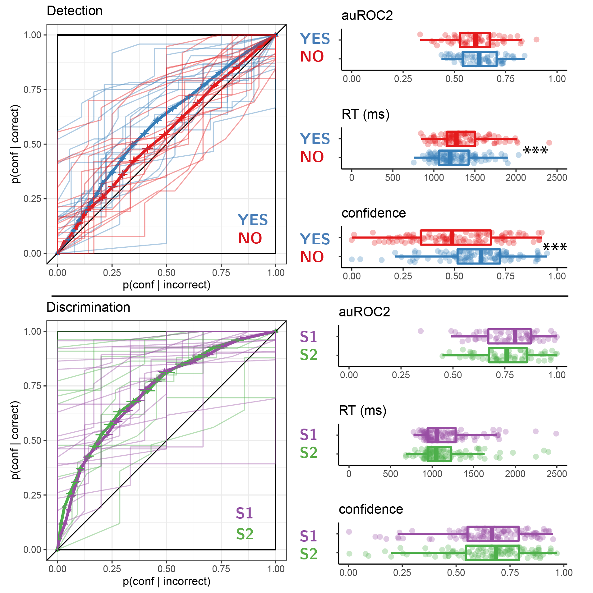
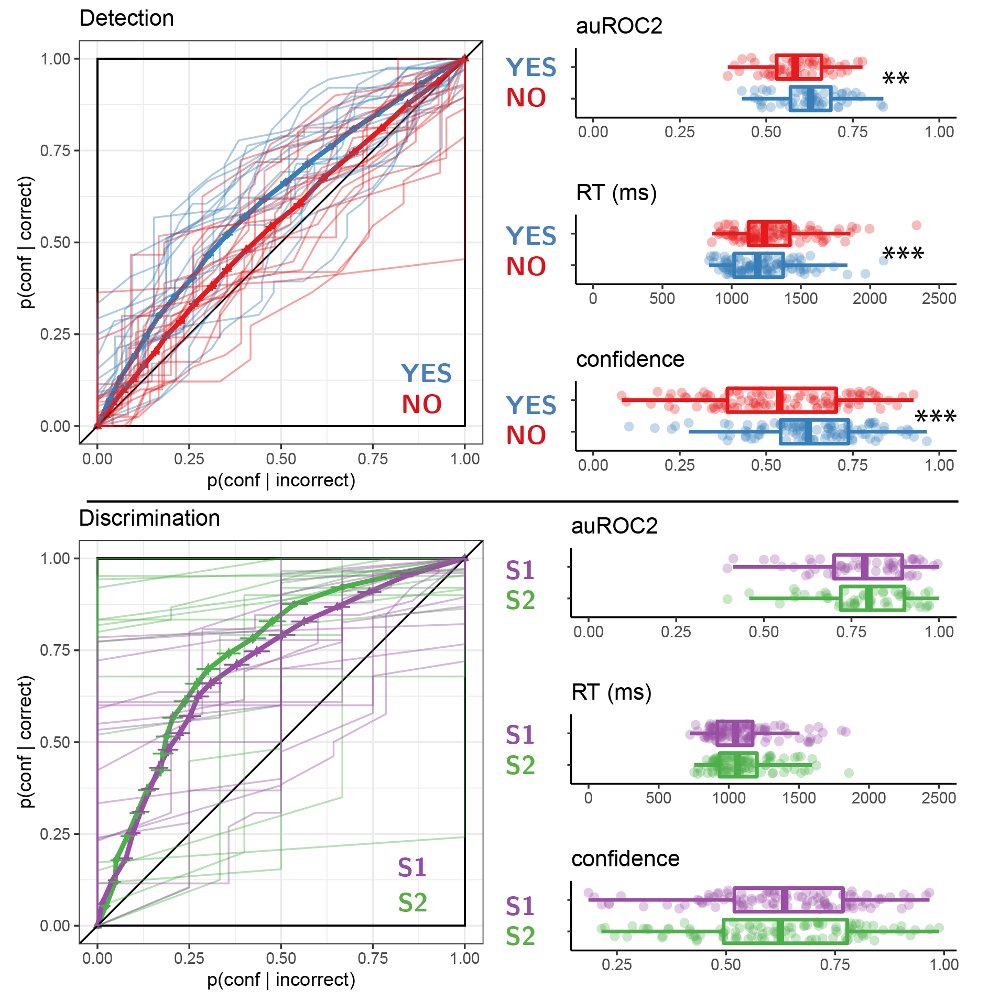

```{r appendix-setup, include=FALSE}
knitr::opts_chunk$set(warning = FALSE, message = FALSE) 

library(groundhog)

groundhog.library(
  c(
    'papaja',
    'tidyverse',
    'broom',
    'cowplot',
    'MESS', # for AUCs
    'lsr', # for effect sizes
    'pwr', # for power calculations
    'brms', # for mixed effects modeling
    'BayesFactor', # for Bayesian t test
    'jsonlite', #parsing data from sort_trial
    'knitr',
    'egg',
    'zoo',  # for rollapply
    'RColorBrewer',
    'reticulate', # for python
    'pracma' #for total least squares: http://vladpetyuk.github.io/2018-12-12-total_least_squares_regression
  ),"2022-12-01"
)

r_refs("r-references.bib")
```

# Additional analyses: Exp. 1

## Response time, confidence, and metacognitive sensitivity differences {#appRC:asymmetries1}

In detection, participants were generally slower to deliver 'no' responses compared to 'yes' responses (median difference: `r e1$detection_stats$contrast_responses%>%pull(RT)%>%median()%>%abs()%>%printnum()` ms, `r e1$detection_stats$contrast_responses%>%pull(logRT)%>%t.test()%>%apa_print()%>%'$'(statistic)` for a t-test on the log-transformed response times). No significant difference in response times was observed for the discrimination task (median difference: `r e1$discrimination_stats$contrast_responses%>%pull(RT)%>%mean()%>%abs()%>%printnum()` ms, `r e1$discrimination_stats$contrast_responses%>%pull(logRT)%>%t.test()%>%apa_print()%>%'$'(statistic)`).

Confidence in detection was generally higher than in discrimination (`r t.test(e1$task_stats%>%filter(detection==1)%>%pull(confidence), e1$task_stats%>%filter(detection==0)%>%pull(confidence), paired=TRUE)%>%apa_print()%>%'$'(full_result)`). Within detection, confidence in 'yes' responses was generally higher than confidence in 'no' responses (`r e1$detection_stats$contrast_responses$confidence%>%t.test()%>%apa_print()%>%'$'(full_result)`). No difference in average confidence levels was found between the two discrimination responses (`r e1$discrimination_stats$contrast_responses$confidence%>%t.test()%>%apa_print()%>%'$'(full_result)`).

Following @meuwese2014subjective, we extracted response-conditional type-2 ROC (rc-ROC) curves for the two tasks. For different values of $x \in [0,1]$, we plotted $p(confidence\geq x)$ for correct against incorrect responses, separately for the two response options. Unlike traditional type-I ROC curves that provide a summary of subjects' ability to distinguish between two external world states, type 2 ROC curves represent their ability to track the accuracy of one's own responses. The area under the response-conditional ROC curve (auROC2) is a measure of metacognitive sensitivity, with higher values corresponding to more accurate metacognitive monitoring.

Mean response-conditional ROC curves for the two responses in the discrimination task closely matched (`r e1$AUC%>%filter(detection==0)%>%pull(metacognitive_asymmetry)%>%t.test()%>%apa_print()%>%'$'(full_result)`), indicating that on average, participants had similar metacognitive insight into the accuracy of the two discrimination responses. In contrast, auROC2 estimates for 'yes' responses were significantly higher than for 'no' responses, indicating a metacognitive asymmetry between the two detection responses (group difference in auROC2: `r e1$AUC%>%filter(detection==1)%>%pull(metacognitive_asymmetry)%>%t.test()%>%apa_print()%>%'$'(full_result)`).

(ref:exp1-asymmetries) Behavioural asymmetries in metacognitive sensitivity, response time, and overall confidence in detection (upper panel) and discrimination (lower panel), in Exp. 1. Left: Response conditional type 2 ROC curves for the two tasks and four responses in Exp. 1. The area under the type 2 ROC curve is a measure of metacognitive sensitivity, and the difference in areas between the two responses a measure of metacognitive asymmetry. Single-subject curves are presented in low opacity. Right: distributions of the area under the type 2 ROC curve, median response time, and mean confidence for the four responses, across participants. Box edges and central lines represent the 25, 50 and 75 quantiles. Whiskers cover data points within four inter-quartile ranges around the median. Stars represent significance in a two-sided t-test: \*\*: p\<0.01, \*\*\*: p\<0.001

```{r RC-exp1-asymmetries, echo=FALSE, message=FALSE, fig.cap="(ref:exp1-asymmetries)", fig.scap="Behavioural asymmetries in metacognitive sensitivity, response time, and overall confidence, in Exp. 1"}

# plotAllAsymmetries(e1,'figures/RC-exp1-asymmetries.pdf');
knitr::include_graphics("figures/RC-exp1-asymmetries-enhanced.png")
```

## zROC curves

A difference in response-conditional auROC2 estimates can emerge from higher-order differences in metacognitive monitoring for the two responses and/or from lower-level differences in the perceptual representations of signal and noise [such as in first-order signal detection models where the signal variance is higher; @maniscalco2014signal]. Importantly, a difference can also emerge in first-order signal-detection models that assume equal variance, in the presence of a response bias or insufficient variance in confidence ratings [@mazor2021stage]. To test if the metacognitive asymmetry between 'yes' and 'no' responses could be accounted for by an equal-variance SDT model, we simulated data that was identical to our empirical data except for confidence ratings in correct responses, which were chosen to perfectly agree with the assumptions of an equal-variance SDT model given participants' decision criterion, sensitivity, and their confidence in incorrect responses. We then compared subject-wise differences between the response-conditional auROCs with the differences in this simulated dataset [@mazor2021stage]. The difference in differences was significant, indicating that the observed metacognitive asymmetry could not be accounted for by a first-order equal-variance SDT model (`r e1$AUC%>%filter(detection==1)%>%pull(metacognitive_asymmetry_control)%>%t.test()%>%apa_print()%>%'$'(full_result)`).

An asymmetry in metacognitive sensitivity for 'yes' and 'no' responses is also predicted by unequal-variance Signal Detection Theory (*uvSDT*). Specifically, if the signal distribution is wider than the noise distribution, the overlap between the distributions will be more pronounced for misses and correct rejections than for hits and false alarms, making metacognitive judgments for 'no' responses objectively more difficult. Unequal-variance SDT predicts that plotting the type-1 ROC curve in z-space (taking the inverse cumulative distribution of the confidence rating histogram) will result in a straight line with a slope equal to $\frac{\sigma_{noise}}{\sigma_{signal}}$. Because the variance of the signal distribution is higher than that of the noise distribution, zROC slopes are typically shallow, with slopes below 1.

To obtain an unbiased measure of zROC slopes while controlling for underestimation of the slope due to regression to the mean [@wickens2002elementary, 56], we used total least squares estimation [@R-tls]. In equal-variance SDT, the natural logarithm of the zROC slope is predicted to be 0, corresponding to a slope of 1.

Detection zROC slopes were generally shallower than 1 (as predicted by an unequal-variance SDT model; `r  e1$detection_zROC%>%pull(logslope_tse)%>%t.test%>%apa_print()%>%'$'(full_result)`), and not significantly different from 1 for discrimination zROC curves (as predicted by equal-variance SDT; `r e1$discrimination_zROC%>%pull(logslope_tse)%>%t.test%>%apa_print()%>%'$'(full_result)`).

These results support a difference in the variance-structure of the representation of signal and noise, such that the representation of signal is more variable across trials. However, it is still possible that some of the metacognitive asymmetry in detection (the difference in auROC2 between 'yes' and 'no' responses) reflects additional processes that cannot be captured by a first-order signal-detection model. If this was the case, zROC curves for detection should not only be shallower, but also less linear than for discrimination, reflecting poorer fit of the signal-detection model to detection. To test if this was the case, we compared the subject-wise $R^2$ values for the detection and discrimination zROC regression lines. $R^2$ values reflect the goodness of fit of a linear model to the data. These values were similar for the two tasks (`r t.test(e1$detection_zROC$r.squared,e1$discrimination_zROC$r.squared, paired=TRUE)%>%apa_print%>%'$'(full_result)`), suggesting that a first-order SDT model accounted equally well for the data from both tasks.

## Confidence-RT correlations

```{r RC-conf-RT, echo=FALSE, message=FALSE, include=FALSE}

e1$RT_conf_cor <- e1$trial_df %>%
  group_by(subj_id,detection,response) %>%
  summarise(cor=cor(RT,confidence,method='spearman'))

```

Following our pre-registered analysis plan, we extracted a Spearman correlation coefficient between confidence and response times separately for the two tasks and four responses. We find a negative correlation in all four cases (discrimination responses: `r e1$RT_conf_cor%>%filter(detection==0&response==0)%>%pull(cor)%>%mean()%>%printnum()` and `r e1$RT_conf_cor%>%filter(detection==0&response==1)%>%pull(cor)%>%mean()%>%printnum()`, detection 'yes': `r e1$RT_conf_cor%>%filter(detection==1&response==1)%>%pull(cor)%>%mean()%>%printnum()`, detection 'no': `r e1$RT_conf_cor%>%filter(detection==1&response==0)%>%pull(cor)%>%mean()%>%printnum()`). As hypothesized, this negative correlation was significantly attenuated in detection 'no' responses compared to detection 'yes' responses (tested with a one-tailed t-test: `r apa_print(t.test(e1$RT_conf_cor%>%filter(detection==1&response==1)%>%pull(cor),e1$RT_conf_cor%>%filter(detection==1&response==0)%>%pull(cor),paired=1,alternative='less'))$statistic`). The difference in correlation strength between detection 'no' responses and discrimination responses was only marginally significant (`r apa_print(t.test(e1$RT_conf_cor%>%filter(detection==0)%>%group_by(subj_id)%>%summarise(cor=mean(cor))%>%pull(cor),e1$RT_conf_cor%>%filter(detection==1&response==0)%>%pull(cor),paired=1,alternative='less'))$statistic`).

## Global metacognitive estimates {#global}

```{r RC-global, echo=FALSE, message=FALSE, include=FALSE}

e1$global_df <- read_csv('../experiments/Experiment1/data/global_estimates.csv') %>%
  mutate(estimates = as.numeric(estimates))%>%
  filter(!is.na(estimates));

e1$global_df_per_subj <- e1$global_df %>%
  group_by(subj_id,detection) %>%
  summarise(estimates = mean(estimates)/100) %>%
  spread(detection,estimates,sep='_') %>%
  mutate(diff=detection_0-detection_1);

e1$global_df_per_subj <- e1$global_df %>%
  filter(block_number>3)%>% 
  group_by(subj_id,detection) %>%
  summarise(estimates = mean(estimates)/100) %>%
  spread(detection,estimates,sep='_') %>%
  mutate(diff=detection_0-detection_1);

```

At the end of each 100-trial block, participants estimated their block-wise accuracy. Mean estimated accuracy was `r e1$global_df_per_subj%>%pull(detection_0)%>%mean()%>%printnum()` for discrimination and `r e1$global_df_per_subj%>%pull(detection_1)%>%mean()%>%printnum()`. These figures are close to true correct response rates: `r e1$task_stats_unfiltered%>%filter(detection==0)%>%pull(acc)%>%mean()%>%printnum()` in discrimination and `r e1$task_stats_unfiltered%>%filter(detection==1)%>%pull(acc)%>%mean()%>%printnum()` in detection.

A difference of `r e1$global_df_per_subj%>%pull(diff)%>%mean()%>%printnum()` between mean accuracy estimates for discrimination and detection was not significant at the group level (`r apa_print(e1$global_df_per_subj%>%pull(diff)%>%t.test())$statistic`).

# Additional analyses: Exp. 2

## Response time, confidence, and metacognitive sensitivity differences {#appRC:asymmetries2}

Participants were slower to deliver 'no' responses compared to 'yes' responses (median difference: `r e2$detection_stats$contrast_responses%>%pull(RT)%>%median()%>%abs()%>%printnum()` ms, `r e2$detection_stats$contrast_responses%>%pull(logRT)%>%t.test()%>%apa_print()%>%'$'(statistic)` for a t-test on the log-transformed response times). No significant difference in response times was observed for the discrimination task (median difference: `r e2$discrimination_stats$contrast_responses%>%pull(RT)%>%mean()%>%abs()%>%printnum()` ms, `r e2$discrimination_stats$contrast_responses%>%pull(logRT)%>%t.test()%>%apa_print()%>%'$'(statistic)`).

Confidence in detection was generally lower than in discrimination, consistent with lower accuracy in this task (`r t.test(e2$task_stats%>%filter(detection==1)%>%pull(confidence), e2$task_stats%>%filter(detection==0)%>%pull(confidence), paired=TRUE)%>%apa_print()%>%'$'(full_result)`). Within detection, confidence in 'yes' responses was generally higher than confidence in 'no' responses (`r e2$detection_stats$contrast_responses$confidence%>%t.test()%>%apa_print()%>%'$'(full_result)`). No difference in average confidence levels was observed between the two discrimination responses (`r e2$discrimination_stats$contrast_responses$confidence%>%t.test()%>%apa_print()%>%'$'(full_result)`).

In contrast to the results of Exp. 1, auROC2 values for 'yes' and 'no' responses were not significantly different (group difference in area under the response-conditional curve, auROC2: `r e2$AUC%>%filter(detection==1)%>%pull(metacognitive_asymmetry)%>%t.test()%>%apa_print()%>%'$'(full_result)`). auROC2s were also not significantly different when controlling for type-1 response and confidence biases (`r e2$AUC%>%filter(detection==1)%>%pull(metacognitive_asymmetry_control)%>%t.test()%>%apa_print()%>%'$'(full_result)`).

(ref:exp2-asymmetries) Behavioural asymmetries in metacognitive sensitivity, response time, and overall confidence, in Exp. 2. Same conventions as in Fig. \@ref(fig:RC-exp1-asymmetries).

```{r RC-exp2-asymmetries, echo=FALSE, message=FALSE, fig.scap="Behavioural asymmetries in metacognitive sensitivity, response time, and overall confidence, in Exp. 2",  fig.cap= "(ref:exp2-asymmetries)"}
# plotAllAsymmetries(e2,'figures/RC-exp2-asymmetries.pdf');

```

## zROC curves

Unlike in Experiment 1, detection zROC slopes were not significantly different from 1 (`r e2$detection_zROC%>%pull(logslope_tse)%>%t.test%>%apa_print()%>%'$'(full_result)`), whereas discrimination zROC slopes were significantly shallower than 1 (`r e2$discrimination_zROC%>%pull(logslope_tse)%>%t.test%>%apa_print()%>%'$'(full_result)`). This unexpected result indicates equal variance for the signal and noise distributions, but higher variance for targets presented on the right than on the left. Furthermore, a first-order SDT model fitted the data significantly better for the detection task than for the discrimination (difference in $R^2$ for the two tasks: `r e2$zROC_contrast_rsquare%>%pull(fit_diff)%>%t.test()%>%apa_print()%>%'$'(full_result)`).

## Confidence-RT correlations

```{r e2-RC-conf-RT, echo=FALSE, message=FALSE, include=FALSE}

e2$RT_conf_cor <- e2$trial_df %>%
  group_by(subj_id,detection,response) %>%
  summarise(cor=cor(RT,confidence,method='spearman'))

```

Following our pre-registered analysis plan, we extracted a Spearman correlation coefficient between confidence and response times separately for the two tasks and four responses. We find a negative correlation in all four cases (discrimination responses: `r e2$RT_conf_cor%>%filter(detection==0&response==0)%>%pull(cor)%>%mean()%>%printnum()` and `r e2$RT_conf_cor%>%filter(detection==0&response==1)%>%pull(cor)%>%mean()%>%printnum()`, detection 'yes': `r e2$RT_conf_cor%>%filter(detection==1&response==1)%>%pull(cor)%>%mean(na.rm=T)%>%printnum()`, detection 'no': `r e2$RT_conf_cor%>%filter(detection==1&response==0)%>%pull(cor)%>%mean(na.rm=T)%>%printnum()`). This negative correlation was significantly attenuated in detection 'no' responses compared to detection 'yes' responses (tested with a one-tailed t-test: `r apa_print(t.test(e2$RT_conf_cor%>%filter(detection==1&response==1)%>%pull(cor),e2$RT_conf_cor%>%filter(detection==1&response==0)%>%pull(cor),paired=1,alternative='less'))$statistic`). The difference in correlation strength between detection 'no' responses and discrimination responses was also significant (`r apa_print(t.test(e2$RT_conf_cor%>%filter(detection==0)%>%group_by(subj_id)%>%summarise(cor=mean(cor))%>%pull(cor),e2$RT_conf_cor%>%filter(detection==1&response==0)%>%pull(cor),paired=1,alternative='less'))$statistic`).

# Additional analyses: Exp. 3

## Response time, confidence, and metacognitive sensitivity differences {#appRC:asymmetries3}

Participants were slower to deliver 'no' responses compared to 'yes' responses (median difference: `r e3$detection_stats$contrast_responses%>%pull(RT)%>%median()%>%abs()%>%printnum()` ms, `r e3$detection_stats$contrast_responses%>%pull(logRT)%>%t.test()%>%apa_print()%>%'$'(statistic)` for a t-test on the log-transformed response times). No significant difference in response times was observed for the discrimination task (median difference: `r e3$discrimination_stats$contrast_responses%>%pull(RT)%>%mean()%>%abs()%>%printnum()` ms, `r e3$discrimination_stats$contrast_responses%>%pull(logRT)%>%t.test()%>%apa_print()%>%'$'(statistic)`).

Confidence in detection was generally lower than in discrimination, consistent with lower accuracy in this task (`r t.test(e3$task_stats%>%filter(detection==1)%>%pull(confidence), e3$task_stats%>%filter(detection==0)%>%pull(confidence), paired=TRUE)%>%apa_print()%>%'$'(full_result)`). Within detection, confidence in 'yes' responses was generally higher than confidence in 'no' responses (`r e3$detection_stats$contrast_responses$confidence%>%t.test()%>%apa_print()%>%'$'(full_result)`). No difference in average confidence levels was observed between the two discrimination responses (`r e3$discrimination_stats$contrast_responses$confidence%>%t.test()%>%apa_print()%>%'$'(full_result)`).

Within detection, metacognitive sensitivity was higher for 'yes' responses (group difference in area under the response-conditional curve, auROC2: `r e3$AUC%>%filter(detection==1)%>%pull(metacognitive_asymmetry)%>%t.test()%>%apa_print()%>%'$'(full_result)`). auROC2s were also marginally different when controlling for type-1 response and confidence biases (`r e3$AUC%>%filter(detection==1)%>%pull(metacognitive_asymmetry_control)%>%t.test()%>%apa_print()%>%'$'(full_result)`).

(ref:exp3-asymmetries) Behavioural asymmetries in metacognitive sensitivity, response time, and overall confidence, in Exp. 3. Same conventions as in Fig. \@ref(fig:RC-exp1-asymmetries).

```{r RC-exp3-asymmetries, echo=FALSE, message=FALSE, fig.scap="Behavioural asymmetries in metacognitive sensitivity, response time, and overall confidence, in Exp. 2",  fig.cap= "(ref:exp3-asymmetries)"}
# plotAllAsymmetries(e2,'figures/RC-exp3-asymmetries.pdf');

```

## zROC curves

As expected, detection zROC slopes were significantly shallower than 1 (`r e3$detection_zROC%>%pull(logslope_tse)%>%t.test%>%apa_print()%>%'$'(full_result)`), whereas discrimination zROC slopes were not different from 1 (`r e3$discrimination_zROC%>%pull(logslope_tse)%>%t.test%>%apa_print()%>%'$'(full_result)`). Furthermore, a first-order SDT model fitted the data significantly better for the detection than for the discrimination task (difference in $R^2$ for the two tasks: `r e3$zROC_contrast_rsquare%>%pull(fit_diff)%>%t.test()%>%apa_print()%>%'$'(full_result)`).

## Confidence-RT correlations

```{r e3-RC-conf-RT, echo=FALSE, message=FALSE, include=FALSE}

e3$RT_conf_cor <- e3$trial_df %>%
  group_by(subj_id,detection,response) %>%
  summarise(cor=cor(RT,confidence,method='spearman'))

```

We extracted a Spearman correlation coefficient between confidence and response times separately for the two tasks and four responses. We find a negative correlation in all four cases (discrimination responses: `r e3$RT_conf_cor%>%filter(detection==0&response==0)%>%pull(cor)%>%mean()%>%printnum()` and `r e3$RT_conf_cor%>%filter(detection==0&response==1)%>%pull(cor)%>%mean()%>%printnum()`, detection 'yes': `r e3$RT_conf_cor%>%filter(detection==1&response==1)%>%pull(cor)%>%mean(na.rm=T)%>%printnum()`, detection 'no': `r e3$RT_conf_cor%>%filter(detection==1&response==0)%>%pull(cor)%>%mean(na.rm=T)%>%printnum()`). This negative correlation was significantly attenuated in detection 'no' responses compared to detection 'yes' responses (tested with a one-tailed t-test: `r apa_print(t.test(e3$RT_conf_cor%>%filter(detection==1&response==1)%>%pull(cor),e3$RT_conf_cor%>%filter(detection==1&response==0)%>%pull(cor),paired=1,alternative='less'))$statistic`). The difference in correlation strength between detection 'no' responses and discrimination responses was also significant (`r apa_print(t.test(e3$RT_conf_cor%>%filter(detection==0)%>%group_by(subj_id)%>%summarise(cor=mean(cor))%>%pull(cor),e3$RT_conf_cor%>%filter(detection==1&response==0)%>%pull(cor),paired=1,alternative='less'))$statistic`).

## Reverse correlation analysis of standard trials only {#appRC:standardonly}

In the following, we repeat the reverse correlation analysis reported for Exp. 3, but here restricted to the subset of "standard" trials where luminance was not increased by 2/255.

```{r RC-exp3-standard-RC, echo=FALSE, message=FALSE, include=FALSE}

e3_st =list()

e3_st$discRCdf <- e3$demeaned_df %>%
  filter(detection==0 & brightness_boost==0) %>%
  mutate(obj_side=factor(ifelse(side==bright_side, 'true','opposite'),
                         levels=c('true','opposite')),
         side=ifelse(response==side,'chosen','unchosen')) %>%
  group_by(subj_id) %>%
  mutate(median_confidence=median(confidence)) %>%
  ungroup() %>%
  mutate(
    binaryconf = ifelse(confidence>=median_confidence, 1, 0),
    time=(timepoint-1)*40) 

e3_st$RC <- list();

e3_st <- e3_st %>%
  getDiscriminationKernels() %>%
  contrastDiscriminationKernels() %>%
  plotDiscriminationKernels('exp3_standard',c(0,440),c(-0.4,0.8), 'luminance (RGB units)')

e3_st$signalRCdf <- e3$demeaned_df %>%
  filter(detection==1 & signal==1 & brightness_boost==0) %>%
  mutate(side=factor(ifelse(side==bright_side, 'true','opposite'),
                         levels=c('true','opposite'))) %>%
  group_by(subj_id,response) %>%
  mutate(median_confidence=median(confidence)) %>%
  ungroup() %>%
  mutate(
    binaryconf = ifelse(confidence>=median_confidence, 1, 0),
    time=(timepoint-1)*40) 

e3_st <- e3_st %>%
  getDetectionSignalKernels()%>%
  contrastDetectionSignalKernels()%>%
  plotDetectionSignalKernels('exp3_standard',c(0,440),c(-0.4,0.7), 'luminance (RGB units)')

```

### Discrimination decisions {.unnumbered}

Discrimination decisions were sensitive to relative evidence during the first 300 milliseconds of the trial (`r e3_st$RC$accuracy_rel300%>%pull(diff)%>%t.test()%>%apa_print()%>%'$'(statistic)`) with no effect of sum evidence (`r e3_st$RC$accuracy_sum300%>%pull(diff)%>%t.test()%>%apa_print()%>%'$'(statistic)`).

### Discrimination confidence {.unnumbered}

Decision confidence was sensitive to positive (`r e3_st$RC$confidence_pos300%>%pull(diff)%>%t.test()%>%apa_print()%>%'$'(statistic)`) and negative (`r e3_st$RC$confidence_neg300%>%pull(diff)%>%t.test()%>%apa_print()%>%'$'(statistic)`) evidence within the first 300 milliseconds of the stimulus. The effect of sum evidence on decision confidence was not significant in this sample (`r e3_st$RC$confidence_sum300%>%pull(diff)%>%t.test()%>%apa_print()%>%'$'(statistic)`).

### Detection {.unnumbered}

Participants' detection decisions were sensitive to fluctuations in the luminance of the target stimulus, such that 'yes' responses were associated with brighter target stimuli (`r e3_st$RC$signal_decision_pos300%>%pull(diff)%>%t.test()%>%apa_print()%>%'$'(statistic)`). The luminance of the non-target stimulus had a negative effect on the probability of responding 'yes' in the detection task (`r e3_st$RC$signal_decision_neg300%>%pull(diff)%>%t.test()%>%apa_print()%>%'$'(statistic)`) Together, detection decisions were sensitive to relative evidence (the difference in luminance between the target and non-target stimuli; `r e3_st$RC$signal_decision_rel300%>%pull(diff)%>%t.test()%>%apa_print()%>%'$'(statistic)`), and to sum evidence (the overall luminance of the display; `r e3_st$RC$signal_decision_sum300%>%pull(diff)%>%t.test()%>%apa_print()%>%'$'(statistic)`).

Confidence in detection 'yes' responses was similarly positively correlated with the luminance of the target stimulus (`r e3_st$RC$signal_confidenceYes_pos300%>%pull(diff)%>%t.test()%>%apa_print()%>%'$'(statistic)`), and negatively correlated with the luminance of the non-target stimulus (`r e3_st$RC$signal_confidenceYes_neg300%>%pull(diff)%>%t.test()%>%apa_print()%>%'$'(statistic)`). Sum luminance had a significant positive effect on decision confidence when reporting target presence ('yes' responses; `r e3_st$RC$signal_confidenceYes_sum300%>%pull(diff)%>%t.test()%>%apa_print()%>%'$'(statistic)`).

Finally, confidence in detection 'no' responses was not sensitive to random fluctuations in the luminance of the target(`r e3_st$RC$signal_confidenceNo_pos300%>%pull(diff)%>%t.test()%>%apa_print()%>%'$'(statistic)`) and non-target stimulus (`r e3_st$RC$signal_confidenceNo_neg300%>%pull(diff)%>%t.test()%>%apa_print()%>%'$'(statistic)`), nor to the overall luminance of the display (`r e3_st$RC$signal_confidenceNo_sum300%>%pull(diff)%>%t.test()%>%apa_print()%>%'$'(statistic)`), or the difference in luminance between the two stimuli (`r e3_st$RC$signal_confidenceNo_rel300%>%pull(diff)%>%t.test()%>%apa_print()%>%'$'(statistic)`).

# Additional analyses: Exp. 4

## Response time, confidence, and metacognitive sensitivity differences {#appRC:asymmetries4}

Participants were slower to deliver 'no' responses compared to 'yes' responses (median difference: `r e4$detection_stats$contrast_responses%>%pull(RT)%>%median()%>%abs()%>%printnum()` ms, `r e4$detection_stats$contrast_responses%>%pull(logRT)%>%t.test()%>%apa_print()%>%'$'(statistic)` for a t-test on the log-transformed response times). No significant difference in response times was observed for the discrimination task (median difference: `r e4$discrimination_stats$contrast_responses%>%pull(RT)%>%mean()%>%abs()%>%printnum()` ms, `r e4$discrimination_stats$contrast_responses%>%pull(logRT)%>%t.test()%>%apa_print()%>%'$'(statistic)`).

Confidence in detection was generally lower than in discrimination, consistent with lower accuracy in this task (`r t.test(e4$task_stats%>%filter(detection==1)%>%pull(confidence), e4$task_stats%>%filter(detection==0)%>%pull(confidence), paired=FALSE)%>%apa_print()%>%'$'(full_result)`). Within detection, confidence in 'yes' responses was generally higher than confidence in 'no' responses (`r e4$detection_stats$contrast_responses$confidence%>%t.test()%>%apa_print()%>%'$'(full_result)`). Within discrimination, confidence in 'yes' responses was overall higher (`r e4$discrimination_stats$contrast_responses$confidence%>%t.test()%>%apa_print()%>%'$'(full_result)`).

Within detection, metacognitive sensitivity was numerically, but not significantly, higher for 'yes' responses (group difference in area under the response-conditional curve, auROC2: `r e4$AUC%>%filter(detection==1)%>%pull(metacognitive_asymmetry)%>%t.test()%>%apa_print()%>%'$'(full_result)`). This was the case also when controlling for type-1 response and confidence biases (`r e4$AUC%>%filter(detection==1)%>%pull(metacognitive_asymmetry_control)%>%t.test()%>%apa_print()%>%'$'(full_result)`).

(ref:exp4-asymmetries) Behavioural asymmetries in metacognitive sensitivity, response time, and overall confidence, in Exp. 4. Same conventions as in Fig. \@ref(fig:RC-exp1-asymmetries).

```{r RC-exp4-asymmetries, echo=FALSE, message=FALSE, fig.scap="Behavioural asymmetries in metacognitive sensitivity, response time, and overall confidence, in Exp. 2",  fig.cap= "(ref:exp4-asymmetries)"}
# plotAllAsymmetries(e2,'figures/RC-exp4-asymmetries.pdf');

```

## zROC curves

As expected, detection zROC slopes were significantly shallower than 1 (`r e4$detection_zROC%>%pull(logslope_tse)%>%t.test%>%apa_print()%>%'$'(full_result)`), whereas discrimination zROC slopes were not different from 1 (`r e4$discrimination_zROC%>%pull(logslope_tse)%>%t.test%>%apa_print()%>%'$'(full_result)`). Furthermore, a first-order SDT model fitted the data significantly better for the detection than for the discrimination task (difference in $R^2$ for the two tasks: `r e4$zROC_contrast_rsquare%>%pull(fit_diff)%>%t.test()%>%apa_print()%>%'$'(full_result)`).

## Confidence-RT correlations

```{r e4-RC-conf-RT, echo=FALSE, message=FALSE, include=FALSE}

e4$RT_conf_cor <- e4$trial_df %>%
  group_by(subj_id,detection,response) %>%
  summarise(cor=cor(RT,confidence,method='spearman'))

```

We extracted a Spearman correlation coefficient between confidence and response times separately for the two tasks and four responses. We find a negative correlation in all four cases (discrimination responses: `r e4$RT_conf_cor%>%filter(detection==0&response==0)%>%pull(cor)%>%mean()%>%printnum()` and `r e4$RT_conf_cor%>%filter(detection==0&response==1)%>%pull(cor)%>%mean(na.rm=T)%>%printnum()`, detection 'yes': `r e4$RT_conf_cor%>%filter(detection==1&response==1)%>%pull(cor)%>%mean(na.rm=T)%>%printnum()`, detection 'no': `r e4$RT_conf_cor%>%filter(detection==1&response==0)%>%pull(cor)%>%mean(na.rm=T)%>%printnum()`). This negative correlation was significantly attenuated in detection 'no' responses compared to detection 'yes' responses (tested with a one-tailed t-test: `r apa_print(t.test(e4$RT_conf_cor%>%filter(detection==1&response==1)%>%pull(cor),e4$RT_conf_cor%>%filter(detection==1&response==0)%>%pull(cor),paired=1,alternative='less'))$statistic`). The difference in correlation strength between detection 'no' responses and discrimination responses was also significant (`r apa_print(t.test(e4$RT_conf_cor%>%filter(detection==0)%>%group_by(subj_id)%>%summarise(cor=mean(cor))%>%pull(cor),e4$RT_conf_cor%>%filter(detection==1&response==0)%>%pull(cor),paired=0,alternative='less'))$statistic`).

## Reverse correlation analysis of standard trials only

In the following, we repeat the reverse correlation analysis reported for Exp. 4, but here restricted to the subset of "standard" trials where overall hue was not shifted toward the target hue.

```{r RC-exp4-standard-RC, echo=FALSE, message=FALSE, include=FALSE}

e4_st =list()

e4_st$discRCdf <- e4$demeaned_df %>%
  filter(detection==0 & normal_boost==0) %>%
  mutate(obj_side=factor(ifelse(side==special_side, 'true','opposite'),
                         levels=c('true','opposite')),
         side=ifelse(response==side,'chosen','unchosen')) %>%
  group_by(subj_id) %>%
  mutate(median_confidence=median(confidence)) %>%
  ungroup() %>%
  mutate(
    binaryconf = ifelse(confidence>=median_confidence, 1, 0),
    time=(timepoint-1)*40) 

e4_st$RC <- list();

e4_st <- e4_st %>%
  getDiscriminationKernels() %>%
  contrastDiscriminationKernels() %>%
  plotDiscriminationKernels('exp4_standard',c(0,440),c(-0.4,0.8), 'luminance (RGB units)')

e4_st$signalRCdf <- e4$demeaned_df %>%
  filter(detection==1 & signal==1 & normal_boost==0) %>%
  mutate(side=factor(ifelse(side==special_side, 'true','opposite'),
                         levels=c('true','opposite'))) %>%
  group_by(subj_id,response) %>%
  mutate(median_confidence=median(confidence)) %>%
  ungroup() %>%
  mutate(
    binaryconf = ifelse(confidence>=median_confidence, 1, 0),
    time=(timepoint-1)*40) 

e4_st <- e4_st %>%
  getDetectionSignalKernels()%>%
  contrastDetectionSignalKernels()%>%
  plotDetectionSignalKernels('exp4_standard',c(0,440),c(-0.4,0.7), 'luminance (RGB units)')

```

### Discrimination decisions {.unnumbered}

Discrimination decisions were sensitive to relative evidence during the first 300 milliseconds of the trial (`r e4_st$RC$accuracy_rel300%>%pull(diff)%>%t.test()%>%apa_print()%>%'$'(statistic)`) with no effect of sum evidence (`r e4_st$RC$accuracy_sum300%>%pull(diff)%>%t.test()%>%apa_print()%>%'$'(statistic)`).

### Discrimination confidence {.unnumbered}

Decision confidence was sensitive to positive (`r e4_st$RC$confidence_pos300%>%pull(diff)%>%t.test()%>%apa_print()%>%'$'(statistic)`) and negative (`r e4_st$RC$confidence_neg300%>%pull(diff)%>%t.test()%>%apa_print()%>%'$'(statistic)`) evidence within the first 300 milliseconds of the stimulus. The effect of sum evidence on decision confidence was not significant in this sample (`r e4_st$RC$confidence_sum300%>%pull(diff)%>%t.test()%>%apa_print()%>%'$'(statistic)`).

### Detection {.unnumbered}

Participants' detection decisions were sensitive to fluctuations in the hue of the target stimulus (`r e4_st$RC$signal_decision_pos300%>%pull(diff)%>%t.test()%>%apa_print()%>%'$'(statistic)`). The hue of the non-target stimulus had a negative effect on the probability of responding 'yes' in the detection task (`r e4_st$RC$signal_decision_neg300%>%pull(diff)%>%t.test()%>%apa_print()%>%'$'(statistic)`) Together, detection decisions were sensitive to relative evidence (the difference in hue between the target and non-target stimuli; `r e4_st$RC$signal_decision_rel300%>%pull(diff)%>%t.test()%>%apa_print()%>%'$'(statistic)`), and to sum evidence (the overall evidence in hue-space for the two stimuli together; `r e4_st$RC$signal_decision_sum300%>%pull(diff)%>%t.test()%>%apa_print()%>%'$'(statistic)`).

Confidence in detection 'yes' responses was similarly positively correlated with the hue of the target stimulus (`r e4_st$RC$signal_confidenceYes_pos300%>%pull(diff)%>%t.test()%>%apa_print()%>%'$'(statistic)`), but was not correlated with the hue of the non-target stimulus (`r e4_st$RC$signal_confidenceYes_neg300%>%pull(diff)%>%t.test()%>%apa_print()%>%'$'(statistic)`). Sum evidence in hue space had a marginal positive effect on decision confidence when reporting target presence ('yes' responses; `r e4_st$RC$signal_confidenceYes_sum300%>%pull(diff)%>%t.test()%>%apa_print()%>%'$'(statistic)`).

Finally, confidence in detection 'no' responses was negatively sensitive to random fluctuations in the hue of the target(`r e4_st$RC$signal_confidenceNo_pos300%>%pull(diff)%>%t.test()%>%apa_print()%>%'$'(statistic)`), but not the non-target stimulus (`r e4_st$RC$signal_confidenceNo_neg300%>%pull(diff)%>%t.test()%>%apa_print()%>%'$'(statistic)`). The overall hue of the display also affected confidence in decisions about absence (`r e4_st$RC$signal_confidenceNo_sum300%>%pull(diff)%>%t.test()%>%apa_print()%>%'$'(statistic)`), without an effect for the hue difference between the two stimuli (`r e4_st$RC$signal_confidenceNo_rel300%>%pull(diff)%>%t.test()%>%apa_print()%>%'$'(statistic)`).

# Effects of evidence on decision and confidence: Exp. 2 and 3

We plotted optimal behaviour, as well as participants' responses and their confidence in correct responses, as a function of perceptual evidence in a two-dimensional representational space. First, for each trial we extracted mean luminance (minus background luminance) in the first 300 milliseconds for the right and left stimuli. These numbers were rounded to the closest integer. For each tuple of such integers, we extracted the posterior probability for stimulus category (Fig. \@ref(fig:RC-2d-empirical), top row), participants' empirical discrimination and detection decisions (middle row), and participants' subjective confidence in correct responses (bottom row).

```{r RC-2d-empirical, fig.cap="Top row: posterior probability of stimulus category given perceptual evidence for discrimination (left) and detection (right). Middle row: decision probability as a function of perceptual evidence. Bottom row: mean confidence in correct responses as a function of perceptual evidence."}

knitr::include_graphics('figures/empirical_tile.png')

```

# Correlations betweeen detection decisions and discrimination confidence

```{r compare_det_disc, echo=FALSE, cache= TRUE, message=FALSE, warning=FALSE, results='hide', fig.show='hide'}

e1 <- e1 %>%
  aggregateEffects();

e2 <- e2 %>%
  aggregateEffects()

e3 <- e3 %>%
  aggregateEffects()

e4 <- e4 %>%
  aggregateEffects()

e3$all_PEBs <- e3$discrimination_conf_PEB %>%
  rename(disc_conf=PEB) %>%
  merge(e3$yes_conf_PEB %>%
          rename(yes_conf=PEB)) %>%
  merge(e3$detection_dec_PEB %>%
          rename(det_dec=PEB)) %>%
  merge(e3$no_conf_PEB %>%
          rename(no_conf=PEB))

e4$all_PEBs <- e4$discrimination_conf_PEB %>%
  rename(disc_conf=PEB) %>%
  merge(e4$yes_conf_PEB %>%
          rename(yes_conf=PEB)) %>%
  merge(e4$detection_dec_PEB %>%
          rename(det_dec=PEB)) %>%
  merge(e4$no_conf_PEB %>%
          rename(no_conf=PEB))

e1$det_disc_stats <- merge(
  e1$detection_stats$general,
  e1$discrimination_stats$general,
  by='subj_id', 
  suffix = c('_det','_dis'))
  
e2$det_disc_stats <- merge(
  e2$detection_stats$general,
  e2$discrimination_stats$general,
  by='subj_id', 
  suffix = c('_det','_dis'));

e3$det_disc_stats <- merge(
  e3$detection_stats$general,
  e3$discrimination_stats$general,
  by='subj_id', 
  suffix = c('_det','_dis'));

e4$det_disc_stats <- merge(
  e4$detection_stats$general,
  e4$discrimination_stats$general,
  by='subj_id', 
  suffix = c('_det','_dis'))
```

If discrimination confidence and detection decisions draw on shared representational resources, one may expect that subjects who report higher levels of confidence in detection will also be more likely to report target presence in detection. This was not the case in any of the four experiments (Exp. 1: `r cor.test(e1$det_disc_stats$bias_det,e1$det_disc_stats$confidence_dis)%>%apa_print()%>%'$'(full_result)`; Exp. 2: `r cor.test(e2$det_disc_stats$bias_det,e2$det_disc_stats$confidence_dis)%>%apa_print()%>%'$'(full_result)`; Exp. 3: `r cor.test(e3$det_disc_stats$bias_det,e3$det_disc_stats$confidence_dis)%>%apa_print()%>%'$'(full_result)`; Exp. 4: `r cor.test(e4$det_disc_stats$bias_det,e4$det_disc_stats$confidence_dis)%>%apa_print()%>%'$'(full_result)`).

Similarly, discrimination confidence effects of the evidence boost manipulation in Exp. 3 and 4 were not correlated with detection decision effects of the same participants (Exp. 3: `r apa_print(cor.test(e3$all_PEBs$det_dec, e3$all_PEBs$disc_conf))$full_result`; Exp. 4: `r apa_print(cor.test(e4$all_PEBs$det_dec, e4$all_PEBs$disc_conf))$full_result`).

# Compuatational models

## General framework

### Generative model {.unnumbered}

Stimuli were represented as two vectors of 12 values each ${\vec{E}_l}$ and ${\vec{E}_r}$, corresponding to the two sensory channels (e.g., the right and left stimuli in Exp. 2). In the discrimination task, one sensory channel transmitted pure noise (that is, samples were centered around zero), and one channel had additional signal in it (samples were centered around a non-zero value). The signal channel was chosen randomly for each trial with equal probability. In the detection task, both sensory channels transmitted pure noise.

```{=tex}
\begin{equation}
  E[i] \sim \begin{cases}
    \mathcal{N}(0.5,1), & \text{if signal}.\\
    \mathcal{N}(0,1), & \text{if noise}.\\
  \end{cases}
\end{equation}
```
On top of the presented noise, we added perceptual noise to the stimulus, resulting in a degraded representation of each sensory channel $E'$. Importantly, this additional noise affected the agent's decisions and confidence ratings, but did not affect the stimulus itself such that trial-wise estimates of stimulus energy were unaffected for the reverse correlation analysis. The noise was channel and time specific.

### Belief update {.unnumbered}

Agents kept track of three quantities, the log likelihood for signal in the right versus the left channels ($LLR_r$), and the log likelihood for the presence of signal in one of the channels, versus noise in both channels ($LLR_p$). Both values were set to 0 at the beginning of each trial. They were then updated from the second timepoint and on (we used the first timepoint as a control, to make sure reverse correlation analysis is not showing any effect of evidence at this timepoint). Log likelihood ratios were updated according to the following rule, where i indexes timepoint within the trial:

$$
 LLR_{r,i+1} = LLR_{r,i}+log(P_s(E'_r{i})+log(P_n(E'_l{i})) - log(P_n(E'_r{i})-log(P_s(E'_l{i}))
$$

and

$$ 
LLR_{p,i+1} = LLR_{p,i} + log(p_{right}P_s(E'_r{i})P_n(E'_l{i})+p_{left}P_n(E'_r{i})P_s(E'_l{i})) - log(P_n(E'_r{i}))-log(P_n(E'_l{i}))
$$ where $P_s$ is the true probability density function of $E'$ values conditioned on signal being present in the channel, and $P_n$ is the true probability density function of $E'$ values conditioned on signal being absent. $p_{right}=\frac{e^{LLR_{r,i}}}{1+e^{LLR_{r,i}}}$ is the probability that the signal is in the right channel (based on all previous samples) and $p_{left}=1-p_{right}$ is the probability that the signal is in the left channel (conditioned on signal presence). Note that subjects are rationally incorporating accurate beliefs about the effect of sensory noise on evidence strength in updating their beliefs about the world state.

### Decision {.unnumbered}

In discrimination, agents decided 'right' when $LLR_r>0$ and 'left' otherwise. In detection, agents decided 'present' when $LLR_p>0$ and 'absent' otherwise.

### Confidence {.unnumbered}

Confidence was the probability of being correct, given an equal prior over the two world states. This equals $\frac{e^{LLR_{r}}}{1+e^{LLR_{r}}}$ in discrimination and $\frac{e^{LLR_{p}}}{1+e^{LLR_{p}}}$ in detection.

## Vanilla

In the vanilla model, sensory noise was sampled from $\mathcal{N}(0,2)$.

A python simulation is available [in the project's GitHub](https://github.com/matanmazor/reverseCorrelation/blob/main/simulations/equal_variance.ipynb).

## Stimulus-dependent noise

In the stimulus-dependent noise model, sensory noise was sampled from $\mathcal{N}(0,2^{E})$.

A python simulation is available [in the project's GitHub](https://github.com/matanmazor/reverseCorrelation/blob/main/simulations/unequal_variance.ipynb).

## Random attention

In the random attention noise model, sensory noise was sampled from $\mathcal{N}(0,2)$. However, subjects had access to only one sensory channel per timepoint.

At the beginning of each trial, one of the two channels was chosen at random with equal probability to be the preferred channel. Then, at each timepoint, one of the two channels was selected to be attended, with a $0.95$ probability of being the preferred channel. Subjects then used information from this channel only to update their beliefs. For example, upon attending the left channel:

$$
 LLR_{r,i+1} = LLR_{r,i}+log(P_n(E'_l{i})) - log(P_s(E'_l{i}))
$$

and

$$ 
LLR_{p,i+1} = LLR_{p,i} + log(p_{right}P_n(E'_l{i})+p_{left}P_s(E'_l{i})) - log(P_n(E'_l{i}))
$$

A python simulation is available [in the project's GitHub](https://github.com/matanmazor/reverseCorrelation/blob/main/simulations/random_attention.ipynb).

## Goal-directed attention

In the goal-directed attention noise model, sensory noise was sampled from $\mathcal{N}(0,2)$. However, subjects had only access to one sensory channel per timepoint.

The probability of attending the right channel was set to $S(LLR_r)$, where $S(x)=\frac{1}{1+e^{-5x}}$. This made agents heavily biased to attend the channel that is more likely to include signal.

A python simulation is available [in the project's GitHub](https://github.com/matanmazor/reverseCorrelation/blob/main/simulations/goal_directed_attention.ipynb).

# Time resolved decision and confidence kernels from model simulations

In the main paper, qualitative model predictions were derived after averaging over timepoints. Here we include time-resolved decision and confidence kernels. As a sanity check, in these simulations agents only incorporated evidence from the second time point and on, allowing us to verify that evidence in the first timepoint has zero contribution to decision and confidence kernels.

One noteworthy pattern is that the effect of sum evidence on discrimination confidence in the goal-directed model grows over time within a trial (see Fig. \@ref(fig:RC-gda-RC)C, black curve). This is due to the fact that in this model, the probability of attending the signal channel increases with every time point, making agents increasingly blind to evidence in the non-signal channel, and increasingly sensitive to evidence in the signal channel. To quantify this effect, we contrasted the timepoints at which the relative- and sum-evidence confidence kernels peaked. Indeed, in the goal-directed attention model, the sum-evidence kernel peaked significantly later (`r gda$RC$confidence_peak$diff%>%t.test()%>%apa_print()%>%'$'(statistic)`). This was not the case in any of the other models (vanilla: `r ev$RC$confidence_peak$diff%>%t.test()%>%apa_print()%>%'$'(statistic)`; stimulus-dependent noise: `r uv$RC$confidence_peak$diff%>%t.test()%>%apa_print()%>%'$'(statistic)`; random attention: `r ra$RC$confidence_peak$diff%>%t.test()%>%apa_print()%>%'$'(statistic)`).

The same effect was not present in empirical kernels (Exp. 1: `r e1$RC$confidence_peak$diff%>%t.test()%>%apa_print()%>%'$'(statistic)`; Exp. 2: `r e2$RC$confidence_peak$diff%>%t.test()%>%apa_print()%>%'$'(statistic)`; Exp. 3: `r e3$RC$confidence_peak$diff%>%t.test()%>%apa_print()%>%'$'(statistic)`; Exp. 4: `r e4$RC$confidence_peak$diff%>%t.test()%>%apa_print()%>%'$'(statistic)`). This null result is difficult to interpret, given that the effect was not very strong in the simulation, and that its magnitude is sensitive to the steepness of the sigmoid function. We therefore do not interpret it further.

(ref:RC-ev-RC) Reverse correlation kernels derived from simulation of the vanilla model. Same conventions as Fig. \@ref(fig:RC-exp1-RC).

```{r RC-ev-RC, echo=FALSE, message=FALSE, fig.cap="(ref:RC-ev-RC)"}


```

(ref:RC-uv-RC) Reverse correlation kernels derived from simulation of the stimulus-dependent noise model. Same conventions as Fig. \@ref(fig:RC-exp1-RC).

```{r RC-uv-RC, echo=FALSE, message=FALSE, fig.cap="(ref:RC-uv-RC)"}

knitr::include_graphics("figures/RC/uv/RC-uv-RC.png")
```

(ref:RC-gda-RC) Reverse correlation kernels derived from simulation of the guided attention model. Same conventions as Fig. \@ref(fig:RC-exp1-RC).

```{r RC-gda-RC, echo=FALSE, message=FALSE, fig.cap="(ref:RC-gda-RC)"}


```

(ref:RC-ra-RC) Reverse correlation kernels derived from simulation of the random attention model. Same conventions as Fig. \@ref(fig:RC-exp1-RC).

```{r RC-ra-RC, echo=FALSE, message=FALSE, fig.cap="(ref:RC-ra-RC)"}

knitr::include_graphics("figures/RC/ra/RC-ra-RC.png")
```

# Pseudo-discrimination analysis {#appRC:PDRC}

```{r all-relevant-code-for-PD, echo=FALSE, message=FALSE, warning=FALSE}

### THIS THING SHOULD BE WRAPPED IN A PACKAGE!

library("papaja")
r_refs("r-references.bib")
library('reticulate')
library('tidyverse')
library('broom')
library('cowplot')
library('MESS') # for AUCs
library('lsr') # for effect sizes
library('pwr') # for power calculations
library('brms') # for mixed effects modeling
library('BayesFactor') # for Bayesian t test
library('jsonlite') #parsing data from sort_trial
library('knitr')
library('egg')
library('zoo') # for rollapply
library('RColorBrewer')

e1_pd=list()

e1_pd$df <- read_csv('../experiments/Experiment1/data/RC.csv', lazy=FALSE) %>%
  group_by(subj_id, detection) %>%
  mutate(confidence=confidence/1000,
         # in the original coding, 3 is right and 1 is left. 
         # changed to be 0 for right/up and 1 for left/down, to align 
         # with the coding of responses.
         direction = ifelse(direction==3,1,0)); 

e1_pd$trial_df_unfiltered <- e1_pd$df %>%
  group_by(subj_id, trial_id) %>%
  summarise(
    detection = detection[timepoint==1],
    direction = direction[timepoint==1],
    signal = signal[timepoint==1],
    response = response[timepoint==1],
    RT = RT[timepoint==1]-700, # stimulus duration
    confidence = confidence[timepoint==1],
    correct = correct[timepoint==1],
    trial_number = trial_number[timepoint==1],
    logRT = log(RT[timepoint==1]),
    conf_bi = ifelse(
      response==1, 
      as.numeric(confidence),
      -1*as.numeric(confidence)))%>%
  group_by(subj_id) %>%
  mutate(
    conf_discrete = ntile(confidence,20) %>%
      factor(levels=1:21))

e1_pd$task_stats_unfiltered <- e1_pd$trial_df_unfiltered %>%
  group_by(subj_id,detection) %>%
  summarise(acc=mean(correct),
            RT = median(RT),
            confidence=mean(confidence));

e1_pd$trial_df <- e1_pd$trial_df_unfiltered %>%
  filter(trial_number>300);

e1_pd$detection_df <- e1_pd$trial_df %>%
  filter(detection==1) %>%
  mutate(stimulus=signal);

e1_pd$discrimination_df <- e1_pd$trial_df %>%
  filter(detection==0) %>%
  mutate(stimulus = direction);

detection_colors = c('#377eb8', '#e41a1c');
discrimination_colors = c('#4daf4a','#984ea3')

e1_pd$PDRCdf <- e1_pd$df %>%
  filter(detection==1 &
           signal ==1  &
           trial_number>300) %>%
  mutate(energyChosen = ifelse((response==1 & direction == 1) | (response==0 & direction==0),
                               energyLeft,
                               energyRight),
         energyUnchosen = ifelse((response==1 & direction == 1) | (response==0 & direction==0),
                                 energyRight,
                                 energyLeft)) %>%
  dplyr::select(subj_id,timepoint,energyChosen,energyUnchosen, confidence, trial_number, response) %>%
  gather('direction','energy',4:5) %>%
  mutate(direction=ifelse(direction=='energyChosen',
                          'chosen',
                          'unchosen'),
         session = round(trial_number/300)) %>%
  group_by(subj_id, session) %>%
  mutate(median_confidence=median(confidence)) %>%
  ungroup() %>%
  mutate(
    binaryconf = ifelse(confidence>=median_confidence, 1, 0)
  );

e1_pd$PD_decision_kernel <- e1_pd$PDRCdf %>%
  group_by (subj_id,direction,timepoint) %>%
  summarise(energy=mean(energy)) %>%
  group_by(subj_id, direction)%>%
  arrange(timepoint) %>%
  mutate(sm_energy=rollapply(energy,5,mean,align='right',fill=NA),
         time=(timepoint-4)/60*1000)

e1_pd$PD_confidence_kernel <-  e1_pd$PDRCdf %>%
  group_by (subj_id,direction, binaryconf, timepoint) %>%
  summarise(energy=mean(energy)) %>%
  group_by(subj_id, direction, timepoint) %>%
  mutate(conf_effect = energy[binaryconf==1]-energy[binaryconf==0]) %>%
  group_by(subj_id, direction) %>%
  arrange(timepoint) %>%
  mutate(sm_energy=rollapply(conf_effect,5,mean,align='right',fill=NA),
         time=(timepoint-4)/60*1000)

e1_pd$RC$PDdecision300 <- e1_pd$PD_decision_kernel %>%
  filter(timepoint>4 & timepoint<22) %>%
  group_by(subj_id,timepoint) %>%
  summarise(diff=sm_energy[direction=='chosen']-sm_energy[direction=='unchosen']) %>%
  group_by(subj_id) %>%
  summarise(diff=mean(diff));

e1_pd$RC$PDconfidence300 <- e1_pd$PD_confidence_kernel %>%
  filter(timepoint>4 & timepoint<22) %>%
  group_by(subj_id,timepoint) %>%
  summarise(diff=sm_energy[direction=='chosen']-sm_energy[direction=='unchosen']) %>%
  group_by(subj_id) %>%
  summarise(diff=mean(diff));

e1_pd$RC$PDPEB300 <- e1_pd$PD_confidence_kernel %>%
  filter(timepoint>4 & timepoint<22) %>%
  group_by(subj_id,timepoint) %>%
  summarise(diff=sm_energy[direction=='chosen']+sm_energy[direction=='unchosen']) %>%
  group_by(subj_id) %>%
  summarise(diff=mean(diff));

e1_pd$RC$PDconfidenceChosenOnly300 <- e1_pd$PD_confidence_kernel %>%
  filter(timepoint>4 & timepoint<22) %>%
  group_by(subj_id,timepoint) %>%
  summarise(diff=sm_energy[direction=='chosen']) %>%
  group_by(subj_id) %>%
  summarise(diff=mean(diff));

e1_pd$RC$PDconfidenceUnchosenOnly300 <- e1_pd$PD_confidence_kernel %>%
  filter(timepoint>4 & timepoint<22) %>%
  group_by(subj_id,timepoint) %>%
  summarise(diff=sm_energy[direction=='unchosen']) %>%
  group_by(subj_id) %>%
  summarise(diff=mean(diff));

e1_pd$PD_confidence_kernel_by_resp <-  e1_pd$PDRCdf %>%
  group_by (subj_id,direction, binaryconf, timepoint, response) %>%
  summarise(energy=mean(energy)) %>%
  group_by(subj_id, direction, timepoint, response) %>%
  mutate(conf_effect = energy[binaryconf==1]-energy[binaryconf==0]) %>%
  group_by(subj_id, direction, response) %>%
  arrange(timepoint) %>%
  mutate(sm_energy=rollapply(conf_effect,5,mean,align='right',fill=NA),
         time=(timepoint-4)/60*1000)


e1_pd$RC$PDconfidence300_by_resp <- e1_pd$PD_confidence_kernel_by_resp %>%
  filter(timepoint>4 & timepoint<22) %>%
  group_by(subj_id,timepoint,response) %>%
  summarise(diff=sm_energy[direction=='chosen']-sm_energy[direction=='unchosen']) %>%
  group_by(subj_id,response) %>%
  summarise(diff=mean(diff)) %>%
  spread(response, diff,sep='');

e1_pd$RC$PDPEB300_by_resp <- e1_pd$PD_confidence_kernel_by_resp %>%
  filter(timepoint>4 & timepoint<22) %>%
  group_by(subj_id,timepoint,response) %>%
  summarise(diff=sm_energy[direction=='chosen']+sm_energy[direction=='unchosen']) %>%
  group_by(subj_id,response) %>%
  summarise(diff=mean(diff)) %>%
  spread(response, diff,sep='');

e2=list()

e2$df <- read_csv('../experiments/Experiment2/data/Flicker.csv', lazy=FALSE) %>%
  group_by(s,task,trial_index) %>%
  mutate(side=c(rep(0,48),rep(1,48)),
         timepoint=rep(1:12,8), 
         eccentricity = rep(c(rep(1,12),rep(2,12),rep(3,12),rep(4,12)),2)) %>%
  rename(subj_id = s,
         trial_id = trial_index) %>%
  mutate(detection = ifelse(task=='detection',1,0),
         bright_side=ifelse(bright_side=='right',1,0),
         signal=signal_presence,
         detection=as.factor(detection),
         response=as.factor(response),
         correct=as.factor(correct),
         subj_id=as.factor(subj_id)) %>%
  ungroup() %>%
  dplyr::select(subj_id,detection,trial_id,
                RT,signal,correct,bright_side,
                response,conf_RT,confidence,
                luminance,side,timepoint,
                eccentricity,trial)

e2$trial_df <- e2$df %>%
  group_by(subj_id, trial_id) %>%
  summarise(
    detection = detection[side==1 & timepoint==1 & eccentricity == 1],
    bright_side = bright_side[side==1 & timepoint==1 & eccentricity == 1],
    signal = signal[side==1 & timepoint==1 & eccentricity == 1],
    response = response[side==1 & timepoint==1 & eccentricity == 1],
    RT = RT[side==1 & timepoint==1 & eccentricity == 1]-480, # stimulus duration
    confidence = confidence[side==1 & timepoint==1 & eccentricity == 1],
    correct = correct[side==1 & timepoint==1 & eccentricity == 1],
    trial_number = trial[side==1 & timepoint==1 & eccentricity == 1],
    conf_bi = ifelse(
      response==1, 
      as.numeric(confidence),
      -1*as.numeric(confidence)))%>%
  group_by(subj_id) %>%
  mutate(
    conf_discrete = ntile(confidence,20) %>%
      factor(levels=1:21),
    logRT=log(RT));

e2$detection_df <- e2$trial_df %>%
  filter(detection==1) %>%
  mutate(stimulus=signal);

e2$discrimination_df <- e2$trial_df %>%
  filter(detection==0) %>%
  mutate(stimulus = bright_side);

e2$demeaned_df <- e2$df %>%
  mutate(luminance=ifelse(signal==1 & side==bright_side,
                          luminance-133,
                          luminance-128),
         time=(timepoint-1)*40);

```

In our pre-registration document (<https://osf.io/d3vkm/>), we specified our plan for *pseudo-discrimination analysis*, where we analyze detection 'signal' trials as if they were discrimination trials:

> In this analysis, we will assume that in the majority of 'different' trials, when participants responded 'yes' they correctly identified the brighter set. For example, a detection trial in which the brighter set was presented on the right and in which the participant responded 'yes' will be treated as a discrimination trial in which the participant responded 'right'. Conversely, a trial in which the brighter set was presented on the right and in which the participant responded 'no' will be treated as a discrimination trial in which the participant responded 'left'. These hypothetical responses will then be submitted to the same reverse correlation analysis described in the previous section confidence kernels.

We subsequently realized that a much simpler approach is to contrast 'yes' and 'no' responses for the true and opposite direction of motion (or flickering stimuli) in signal trials. This alternative approach does not entail treating 'no' responses as the successful detection of a wrong signal. The results of this analysis mostly agree with the pre-registered pseudo-discrimination analysis. For completeness, we include the pre-registered pseudo-discrimination analysis for both experiments here.

(ref:caption1) Decision and confidence pseudo-discrimination kernels, Experiment 1. Upper left: motion energy in the "chosen" (green) and "unchosen" (purple) direction as a function of time. Bottom left: a subtraction between energy in the "chosen" and "unchosen" directions. Upper right: confidence effects for motion energy in the "chosen" (green) and "unchosen" (purple) directions. Lower right: a subtraction between confidence effects in the "chosen" and "unchosen" directions. Shaded areas represent the mean +- one standard error. The first 300 milliseconds of the trial are marked in yellow.

## Exp. 1

```{r ch2-exp1-RC-PD-figure, echo=FALSE, message=FALSE, warning=FALSE, fig.cap='(ref:caption1)', fig.scap="Pseudo-discrimination kernels for detection signal trials."}


p1 <- ggplot(e1_pd$PD_decision_kernel%>%
               group_by(direction,time) %>%
               summarise(se=se(sm_energy),
                         energy=mean(sm_energy)),aes(x=time,y=energy,color=direction)) +
  geom_hline(yintercept=0) +
  annotate(geom = "rect", xmin=0, xmax=300, ymin=-2600,ymax=2600,
           color="transparent", fill="orange", alpha=0.3) +
  geom_line() +
  geom_ribbon(aes(ymin = energy-se, ymax = energy+se, fill=direction),alpha=0.5) +
  scale_color_manual(values=discrimination_colors)+
  scale_fill_manual(values=discrimination_colors) +
  theme_minimal()+theme(
    axis.text.y=element_blank(),
    axis.ticks.y=element_blank(),
    axis.text.x=element_blank(),
    axis.ticks.x=element_blank(),
    axis.title.x=element_blank()) +
  labs(y='energy',
       x='time (ms.)',
       title='Decision kernel: pseudo-disc.')+
  theme(legend.position = 'none')

p2 <- ggplot(
  data= e1_pd$PD_decision_kernel%>%
    group_by(time,subj_id) %>%
    summarise(diff=sm_energy[direction=='chosen']-sm_energy[direction=='unchosen'])%>%
    group_by(time) %>%
    summarise(se=se(diff),
              diff=mean(diff)),
  aes(x=time,y=diff)) +
  geom_hline(yintercept=0) +
  annotate(geom = "rect", xmin=0, xmax=300, ymin=-2500,ymax=3500,
           color="transparent", fill="orange", alpha=0.3) +
  geom_line() +
  geom_ribbon(aes(ymin = diff-se, ymax = diff+se),alpha=0.5) +
  theme_minimal()+theme(
    axis.text.y=element_blank(),
    axis.ticks.y=element_blank()) +
  labs(title='',
       y='energy difference',
       x='time (ms.)');

p3 <- ggplot(
  data = e1_pd$PD_confidence_kernel %>%
    group_by(direction,time) %>%
    summarise(se=se(sm_energy),
              energy=mean(sm_energy)),
  aes(x=time,y=energy,color=direction)) +
  geom_hline(yintercept=0) +
  annotate(geom = "rect", xmin=0, xmax=300, ymin=-2600,ymax=2600,
           color="transparent", fill="orange", alpha=0.3) +
  geom_line() +
  geom_ribbon(aes(ymin = energy-se, ymax = energy+se, fill=direction),alpha=0.5) +
  scale_color_manual(values=discrimination_colors)+
  scale_fill_manual(values=discrimination_colors) +
  theme_minimal()+theme(
    axis.text.y=element_blank(),
    axis.ticks.y=element_blank(),
    axis.text.x=element_blank(),
    axis.ticks.x=element_blank(),
    axis.title.x=element_blank()) +
  labs(y='energy',
       x='time (ms.)',
       title='Confidence kernel: pseudo-disc.')+
  theme(legend.position = c(0.8, 0.8));

p4 <- ggplot(data= e1_pd$PD_confidence_kernel%>%
               group_by(time,subj_id) %>%
               summarise(diff=sm_energy[direction=='chosen']-sm_energy[direction=='unchosen'])%>%
               group_by(time) %>%
               summarise(se=se(diff),
                         diff=mean(diff)),
             aes(x=time,y=diff)) +
  geom_hline(yintercept=0) +
  annotate(geom = "rect", xmin=0, xmax=300, ymin=-2500,ymax=3500,
           color="transparent", fill="orange", alpha=0.3) +
  geom_line() +
  geom_ribbon(aes(ymin = diff-se, ymax = diff+se),alpha=0.5) +
  theme_minimal()+theme(
    axis.text.y=element_blank(),
    axis.ticks.y=element_blank()) +
  labs(title='',
       y='energy difference',
       x='time (ms.)');

# p<- grid.arrange(p1, p3, p2, p4, ncol=2);
# ggsave('figures/RC-exp1-PD-RC.png',p, width=7, height=5)
knitr::include_graphics('figures/RC-exp1-PD-RC.png')
```

Pseudo-discrimination decision kernels were highly similar to discrimination decision kernels. Here also, motion energy during the first 300 milliseconds of the stimulus had a significant effect on decision (`r e1_pd$RC$PDdecision300%>%pull(diff)%>%t.test()%>%apa_print()%>%'$'(statistic)`) and on decision confidence (`r e1_pd$RC$PDconfidence300%>%pull(diff)%>%t.test()%>%apa_print()%>%'$'(statistic)`). However, unlike in discrimination, where motion energy in the chosen direction influenced decision confidence more than motion energy in the unchosen direction, no such positive evidence bias was observed for detection responses (`r e1_pd$RC$PDPEB300%>%pull(diff)%>%t.test()%>%apa_print()%>%'$'(statistic)`).

While motion energy during the first 300 milliseconds of the trial significantly affected confidence in 'yes' responses (`r e1_pd$RC$PDconfidence300_by_resp %>%pull(response1)%>%t.test()%>%apa_print%>%'$'(statistic)`), it had no significant effect on confidence in 'no' responses (`r e1_pd$RC$PDconfidence300_by_resp %>%pull(response0)%>%t.test()%>%apa_print%>%'$'(statistic)`). However, given that the pseudo-discrimination analysis was performed on signal trials only, confidence kernels for 'no' responses were based on fewer trials than confidence kernels for 'yes' responses, such that the absence of a significant effect in 'no' responses may reflect insufficient statistical power to detect one.

## Exp. 2

```{r ch2-exp2-PD-RC, echo=FALSE, message=FALSE, warning=FALSE, fig.cap='Decision and confidence pseudo-discrimination kernels, Experiment 2. Upper left: luminance in the "chosen" (green) and "unchosen" (purple) stimulus as a function of time and spatial position. Bottom left: decision kernel averaged across the four spatial positions. Upper right: confidence effects for motion energy in the "chosen" (green) and "unchosen" (purple) stimuli. Bottom right: confidence effects averaged across the four spatial positions. Shaded areas represent the the mean +- one standard error. The first 300 milliseconds of the trial are marked in yellow. '}


e2_pd = list()

e2_pd$PDRCdf <- e2$demeaned_df %>%
  filter(detection==1) %>%
  mutate(side = factor(ifelse((response==1 & side==bright_side) |
                                (response==0 & side!=bright_side),
                              'chosen',
                              'unchosen'),
                       levels=c('chosen','unchosen'))) %>%
  dplyr::select(subj_id,time,side,eccentricity,confidence, trial,luminance) %>%
  group_by(subj_id) %>%
  mutate(median_confidence=median(confidence)) %>%
  ungroup() %>%
  mutate(
    binaryconf = ifelse(confidence>=median_confidence, 1, 0)
  );

e2_pd$PD_decision_kernel <- e2_pd$PDRCdf %>%
  group_by (subj_id,side,time,eccentricity) %>%
  summarise(luminance=mean(luminance))


p1 <- ggplot(e2_pd$PD_decision_kernel%>%
               group_by(side,time,eccentricity) %>%
               summarise(se=se(luminance),
                         luminance=mean(luminance)) %>%
               mutate(position=ifelse(side=='unchosen',
                                      eccentricity,
                                      5-eccentricity),
                      sig=pt(-abs(luminance/se),101)<0.05/48,
                      side=factor(side,levels=c('unchosen','chosen'))),
             aes(x=position,y=time,fill=luminance)) +
  geom_tile(size=1) +
  geom_tile(aes(color=sig),alpha=0,size=1,show.legend = FALSE)+
  scale_y_reverse() +
  scale_fill_gradient2(low='#984ea3',mid='white',high='#4daf4a', midpoint=0)+
  scale_colour_manual(values = c("#00000000", "#000000")) +
  theme_classic()+
  theme(axis.title.x=element_blank(),
        axis.text.x=element_blank(),
        axis.ticks.x=element_blank(),
        axis.text.y=element_blank(),
        axis.ticks.y=element_blank(),
        line = element_blank()) +
  facet_wrap(~side)+
  ggtitle('Decision kernel: pseudo-disc.')

e2_pd$PD_confidence_kernel <- e2_pd$PDRCdf %>%
  group_by (subj_id,side,time,eccentricity,binaryconf) %>%
  summarise(luminance=mean(luminance)) %>%
  group_by (subj_id,side,time,eccentricity) %>%
  summarise(diff = luminance[binaryconf==1]-luminance[binaryconf==0])

p2 <- ggplot(e2_pd$PD_confidence_kernel%>%
               group_by(side,time,eccentricity) %>%
               summarise(se=se(diff),
                         luminance=mean(diff)) %>%
               mutate(position=ifelse(side=='unchosen',
                                      eccentricity,
                                      5-eccentricity),
                      sig=pt(-abs(luminance/se),101)<0.05/48,
                      side=factor(side,levels=c('unchosen','chosen'))),
             aes(x=position,y=time,fill=luminance)) +
  geom_tile(size=1) +
  geom_tile(aes(color=sig),alpha=0,size=1,show.legend = FALSE)+
  scale_y_reverse() +
  scale_fill_gradient2(low='#984ea3',mid='white',high='#4daf4a', midpoint=0)+
  scale_colour_manual(values = c("#00000000", "#000000")) +
  theme_classic()+
  theme(axis.title.x=element_blank(),
        axis.text.x=element_blank(),
        axis.ticks.x=element_blank(),
        axis.text.y=element_blank(),
        axis.ticks.y=element_blank(),
        line = element_blank()) +
  facet_wrap(~side)+
  ggtitle('Confidence kernel: pseudo-disc.');

p3 <- ggplot(e2_pd$PD_decision_kernel%>%
               group_by(side,time, subj_id) %>%
               summarise(luminance=mean(luminance)) %>%
               group_by(side,time)%>%
               summarise(se=se(luminance),
                         luminance=mean(luminance)),aes(x=time,y=luminance,color=side)) +
  geom_hline(yintercept=0)  +
  annotate(geom = "rect", xmin=0, xmax=300, ymin=-0.5,ymax=0.5,
           color="transparent", fill="orange", alpha=0.3) +
  geom_line() +
  geom_ribbon(aes(ymin = luminance-se, ymax = luminance+se, fill=side),alpha=0.5) +
  scale_color_manual(values=discrimination_colors)+
  scale_fill_manual(values=discrimination_colors) +
  theme_minimal()+theme(
    axis.text.y=element_blank(),
    axis.ticks.y=element_blank()) +
  labs(y='luminance',
       x='time (ms.)')+
  theme(legend.position = 'none');

p4 <- ggplot(e2_pd$PD_confidence_kernel%>%
               group_by(side,time, subj_id) %>%
               summarise(luminance=mean(diff)) %>%
               group_by(side,time)%>%
               summarise(se=se(luminance),
                         luminance=mean(luminance)),aes(x=time,y=luminance,color=side)) +
  geom_hline(yintercept=0)  +
  annotate(geom = "rect", xmin=0, xmax=300, ymin=-0.5,ymax=0.5,
           color="transparent", fill="orange", alpha=0.3) +
  geom_line() +
  geom_ribbon(aes(ymin = luminance-se, ymax = luminance+se, fill=side),alpha=0.5) +
  scale_color_manual(values=discrimination_colors)+
  scale_fill_manual(values=discrimination_colors) +
  theme_minimal()+theme(
    axis.text.y=element_blank(),
    axis.ticks.y=element_blank()) +
  labs(y='luminance',
       x='time (ms.)')+
  theme(legend.position = c(0.2, 0.9))

p5 <- ggplot(e2_pd$PD_decision_kernel%>%
               group_by(time, subj_id) %>%
               summarise(luminance=mean(luminance[side=='chosen'])-mean(luminance[side=='unchosen'])) %>%
               summarise(se=se(luminance),
                         luminance=mean(luminance)),aes(x=time,y=luminance)) +
  geom_hline(yintercept=0)  +
  annotate(geom = "rect", xmin=0, xmax=300, ymin=-0.5,ymax=0.7,
           color="transparent", fill="orange", alpha=0.3) +
  geom_line() +
  geom_ribbon(aes(ymin = luminance-se, ymax = luminance+se),fill='black',alpha=0.5) +
  theme_minimal()+theme(
    axis.text.y=element_blank(),
    axis.ticks.y=element_blank()) +
  labs(y='luminance',
       x='time (ms.)')+
  theme(legend.position = 'none');

p6 <- ggplot(e2_pd$PD_confidence_kernel%>%
               group_by(time, subj_id) %>%
               summarise(luminance=mean(diff[side=='chosen'])-mean(diff[side=='unchosen'])) %>%
               summarise(se=se(luminance),
                         luminance=mean(luminance)),aes(x=time,y=luminance)) +
  geom_hline(yintercept=0)  +
  annotate(geom = "rect", xmin=0, xmax=300, ymin=-0.5,ymax=0.7,
           color="transparent", fill="orange", alpha=0.3) +
  geom_line() +
  geom_ribbon(aes(ymin = luminance-se, ymax = luminance+se),fill='black',alpha=0.5) +
  theme_minimal()+theme(
    axis.text.y=element_blank(),
    axis.ticks.y=element_blank()) +
  labs(y='luminance',
       x='time (ms.)')+
  theme(legend.position = 'none');

# p<-grid.arrange(p3, p4, p5, p6, ncol=2)
# ggsave('figures/RC-exp2-PD-RC.png',p, width=7, height=5)
knitr::include_graphics('figures/RC-exp2-PD-RC.png')

e2_pd$RC$PDdecision300 <- e2_pd$PD_decision_kernel %>%
  filter(time<300)%>%
  group_by(subj_id) %>%
  summarise(diff=mean(luminance[side=='chosen'])-mean(luminance[side=='unchosen']));


e2_pd$RC$PDconfidence300 <- e2_pd$PD_confidence_kernel %>%
  filter(time<300)%>%
  group_by(subj_id) %>%
  summarise(diff=mean(diff[side=='chosen'])-mean(diff[side=='unchosen']));

e2_pd$RC$PDPEB300 <- e2_pd$PD_confidence_kernel %>%
  filter(time<300)%>%
  group_by(subj_id) %>%
  summarise(diff=mean(diff[side=='chosen'])+mean(diff[side=='unchosen']));

e2_pd$RC$PDconfideneChosenOnly300 <- e2_pd$PD_confidence_kernel %>%
  filter(time<300)%>%
  group_by(subj_id) %>%
  summarise(diff=mean(diff[side=='chosen']));

e2_pd$RC$PDconfideneUnchosenOnly300 <- e2_pd$PD_confidence_kernel %>%
  filter(time<300)%>%
  group_by(subj_id) %>%
  summarise(diff=mean(diff[side=='unchosen']));


```

Similar to decision kernels in Exp. 2, random fluctuations in luminance during the first 300 milliseconds of the stimulus had a significant effect on decision (`r e2_pd$RC$PDdecision300%>%pull(diff)%>%t.test()%>%apa_print()%>%'$'(statistic)`). However, in Exp. 2 this analysis revealed no effect of luminance on decision confidence (`r e2_pd$RC$PDconfidence300%>%pull(diff)%>%t.test()%>%apa_print()%>%'$'(statistic)`), and no positive evidence bias in confidence judgments (`r e2_pd$RC$PDPEB300%>%pull(diff)%>%t.test()%>%apa_print()%>%'$'(statistic)`).
