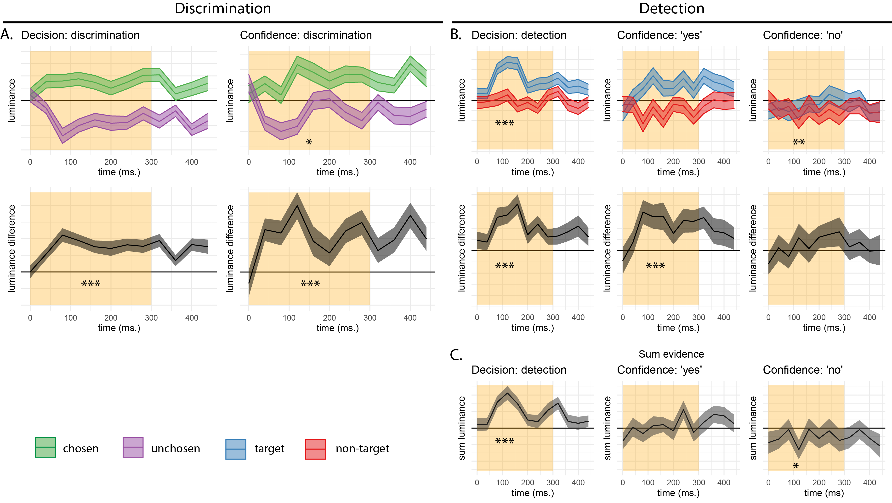

```{r RC_load_pkgs, echo=FALSE, message=FALSE, include=FALSE}
# List of packages required for this analysis
pkg <- c("dplyr", "ggplot2", "knitr", "bookdown")
# Check if packages are not installed and assign the
# names of the packages not installed to the variable new.pkg
new.pkg <- pkg[!(pkg %in% installed.packages())]
# If there are any packages in the list that aren't installed,
# install them
if (length(new.pkg)) {
  install.packages(new.pkg, repos = "https://cran.rstudio.com")
}
# Load packages

library("papaja")
r_refs("r-references.bib")
library('tidyverse')
library('broom')
library('cowplot')
library('MESS') # for AUCs
library('lsr') # for effect sizes
library('pwr') # for power calculations
library('brms') # for mixed effects modeling
library('BayesFactor') # for Bayesian t test
library('jsonlite') #parsing data from sort_trial
library('knitr')
library('egg')
library('zoo') # for rollapply
library('RColorBrewer')
library('reticulate') # for python

```

# Introduction

When considering two alternative hypotheses, the probability of the chosen hypothesis to be correct is not only a function of the availability of evidence for the chosen hypothesis, but also for the unchosen one. For example, when deciding that there are more ants in the kitchen than in the living room, confidence should not only positively weigh the number of ants found in the kitchen (*positive evidence*), but also negatively weigh the number of ants found in the living room (*negative evidence*). However, when rating subjective confidence, subjects place disproportional weight on evidence in favour of their decision, giving rise to a *positive evidence bias* [@zylberberg2012construction; @koizumi2015does; @peters2017perceptual; @sepulveda2020visual; @samaha2020positive; @rollwage2020confidence]. This finding is surprising, especially given reports that subjects weigh positive and negative evidence to similar degrees in making their primary decisions [@zylberberg2012construction; @peters2017perceptual].

Equivalently, confidence ratings in discrimination are sensitive not only to the *relative evidence* of the chosen hypothesis compared with the unchosen one (here, the difference in the number of ants in the kitchen and the living room; also termed *balance of evidence*; see Fig. \@ref(fig:RC-2dmodel), left panel), but also to the *sum evidence* for the two hypotheses [here, the total number of ants found in both rooms; for perceptual decisions, this is often related to *visibility*, @rausch2018confidence]. Positively weighing the sum of positive and negative evidence in rating decision confidence cancels out some of the negative contribution of negative evidence to relative evidence. 

(ref:RC-2dmodel) Discrimination and detection in a two-dimensional Signal Detection Theory model. Left: in a two-dimensional SDT model, evidence $e$ is sampled from one of two Gaussian distributions (here centered at (0,1) and (1,0)). We define relative evidence as $e_{S1}-e_{S2}$ and sum evidence as $e_{S1}+e_{S2}$. Circles represent contours of two-dimensional distributions. Center and Left: response and confidence accuracy are maximized when based on a log-likelihood ratio for the two stimulus categories. Center: in discrimination, this yields optimal decision and confidence criteria that are based on relative evidence (distance from the main diagonal), irrespective of sum evidence. Right: in detection, this yields optimal decision and confidence that are based on a non-linear interaction between relative and sum evidence. The third circle centred at (0,0) represents the two-dimensional distribution of percepts in the absence of stimuli.

```{r RC-2dmodel, echo=FALSE,out.width="\\textwidth",fig.scap="Discrimination and detection in a two-dimensional SDT model", fig.cap="(ref:RC-2dmodel)"}

```


Different models identify the origin of this evidence weighting asymmetry at different levels of the cognitive hierarchy, going from a metacognitive bias to ignore conflicting information (metacognitive level), through asymmetries in the active sampling of evidence (attention allocation level), down to perceptual asymmetries between the representations of signal and noise (perception level). These models vary in whether they postulate separate evidence accumulation processes for decision and confidence judgments, and in whether they model confidence formation as following a suboptimal heuristic, or alternatively as being optimal with respect to available information (information which may be limited or corrupted by noise). 

At the metacognitive level, a positive evidence bias in confidence formation may result from an impoverished readout of sensory evidence by a higher-order metacognitive system. For example, an asymmetry in evidence weighting emerges in certain diffusion models when confidence is judgments are made by a separate metacognitive system, based on the time taken to reach a decision [@zylberberg2012construction]. Other models, inspired by a theoretical account of confirmation bias [@stocker2007bayesian], postulate that ignoring negative evidence may be beneficial if metacognitive judgments, in addition to tracking the probability of being correct, optimize for self-consistency [@peters2017perceptual], or for resource efficiency when dealing with high-dimensional representational spaces [@maniscalco2016heuristic]. 

Alternatively, @sepulveda2020visual propose that a positive evidence bias can emerge from asymmetries in attention allocation: if agents selectively attend to options they are more likely to select (for example, by directing their gaze toward them), confidence judgments will be more sensitive to evidence in support of the selected option. Unlike the above metacognitive models, in this attention-based model confidence judgments reflect full access to the evidence that was used to make the decision, including evidence that does not support the final decision. As a result, the same evidence-weighting asymmetries that appear in confidence judgments should also leave their mark on the decision itself.  

Finally, a third family of models identifies the origin of this bias in the variance structure of perceptual evidence. For example, the probability of being correct is better tracked by positive than negative evidence in a signal-detection model equipped with  realistic assumptions about the sensory encoding of signal and noise [@miyoshi2020decision]. Similarly, reinforcement and deep learning algorithms show a positive evidence bias in measures of confidence when trained on stimuli that are independently degraded by low contrast and random noise [@webb2022natural]. Similar to the attention allocation model from Sepulveda and colleagues, here too confidence and decisions are made based on all available evidence, with the objective function of estimating the probability of being correct, or opting out of a decision when uncertain. Importantly, however, here agents passively perceive the evidence, rather than actively sample it based on their goals. 

To decide between these competing models, here we focus on the predictions they make not only for the effect of sum evidence on confidence in discrimination, but also for discrimination performance, and for detection decisions and confidence where considering sum evidence leads to optimal performance. In what follows, we first show that previous reports of a symmetric wheighting of positive and negative evidence in making perceptual decisions are not informative, as no model makes alternative predictions. Then, we present two Bayes-rational models in which confidence judgments are the probability of a decision to be correct. Both models reproduce a positive evidence bias, but they make different predictions for the effect of sum evidence on discrimination accuracy and detection decisions and confidence. Finally, we compare these predictions to data from four experiments [..]

## Methodological note: positive evidence bias in perceptual decisions

The positive evidence bias in decision confidence is often perceived as particularly striking, given that positive and negative evidence are equally weighted in forming a decision [@zylberberg2012construction; @peters2017perceptual]. For example, using reverse correlation, @zylberberg2012construction showed that momentary fluctuations in the availability of perceptual evidence for and against a decision were equally predictive of the decision itself. Similarly, @peters2017perceptual showed that in classifying rapidly presented images as 'face' or 'house', decisions are not solely guided by positive evidence (e.g., face-related brain activity when deciding 'face'), but also by negative evidence (e.g., house-related brain activity when deciding 'face').

In both of these cases, it is useful to ask what it would look like for an agent to only consider positive evidence in making a decision. This soon becomes circular given that positive and negative evidence are defined with respect to the decision itself. For example, when analyzing the decisions of an agent that consistently ignores evidence for one alternative (for example, who only considers face-evidence when making some decisions, and only considers house-evidence for others), both positive and negative evidence should still be predictive of decisions. The effect of positive evidence is then driven by those trials in which the agent selected the attended alternative, and the effect of negative evidence by those trials in which the agent selected the ignored alternative (because the evidence for the attended alternative was insufficient). Put differently, asymmetries of positive and negative evidence cannot affect the decision itself, because by the time of making the decision there is no positive and negative evidence, but two sources of evidence that may become positive or negative, depending on the decision. 

# Computational models

We focused our modelling attempts on a subset of models in which agents are Bayes-rational in making their decision and in rating their confidence as the probability of being correct. In both models, agents are exposed to samples of evidence that are corrupted by sensory noise. Samples are coordinates in a two dimensional evidence space (evidence for option A against evidence for option B), and agents are presented with 12 such samples per trial, after which they make a decision and rate their confidence. In model 1 (sample dependent noise), agents have full access to sample coordinates. In model 2 (goal dependent attention), agents can only attend to one stimulus dimension per sample. 

Given presented evidence, agents decide on the world state which maximizes the likelihood of observing the evidence: in *Discrimination* blocks, they decide which of the two dimensions was the signal dimension (where samples are distributed $\mathcal{N}(0.5,1)$) and which was the noise dimension (where samples are distributed $\mathcal{N}(0,1)$), and in *Detection* blocks, whether any of the two dimensions had signal, or alternatively, whether both consisted of noise only. After making a decision, agents rate their confidence as the probability of being correct using Bayes rule, and given a uniform prior over the two options. A full specification of all three models is available in the Appendix. 

## Model 1: sample-dependent noise

In this first model, perceptual noise increases with signal intensity. This assumption is biologically plausible: the representation of signal is expected to be inherently more variable due to the Weber-Fechner law [@fechner1860elements] and the coupling between firing rate mean and variability implied by a Poisson form for neuronal firing rates. Identifying the origin of the positive evidence bias at the perceptual level, this model shares family resemblance with the perceptual model of @miyoshi2020decision. However, two important differences are worth pointing out. First, here perceptual noise is conditioned not on stimulus class, but on the perceptual sample. This seems more plausible, as the perceptual system has no access to stimulus class beyond the information that is available in perceptual samples. And second, here we assume that confidence ratings are made based on all available evidence in a Bayes-rational way, rather than following a heuristic.

<!-- ## Model 2: random allocation of attention -->

<!-- In the second model, perceptual noise is not affected by stimulus intensity, and is always sampled from $\mathcal{N}(0,1)$). Here agents can either perceive evidence for A or for B per sample, but never both. They decide whether to sample evidence for A or for B randomly, but incorporate this evidence into their decisions and confidence in a Bayes-optimal way. -->

## Model 2: goal-dependent allocation of attention

In the second model, perceptual noise is not affected by stimulus intensity, and is always sampled from $\mathcal{N}(0,1)$). Here agents can either perceive evidence for A or for B per sample, but never both. The probability of attending to (that is, sampling evidence from) A is a function of the posterior probability that A is the signal channel. Placing the positive evidence bias at the attention-allocation level, this model shares family resemblance with the model of @sepulveda2020visual.


# Experiment 1

## Methods

### Participants

The research complied with all relevant ethical regulations, and was approved by the Research Ethics Committee of University College London (study ID number 1260/003). 10 participants were recruited via the UCL's psychology subject pool, and gave their informed consent prior to their participation. Each participant performed four sessions of 600 trials each, in blocks of 100 trials. Sessions took place on different days and consisted of 3 discrimination blocks interleaved with 3 detection blocks. 

### Experimental procedure

The experimental procedure for Exp. 1 largely followed the procedure described in @zylberberg2012construction, Exp. 1. Participants observed a random-dot kinematogram for a fixed duration of 700 ms. In discrimination trials, the direction of motion was one of two opposite directions with equal probability, and participants reported the observed direction by pressing one of two arrow keys on a standard keyboard. In detection blocks participants reported whether there was coherent motion by pressing one of two arrow keys on a standard keyboard. In half of the detection trials dots moved coherently to one of two opposite directions, and in the other half they moved randomly.

In both detection and discrimination blocks, participants indicated their confidence following each decision. Confidence was reported on a continuous scale ranging from chance to complete certainty. To avoid systematic response biases affecting confidence reports, the orientation (vertical or horizontal) and polarity (e.g., right or left) of the scale was set to agree with the type 1 response. For example, following an up arrow press, a vertical confidence bar was presented where 'guess' is at the center of the screen and 'certain' appeared at the upper end of the scale (see Fig. \@ref(fig:RC-exp1-design)). 

To control for response requirements, for five subjects the dots moved to the right or to the left, and for the other five subjects they moved upward or downward. The first group made discrimination judgments with the right and left keys and detection judgments with the up and down keys, and this mapping was reversed for the second group. The number of coherently moving dots ('motion coherence') was adjusted to maintain performance at around 70% accuracy for detection and discrimination tasks independently. This was achieved by measuring mean accuracy after every 20 trials, and adjusting coherence by a step of 3% if accuracy fell below 60% or went above 80%.

Stimuli for discrimination blocks were generated using the exact same procedure reported in @zylberberg2012construction^[We reused the original Matlab code that was used for Exp. 1 in Zylberberg et. al. (2012), kindly shared by Ariel Zylberberg. ]. Trials started with a presentation of a fixation cross for one second, immediately followed by stimulus presentation. The stimulus consisted of 152 white dots (diameter = $0.14^\circ$), presented within a $6.5^\circ$ circular aperture centered on the fixation point for 700 milliseconds (42 frames, frame rate = 60 Hz). Dots were grouped in two sets of 76 dots each. Every other frame, the dots of one set were replaced with a new set of randomly positioned dots. For each coherence value of $c'$, a proportion of $c'$ of the dots from the second set moved coherently in one direction by a fixed distance of $0.33^\circ$, while the remaining dots in the set moved in random directions by a fixed distance of $0.33^\circ$. On the next update, the sets were switched, to prevent participants from tracing the position of specific dots. Frame-specific coherence values were sampled for each screen update from a normal distribution centred around the coherence value $c$ with a standard deviation of 0.07, with the constraint that $c'$ must be a number between 0 and 1.

Stimuli for detection blocks were generated using a similar procedure, with the only difference being that on a random half of the trials coherence was set to 0%, without random sampling of coherence values for different frames (see Fig. 1). 

To probe global metacognitive estimates of task performance, at the end of each experimental block (100 trials) participants estimated the number of correct responses they have made. Analysis of these global metacognitive estimates is provided in Appendix \@ref(global)


```{r RC-exp1-design, echo=FALSE,out.width="\\textwidth",fig.scap="Experimental design for Exp. 1", fig.cap="Task design for Experiment 1. In both discrimination and detection blocks, participants viewed 700 milliseconds of a random dot motion array, after which they made a keyboard response to indicate their decision (motion direction in discrimination, signal absence or presence in detection), followed by a continuous confidence report using the mouse. 5 participants viewed vertically moving dots and indicated their detection responses on a horizontal scale, and 5 participants viewed horizontally moving dots and indicated their detection responses on a vertical scale. "}
knitr::include_graphics("figures/designExp1.png")
```

### Randomization

The order and timing of experimental events was determined pseudo-randomly by the Mersenne Twister pseudorandom number generator, initialized in a way that ensures registration time-locking [@mazor2019novel]. 

### Analysis

Experiment 1 was pre-registered (pre-registration document is available here: [https://osf.io/z2s93/](https://osf.io/z2s93/)). Our full pre-registered analysis is available in the Appendix. 

<!-- Our pre-registered objectives for this study were to: -->

<!-- 1. Replicate the finding that metacognitive sensitivity for ‘no’ responses is lower than for ‘yes’ responses in detection [@meuwese2014subjective; @kanai2010subjective; @kellij2018foundations], and generalize these findings to a different task (determining whether or not some dots moved coherently in a random dot kinematogram; RDK). -->

<!-- 2. Estimate the goodness of fit of an unequal-variance SDT model to perceptual detection data, and compare it to the fit of models that assume a qualitative difference between confidence in absence and confidence in presence. -->

<!-- 3. Replicate the results of @zylberberg2012construction for perceptual discrimination. Namely, show that confidence in a motion discrimination task is mostly influenced by evidence for the selected direction within a short time window around 300 milliseconds after stimulus onset.  -->

<!-- 4. Test the generality of the results of @zylberberg2012construction to perceptual detection, where, by definition, no evidence can be collected to support a ‘no’ decision. Examine the contribution of signal variance. -->

#### Reverse correlation analysis {-}

For the reverse correlation analysis, we followed a procedure similar to the one described in @zylberberg2012construction. For each of the four directions (right, left, up and down), we applied two spatiotemporal filters to the frames of the dot motion stimuli as described in previous studies [@adelson1985spatiotemporal; @zylberberg2012construction]. The outputs of the two filters were squared and summed, resulting in a three-dimensional matrix with motion energy in a specific direction as a function of x, y, and time. We then took the mean of this matrix across the x and y dimensions to obtain an estimate of the overall temporal fluctuations in motion energy in the selected direction. Using this filter, we obtained estimates of temporal fluctuations in the mean and variance of motion energy for upward, downward, leftward and rightward motion within each trial. Additionally, for every time point we extracted the variance along the x and y dimensions, but given a high correlation between our mean and variance estimates, we focused our analysis on the mean motion energy.

In order to distill random fluctuations in motion energy from mean differences between stimulus categories, we subtracted the mean motion energy from trial-specific motion energy vectors. The mean motion energy vectors were extracted at the group level, separately for each motion coherence level and as a function of motion direction. We chose this approach instead of the linear regression approach used by @zylberberg2012construction in order to control for nonlinear effects of coherence on motion energy.

#### Statistical inference {-}

Statistics were extracted separately for each participant, and group-level inference was then performed on the first-order statistics. T-test Bayes factors were used to quantify the evidence for the null when appropriate, using a Jeffrey-Zellner-Siow Prior for the null distribution, with a unit prior scale [@rouder2009bayesian]. 


## Results


```{r RC-exp1-load-and-format-data, echo=FALSE, cache=TRUE, message=FALSE}

e1=list()

e1$df <- read_csv('../experiments/Experiment1/data/RC.csv', lazy=FALSE) %>%
  group_by(subj_id, detection) %>%
  mutate(confidence=confidence/1000,
         # in the original coding, 3 is right and 1 is left. 
         # changed to be 0 for right/up and 1 for left/down, to align 
         # with the coding of responses.
         direction = ifelse(direction==3,1,0)); 
 
e1$trial_df_unfiltered <- e1$df %>%
  group_by(subj_id, trial_id) %>%
  summarise(
    detection = detection[timepoint==1],
    direction = direction[timepoint==1],
    signal = signal[timepoint==1],
    response = response[timepoint==1],
    RT = RT[timepoint==1]-700, # stimulus duration
    confidence = confidence[timepoint==1],
    correct = correct[timepoint==1],
    trial_number = trial_number[timepoint==1],
    logRT = log(RT[timepoint==1]),
    conf_bi = ifelse(
        response==1, 
        as.numeric(confidence),
        -1*as.numeric(confidence)))%>%
  group_by(subj_id) %>%
  mutate(
    conf_discrete = ntile(confidence,20) %>%
      factor(levels=1:21))

e1$task_stats_unfiltered <- e1$trial_df_unfiltered %>%
  group_by(subj_id,detection) %>%
  summarise(acc=mean(correct),
            RT = median(RT),
            confidence=mean(confidence));

e1$trial_df <- e1$trial_df_unfiltered %>%
  filter(trial_number>300);

e1$detection_df <- e1$trial_df %>%
  filter(detection==1) %>%
  mutate(stimulus=signal);

e1$discrimination_df <- e1$trial_df %>%
  filter(detection==0) %>%
  mutate(stimulus = direction);

```

```{r RC-exp1-general-stats, echo=FALSE, cache=TRUE, message=FALSE}

# get basic stats
generalStats <- function(df) {
  
  stats = list();

  # GENERAL STATS
  stats$general <- df %>%
    group_by(subj_id) %>%
    summarise(
      bias = mean(ifelse(response==1,1,0)),
      acc = mean(ifelse(correct==1,1,0)),
      hit_rate = sum(correct==1 & stimulus==1)/sum(stimulus==1),
      false_alarm_rate=sum(correct==0 & stimulus==0)/sum(stimulus==0),
      dprime=qnorm(hit_rate)-qnorm(false_alarm_rate),
      confidence=mean(confidence),
      )
  
  # STATS AS A FUNCTION OF ACCURACY
  stats$by_acc <-
    df %>%
    group_by(subj_id, correct) %>%
    summarise(
      RT = mean(RT),
      confidence = mean(confidence),
      logRT = mean(logRT)
    )
  
  # STATS PER RESPONSE
  stats$by_response <-
    df %>%
    group_by(subj_id, response) %>%
    summarise(
      cor = cor(x=logRT, y=confidence), #correlation between RT and confidence
      RT = mean(RT),
      logRT = mean(logRT),
      confidence = mean(confidence),
      acc=mean(correct),
      count = n()
    )
  
  # A DIRECT CONTRAST BETWEEN THE TWO RESPONSES
  stats$contrast_responses <-
    stats$by_response %>%
    group_by(subj_id) %>%
    summarise(
      RT=RT[response==1]-RT[response==0], 
      logRT = logRT[response==1]-logRT[response==0],
      confidence=confidence[response==1]-confidence[response==0],
      cor = cor[response==1]-cor[response==0],
      acc = acc[response==1]-acc[response==0])
  
  return(stats)

}

# get stats for both tasks

generalStats2Tasks <- function(e) {
  
  e$detection_stats <- generalStats(e$detection_df);
  
  e$discrimination_stats <- generalStats(e$discrimination_df);
  
  e$task_stats <- rbind(e$detection_stats$general%>%mutate(detection=1),
                        e$discrimination_stats$general%>%mutate(detection=0))
  
  return(e)
}

e1 <- generalStats2Tasks(e1);


# Compare area under the response conditional curve
testAUC <- function(e) {
  
  e$made_errors <- e$trial_df %>%
    group_by(subj_id, detection, response, correct, .drop=FALSE) %>%
    tally() %>% 
    group_by(subj_id) %>%
      summarise(min_per_cell=min(n))%>%
    filter(min_per_cell>1) %>%
    pull(subj_id);

  e$conf_counts <- e$trial_df %>%
    filter(subj_id %in% e$made_errors) %>%
  mutate(subj_id=factor(subj_id)) %>%
  group_by(subj_id, detection, response, correct, confidence, .drop=FALSE) %>%
  tally() %>%
  spread(correct, n, sep='', fill=0) %>%
  arrange(desc(confidence), by_group=TRUE) %>%
  group_by(subj_id, detection, response)%>%
  mutate(cs_correct=cumsum(correct1)/sum(correct1),
         cs_incorrect=cumsum(correct0)/sum(correct0));

e$conf_counts <-e$conf_counts %>%
  group_by(subj_id, detection, response,.drop=TRUE) %>%
  summarise(
    cs_correct=c(0,1),
    cs_incorrect=c(0,1)) %>%
  bind_rows(e$conf_counts,.) %>%
  group_by(subj_id, detection, response,cs_incorrect) %>%
  summarise(cs_correct=max(cs_correct)) %>%
  merge(e$task_stats%>%dplyr::select(subj_id,detection,dprime, hit_rate, false_alarm_rate))%>%
  mutate(miss_rate=1-hit_rate,
         cr_rate=1-false_alarm_rate,
         cs_correct_from_sdt= ifelse(response==1,
           pnorm(qnorm(false_alarm_rate*cs_incorrect), mean=-dprime)/hit_rate,
           pnorm(qnorm(miss_rate*cs_incorrect), mean=-dprime)/cr_rate));

  e$AUC <- e$conf_counts %>%
    group_by(subj_id, detection, response,.drop=TRUE) %>%
    summarise(AUC = auc(cs_incorrect, cs_correct)) %>%
    spread(response, AUC, sep='')%>%
    mutate(metacognitive_asymmetry=(response1-response0),
           average_AUC=response1/2+response0/2);
  
  e$sdtAUC <- e$conf_counts %>%
    group_by(subj_id, detection, response,.drop=TRUE) %>%
    summarise(AUC = auc(cs_incorrect, cs_correct_from_sdt)) %>%
    spread(response, AUC, sep='')%>%
    mutate(metacognitive_asymmetry_from_sdt=(response1-response0))

  e$AUC <- e$AUC %>%
    merge(e$sdtAUC%>%dplyr::select(subj_id,detection,metacognitive_asymmetry_from_sdt)) %>%
            mutate(metacognitive_asymmetry_control = metacognitive_asymmetry-metacognitive_asymmetry_from_sdt)
  
  return(e)

};

e1 <- testAUC(e1);

```

### Response accuracy

Overall proportion correct was `r e1$task_stats_unfiltered%>%filter(detection==0)%>%pull(acc)%>%mean()%>%printnum()` in the discrimination and `r e1$task_stats_unfiltered%>%filter(detection==1)%>%pull(acc)%>%mean()%>%printnum()` in the detection task. Performance for discrimination was significantly higher than for detection (`r t.test(e1$task_stats_unfiltered%>%filter(detection==0)%>%pull(acc), e1$task_stats_unfiltered%>%filter(detection==1)%>%pull(acc), paired=TRUE)%>%apa_print()%>%'$'(full_result)`). This difference in task performance reflected a slower convergence of the staircasing procedure for the discrimination task during the first session. When discarding all data from the first session and analyzing only data from the last three sessions (1800 trials per participant), task performance was equated between the two tasks at the group level (`r t.test(e1$task_stats%>%filter(detection==0)%>%pull(acc), e1$task_stats%>%filter(detection==1)%>%pull(acc), paired=TRUE)%>%apa_print()%>%'$'(full_result)`; `r ttestBF(e1$task_stats%>%filter(detection==0)%>%pull(acc), e1$task_stats%>%filter(detection==1)%>%pull(acc), paired=TRUE)%>%apa_print()%>%'$'(statistic)`).  In order to avoid confounding differences between discrimination and detection decision and confidence profiles with more general task performance effects, the first session was excluded from all subsequent analyses.

### Overall properties of response time and confidence distributions

In detection, participants were more likely to respond 'yes' than 'no' (mean proportion of 'yes' responses: `r t.test(e1$detection_stats$general$bias,mu=0.5)%>%apa_print()%>%'$'(full_result)`). We did not observe a consistent response bias for the discrimination data (mean proportion of 'rightward' or 'upward' responses: `r t.test(e1$discrimination_stats$general$bias,mu=0.5)%>%apa_print()%>%'$'(full_result)`). 

Replicating previous studies [@meuwese2014subjective; @mazor2020distinct; @kellij2021investigation; @mazor2021stage], we find the typical asymmetries between detection 'yes' and 'no' responses in response time, overall confidence, and the alignment between subjective confidence and objective accuracy (also termed metacognitive sensitivity, here measured as the area under the response-conditional type 2 ROC curve; see Fig. \@ref(fig:RC-exp1-asymmetries)). 'No' responses were slower compared to 'yes' responses (median difference: `r e1$detection_stats$contrast_responses%>%pull(RT)%>%median()%>%abs()%>%printnum()` ms), and accompanied by lower levels of subjective confidence (mean difference of `r e1$detection_stats$contrast_responses$confidence%>%mean()%>%printnum()` on a 0-1 scale). Metacognitive sensitivity was higher for detection 'yes' compared with detection 'no' responses (mean difference in area under the curve units: `r e1$AUC%>%filter(detection==1)%>%pull(metacognitive_asymmetry)%>%mean()%>%printnum()`). No difference in response time, confidence, or metacognitive sensitivity was found between the two discrimination responses. For a detailed statistical analysis of these behavioural asymmetries see Appendix \@ref(appRC:asymmetries1).

(ref:exp1-asymmetries) Behavioural asymmetries in metacognitive sensitivity, response time, and overall confidence in detection (upper panel) and discrimination (lower panel), in Exp. 1. Left: Response conditional type 2 ROC curves for the two tasks and four responses in Exp. 1. The area under the type 2 ROC curve is a measure of metacognitive sensitivity, and the difference in areas between the two responses a measure of metacognitive asymmetry. Single-subject curves are presented in low opacity. Right: distributions of the area under the type 2 ROC curve, median response time, and mean confidence for the four responses, across participants. Box edges and central lines represent the 25, 50 and 75 quantiles. Whiskers cover data points within four inter-quartile ranges around the median. Stars represent significance in a two-sided t-test: \*\*: p<0.01, \*\*\*: p<0.001

```{r RC-exp1-asymmetries, echo=FALSE, message=FALSE, fig.cap="(ref:exp1-asymmetries)", fig.scap="Behavioural asymmetries in metacognitive sensitivity, response time, and overall confidence, in Exp. 1"}

detection_colors = c('#377eb8', '#e41a1c');
discrimination_colors = c('#4daf4a','#984ea3')
evidence_colors = c('black','#ebac23')

 plotrcROC = function(df, labels, c, title, AUC, alpha=1) {
   #############################
  
  conf_discrete_counts <- df %>%
  mutate(subj_id=factor(subj_id),
         conf_discrete = conf_discrete%>%
            fct_rev()) %>%
  group_by(subj_id, response, correct, conf_discrete, .drop=FALSE) %>%
  tally() %>%
  spread(correct, n, sep='') %>%
  arrange(conf_discrete, by_group=TRUE) %>%
  group_by(subj_id, response)%>%
  mutate(cs_correct=cumsum(correct1)/sum(correct1),
         cs_incorrect=cumsum(correct0)/sum(correct0))

conf_discrete_counts_group <- conf_discrete_counts %>%
  group_by(response, conf_discrete)%>%
  summarise(conf_incorrect = mean(cs_incorrect, na.rm=TRUE),
            conf_correct = mean(cs_correct, na.rm=TRUE),
            conf_incorrect_sem = se(cs_incorrect, na.rm=TRUE),
            conf_correct_sem  = se(cs_correct, na.rm=TRUE));


rcROC <- ggplot(data=conf_discrete_counts_group %>%
                 mutate(response=ifelse(response==1,labels[1],labels[2]) %>%
                          factor(levels=labels)),
       aes(x=conf_incorrect, y=conf_correct, color=response)) +
  geom_line(size=1.3) +
  geom_point(aes(shape = response))+
  geom_errorbar(aes(ymin = conf_correct-conf_correct_sem,ymax = conf_correct+conf_correct_sem)) +
  geom_errorbar(aes(xmin = conf_incorrect-conf_incorrect_sem,xmax = conf_incorrect+conf_incorrect_sem)) +
  geom_abline(slope=1)+
  theme_bw() + coord_fixed() +
  labs(x='p(conf | incorrect)', y='p(conf | correct)', title=title)+ 
  scale_color_manual(values=c)+
  scale_fill_manual(values=c) +
  geom_rect(aes(xmin=0,xmax=1,ymin=0,ymax=1),size=0.5,color='black',alpha=0)+
  geom_line(data=conf_discrete_counts %>%
              filter(as.integer(subj_id)<20) %>%
              mutate(response=ifelse(response==1,labels[1],labels[2]) %>%
                       factor(levels=labels)),
            aes(x=cs_incorrect,y=cs_correct, group=interaction(subj_id,response), color=response),alpha=0.4) +
  theme(legend.position='none');


AUClong <- AUC %>%
  gather('response','rcAUC',3:4) %>%
  mutate(response=ifelse(response=='response1',labels[1],labels[2])%>%factor(levels=labels),
         'auROC2'=rcAUC);

AUCplot <- ggplot(AUClong, aes(x=response,y=auROC2, color=response)) +
  ylim(0,1)+
  geom_boxplot(size=1,fill='white',outlier.alpha=0)+
  geom_jitter(alpha=0.3,size=2, width=0.3) +
  theme(axis.text.x = element_blank(),
        plot.background = element_rect(
    fill = "white",
    colour = "black",
    size = 1)
    )+ 
  scale_color_manual(values=c)+
  scale_fill_manual(values=c)+
  theme_classic()+
  theme(legend.position='none',
        plot.margin=unit(c(10, 25, 15, 25),'pt'),
        axis.title.y=element_blank(),
        axis.title.x=element_blank())+
  coord_flip()+
  labs(title='auROC2',x='');

return(list('rcROC'=rcROC, 'AUC'=AUCplot))

 }
 
 plotAllAsymmetries <- function(experiment, filename) {

  subj_df <- experiment$df %>% 
    group_by(subj_id,detection,response) %>%
    summarise(confidence=mean(confidence),
              RT=median(RT));
  
  DetRTplot <- ggplot(subj_df %>%
                        filter(detection==1) %>%
                        mutate(response=factor(response,levels=c(1,0),
                                               labels=c('yes','no'))),
                      aes(x=response,y=RT,group=response,fill=response,color=response)) +
        ylim(0,2500)+
        geom_boxplot(size=1,fill='white',outlier.alpha=0)+
        geom_jitter(alpha=0.3,size=2, width=0.3) +
  theme(axis.text.x = element_blank(),
        plot.background = element_rect(
    fill = "white",
    colour = "black",
    size = 1)
    )+ 
  scale_color_manual(values=detection_colors)+
  scale_fill_manual(values=detection_colors)+
  theme_classic()+
  theme(legend.position='none',
        plot.margin=unit(c(10, 25, 15, 25),'pt'),
        axis.title.y=element_blank(),
        axis.title.x=element_blank())+
  coord_flip()+
    labs(title='RT (ms)');
  
  Detconfplot <- ggplot(subj_df %>%
                        filter(detection==1) %>%
                        mutate(response=factor(response,levels=c(1,0),
                                               labels=c('yes','no'))),
                      aes(x=response,y=confidence,group=response,fill=response,color=response)) +
        ylim(0,1)+
        geom_boxplot(size=1,fill='white',outlier.alpha=0)+
        geom_jitter(alpha=0.3,size=2, width=0.3) +
  theme(axis.text.x = element_blank(),
        plot.background = element_rect(
    fill = "white",
    colour = "black",
    size = 1)
    )+ 
  scale_color_manual(values=detection_colors)+
  scale_fill_manual(values=detection_colors)+
  theme_classic()+
  theme(legend.position='none',
        plot.margin=unit(c(10, 25, 15, 25),'pt'),
        axis.title.y=element_blank(),
        axis.title.x=element_blank())+
  coord_flip()+
    labs(title='confidence');
  
  DisRTplot <- ggplot(subj_df %>%
                        filter(detection==0) %>%
                        mutate(response=factor(response,levels=c(1,0),
                                               labels=c('S1','S2'))),
                      aes(x=response,y=RT,group=response,fill=response,color=response)) +
        ylim(0,2500)+
        geom_boxplot(size=1,fill='white',outlier.alpha=0)+
        geom_jitter(alpha=0.3,size=2, width=0.3) +
  theme(axis.text.x = element_blank(),
        plot.background = element_rect(
    fill = "white",
    colour = "black",
    size = 1)
    )+ 
  scale_color_manual(values=discrimination_colors)+
  scale_fill_manual(values=discrimination_colors)+
  theme_classic()+
  theme(legend.position='none',
        plot.margin=unit(c(10, 25, 15, 25),'pt'),
        axis.title.y=element_blank(),
        axis.title.x=element_blank())+
  coord_flip()+
  labs(title='RT (ms)');
  
  Disconfplot <- ggplot(subj_df %>%
                        filter(detection==0) %>%
                        mutate(response=factor(response,levels=c(1,0),
                                               labels=c('S1','S2'))),
                      aes(x=response,y=confidence,group=response,fill=response,color=response)) +
        geom_boxplot(size=1,fill='white',outlier.alpha=0)+
        geom_jitter(alpha=0.3,size=2, width=0.3) +
  theme(axis.text.x = element_blank(),
        plot.background = element_rect(
    fill = "white",
    colour = "black",
    size = 1)
    )+ 
  scale_color_manual(values=discrimination_colors)+
  scale_fill_manual(values=discrimination_colors)+
  theme_classic()+
  theme(legend.position='none',
        plot.margin=unit(c(10, 25, 15, 25),'pt'),
        axis.title.y=element_blank(),
        axis.title.x=element_blank())+
  coord_flip()+
    labs(title='confidence');
  
  DetROCplot <- plotrcROC(experiment$detection_df, 
                 c('yes','no'), 
                 detection_colors, 
                 title='Detection', 
                 experiment$AUC%>%filter(detection==1));
  
  DisROCplot <- plotrcROC(experiment$discrimination_df, 
                 c('S1','S2'), 
                 discrimination_colors, 
                 title='Discrimination', 
                 experiment$AUC%>%filter(detection==0));

p <- grid.arrange(DetROCplot$rcROC,DisROCplot$rcROC,DetROCplot$AUC,DisROCplot$AUC,DetRTplot,DisRTplot,Detconfplot,Disconfplot,layout_matrix=rbind(c(1,1,1,3,3,3),c(1,1,1,5,5,5),c(1,1,1,7,7,7),c(2,2,2,4,4,4),c(2,2,2,6,6,6),c(2,2,2,8,8,8)))
ggsave(filename,p,width=8,height=8,dpi=300) 

}

# plotAllAsymmetries(e1,'figures/RC-exp1-asymmetries.pdf');

```

<!-- #### zROC curves -->

```{r RC-exp1-zROC, echo=FALSE}

testzROC <- function(df) {
  
  conf_bi_counts <- df %>%
     mutate(subj_id=factor(subj_id)) %>%
      group_by(subj_id, stimulus, conf_bi, .drop=FALSE) %>%
      tally() %>%
      spread(stimulus, n, sep='', fill=0) %>%
      arrange(desc(conf_bi), by_group=TRUE) %>%
      mutate(cs_1=cumsum(stimulus1)/sum(stimulus1),
             cs_0=cumsum(stimulus0)/sum(stimulus0)) %>%
     filter(cs_1 >0 & cs_1<1 & cs_0>0 & cs_0<1) %>% 
    mutate(z_1 = qnorm(cs_1),
           z_0 = qnorm(cs_0)) %>%
    ungroup()
  
    zROC_slopes1 <- conf_bi_counts %>%
      group_by(subj_id) %>%
      do(model=lm(z_1~z_0,data=.)) %>%
      mutate(tidys=list(broom::tidy(model))) %>%
      unnest(tidys) %>%
      filter(term=='z_0')%>%
      mutate(slope1=estimate)%>%
      dplyr::select('subj_id','slope1') %>%
      drop_na();
    
    # To control for regression to the mean, fit the opposite model and average the two slopes
    # (see Wickens, p. 56)
    zROC_slopes2 <- conf_bi_counts %>%
      group_by(subj_id) %>%
      do(model=lm(z_0~z_1,data=.)) %>%
      mutate(tidys=list(broom::tidy(model))) %>%
      unnest(tidys) %>%
      filter(term=='z_1')%>%
      mutate(slope2=1/estimate)%>%
      dplyr::select('subj_id','slope2') %>%
      drop_na();
      
   zROC_fit <- conf_bi_counts %>%
          group_by(subj_id) %>%
          do(glance(lm(z_1~z_0,data=.))) %>%
          dplyr::select(subj_id,r.squared);
    
   zROC_slopes <- merge(
      zROC_slopes1 %>%
        dplyr::select(subj_id, slope1),
     zROC_slopes2 %>%
        dplyr::select(subj_id, slope2),
    ) %>%
      merge(zROC_fit) %>%
      rowwise()%>%
      mutate(
        logslope = log(slope1)/2+log(slope2)/2
    )
    
  return(zROC_slopes)
}

testzROC2tasks <- function(e) {
  
  e$detection_zROC<- testzROC(e$detection_df);
  
  e$discrimination_zROC <- testzROC(e$discrimination_df);
  
  return(e)
}

e1 <- testzROC2tasks(e1);

```


### Reverse Correlation

Random fluctuations in motion energy made it possible to apply reverse correlation to test which stimulus features are incorporated into decisions and confidence ratings in detection and discrimination. Following @zylberberg2012construction, our statistical analysis focused on the first 300 milliseconds after stimulus onset.

(ref:RC-exp1-RC) Reverse correlation, Exp. 1. A: Decision and confidence discrimination kernels. Upper left: motion energy in the chosen (green) and unchosen (purple) direction as a function of time. Lower left: a subtraction between energy in the chosen and unchosen directions. Upper right: confidence effects for motion energy in the chosen (green) and unchosen (purple) directions. Lower right: a subtraction between confidence effects in the chosen and unchosen directions. B: Decision and confidence detection kernels in signal trials. Upper left: difference in motion energy between 'yes' and 'no' responses in the true (blue) and opposite (red) directions as a function of time. Upper middle and right: confidence effects for motion energy in the true and opposite directions for 'yes' and 'no' responses, respectively. Lower panels: the subtraction of decision and confidence kernels for the true and opposite directions. C: Decision and confidence detection kernels. Left: difference in sum motion energy between detection 'yes' and 'no' responses. Middle and right: difference in sum motion energy between high and low confidence trials in 'yes' and 'no' responses. Shaded areas represent the mean $\pm$ one standard error. The first 300 milliseconds of the trial are marked in yellow. Stars represent significance in a two-sided t-test: \*: p<0.05, \*\*: p<0.01, \*\*\*: p<0.001. In the upper rows of panels A and B, stars represent the significance of a positive evidence bias in evidence weighting.

```{r RC-exp1-RC, echo=FALSE,out.width="\\textwidth",fig.scap="Discrimination and detection in a two-dimensional SDT model", fig.cap="(ref:RC-exp1-RC)"}

```

#### Discrimination {#e1-disc-RC -}


<!-- (ref:exp1-discrimination) Decision and confidence discrimination kernels, Experiment 1. Upper left: motion energy in the chosen (green) and unchosen (purple) direction as a function of time. Lower left: a subtraction between energy in the chosen and unchosen directions. Upper right: confidence effects for motion energy in the chosen (green) and unchosen (purple) directions. Lower right: a subtraction between confidence effects in the chosen and unchosen directions. Shaded areas represent the the mean +- one standard error. The first 300 milliseconds of the trial are marked in yellow. Stars represent significance in a two-sided t-test: \*: p<0.05, \*\*: p<0.01, \*\*\*: p<0.001. In the upper row, stars represent the significance of a positive evidence bias in evidence weighting. -->

```{r RC-exp1-discrimination-RC, echo=FALSE, message=FALSE, warning=FALSE, fig.cap="(ref:exp1-discrimination)", fig.scap="Reverse correlation of discrimination trials, Exp. 1"}

e1$discRCdf <- e1$df %>%
  filter(detection==0 & 
         trial_number>300) %>%
  mutate(energyChosen = ifelse(response==1, 
                               energyLeft, 
                               energyRight),
         energyUnchosen = ifelse(response==1, 
                                 energyRight,
                                 energyLeft),
         energyTrue = ifelse(direction==1, 
                               energyLeft, 
                               energyRight),
         energyOpposite = ifelse(direction==1, 
                                 energyRight,
                                 energyLeft)) %>%
  dplyr::select(subj_id,timepoint,energyChosen,energyUnchosen, energyTrue, energyOpposite, confidence, trial_number, correct) %>%
  gather('direction','energy',4:7) %>%
  mutate(direction=ifelse(direction=='energyChosen',
                          'chosen',
                          ifelse(direction=='energyUnchosen',
                                 'unchosen',
                                 ifelse(direction=='energyTrue',
                                        'true',
                                        'opposite'))),
         session = round(trial_number/300)) %>%
  group_by(subj_id, session) %>%
  mutate(median_confidence=median(confidence)) %>%
  ungroup() %>%
  mutate(
    binaryconf = ifelse(confidence>=median_confidence, 1, 0)
  );

  e1$discrimination_accuracy_kernel <- e1$discRCdf %>%
    filter(direction=='true' | direction=='opposite') %>%
    group_by (subj_id,direction,timepoint,correct) %>%
    summarise(energy=mean(energy)) %>%
    group_by (subj_id,direction,timepoint) %>%
    summarise(energy=energy[correct==1]-energy[correct==0])%>%
    group_by(subj_id, direction)%>%
    arrange(timepoint) %>%
    mutate(sm_energy=rollapply(energy,5,mean,align='right',fill=NA),
           time=(timepoint-4)/60*1000)


      
e1$disc_acc_plot <- ggplot(
  data= e1$discrimination_accuracy_kernel %>%
    group_by(time,subj_id) %>%
    summarise(relative_evidence=sm_energy[direction=='true']-sm_energy[direction=='opposite'],
              sum_evidence = sm_energy[direction=='true']+sm_energy[direction=='opposite'])%>%
    pivot_longer(cols = ends_with('evidence'), names_to = 'contrast', values_to = 'evidence') %>%
    group_by(time,contrast) %>%
    summarise(se=se(evidence),
              evidence=mean(evidence)),
  aes(x=time,y=evidence, color=contrast, fill=contrast)) +
  geom_hline(yintercept=0) +
  annotate(geom = "rect", xmin=0, xmax=300, ymin=-1200,ymax=-1000, 
           color="transparent", fill="black", alpha=1) +
  geom_line() +
  geom_ribbon(aes(ymin = evidence-se, ymax = evidence+se),alpha=0.5) +
  theme_minimal()+
  scale_fill_manual(values=evidence_colors) + 
  scale_color_manual(values=evidence_colors) +
  scale_y_continuous(limits = c(-8000,8000))+
  scale_x_continuous(limits = c(0,700))+
  theme(
    axis.text.y=element_blank(),
    axis.ticks.y=element_blank(),
    legend.position = 'na') +
  labs(title='',
       y='contrast', 
       x='time (ms.)');

ggsave('./figures/RC/exp1/accuracy.png',width=3.5,height=3)

e1$discrimination_confidence_kernel <-  e1$discRCdf %>%
  filter(direction=='chosen' | direction=='unchosen') %>%
    group_by (subj_id,direction, binaryconf, timepoint) %>%
    summarise(energy=mean(energy)) %>%
    group_by(subj_id, direction, timepoint) %>%
    mutate(conf_effect = energy[binaryconf==1]-energy[binaryconf==0]) %>%
    group_by(subj_id, direction) %>%
    arrange(timepoint) %>%
    mutate(sm_energy=rollapply(conf_effect,5,mean,align='right',fill=NA),
           time=(timepoint-4)/60*1000)

e1$disc_conf_plot <- ggplot(
  data = e1$discrimination_confidence_kernel  %>%
    group_by(direction,time) %>%
    summarise(se=se(sm_energy),
              energy=mean(sm_energy)),
  aes(x=time,y=energy,color=direction)) +
  geom_hline(yintercept=0)  +
  annotate(geom = "rect", xmin=0, xmax=300, ymin=-1200,ymax=-1000, 
           color="transparent", fill="black", alpha=1) +
  geom_line() +
  geom_ribbon(aes(ymin = energy-se, ymax = energy+se, fill=direction),alpha=0.5) +
  scale_color_manual(values=discrimination_colors)+
  scale_fill_manual(values=discrimination_colors) + 
  scale_y_continuous(limits = c(-8000,8000)) +
  scale_x_continuous(limits = c(0,700)) +
  theme_minimal()+theme(
    axis.text.y=element_blank(),
    axis.ticks.y=element_blank(),
    axis.text.x=element_blank(),
    axis.ticks.x=element_blank(),
    axis.title.x=element_blank()) +
  labs(y='energy', 
       x='time (ms.)')+
  theme(legend.position = 'na');

ggsave('./figures/RC/exp1/confidence.png',width=3.5,height=3)

e1$disc_conf_sum_rel_plot <- ggplot(
  data= e1$discrimination_confidence_kernel %>%
    group_by(time,subj_id) %>%
    summarise(relative_evidence=sm_energy[direction=='chosen']-sm_energy[direction=='unchosen'],
              sum_evidence = sm_energy[direction=='chosen']+sm_energy[direction=='unchosen'])%>%
    pivot_longer(cols = ends_with('evidence'), names_to = 'contrast', values_to = 'evidence') %>%
    group_by(time,contrast) %>%
    summarise(se=se(evidence),
              evidence=mean(evidence)),
  aes(x=time,y=evidence, color=contrast, fill=contrast)) +
  geom_hline(yintercept=0) +
  annotate(geom = "rect", xmin=0, xmax=300, ymin=-1200,ymax=-1000, 
           color="transparent", fill="black", alpha=1) +
  geom_line() +
  geom_ribbon(aes(ymin = evidence-se, ymax = evidence+se),alpha=0.5) +
  theme_minimal()+
  scale_fill_manual(values=evidence_colors) + 
  scale_color_manual(values=evidence_colors) +
  scale_y_continuous(limits = c(-8000,8000)) +
  scale_x_continuous(limits = c(0,700)) +
  theme(
    axis.text.y=element_blank(),
    axis.ticks.y=element_blank(),
    legend.position = 'na') +
  labs(title='',
       y='contrast', 
       x='time (ms.)');

ggsave('./figures/RC/exp1/confidence_sum_rel.png',width=3.5,height=3)


e1$RC = list();


e1$RC$accuracy_rel300 <- e1$discrimination_accuracy_kernel %>%
  filter(timepoint>4 & timepoint<22) %>%
  group_by(subj_id,timepoint) %>%
  summarise(diff=sm_energy[direction=='true']-sm_energy[direction=='opposite']) %>% 
  group_by(subj_id) %>%
  summarise(diff=mean(diff));

e1$RC$accuracy_sum300 <- e1$discrimination_accuracy_kernel %>%
  filter(timepoint>4 & timepoint<22) %>%
  group_by(subj_id,timepoint) %>%
  summarise(diff=sm_energy[direction=='true']+sm_energy[direction=='opposite']) %>% 
  group_by(subj_id) %>%
  summarise(diff=mean(diff));

e1$RC$confidence_pos300 <- e1$discrimination_confidence_kernel %>%
  filter(timepoint>4 & timepoint<22) %>%
  group_by(subj_id,timepoint) %>%
  summarise(diff=sm_energy[direction=='chosen']) %>% 
  group_by(subj_id) %>%
  summarise(diff=mean(diff));

e1$RC$confidence_neg300 <- e1$discrimination_confidence_kernel %>%
  filter(timepoint>4 & timepoint<22) %>%
  group_by(subj_id,timepoint) %>%
  summarise(diff=sm_energy[direction=='unchosen']) %>% 
  group_by(subj_id) %>%
  summarise(diff=mean(diff));

e1$RC$confidence_rel300 <- e1$discrimination_confidence_kernel %>%
  filter(timepoint>4 & timepoint<22) %>%
  group_by(subj_id,timepoint) %>%
  summarise(diff=sm_energy[direction=='chosen']-sm_energy[direction=='unchosen']) %>% 
  group_by(subj_id) %>%
  summarise(diff=mean(diff));

e1$RC$confidence_sum300 <- e1$discrimination_confidence_kernel %>%
  filter(timepoint>4 & timepoint<22) %>%
  group_by(subj_id,timepoint) %>%
  summarise(diff=sm_energy[direction=='chosen']+sm_energy[direction=='unchosen']) %>% 
  group_by(subj_id) %>%
  summarise(diff=mean(diff));


```

Using reverse correlation analysis we quantified the effect of random fluctuations in motion energy on the probability of responding 'right' and 'left' (or 'up' and 'down'), and on the temporal dynamics of decision formation. Following @zylberberg2012construction, we focused our analysis on the first 300 ms of the trial. Participants' discrimination accuracy was significantly affected by the relative evidence for the true direction of motion compared to the opposite direction (`r e1$RC$accuracy_rel300%>%pull(diff)%>%t.test()%>%apa_print()%>%'$'(statistic)`). Sum evidence had no effect on discrimination accuracy (`r e1$RC$accuracy_sum300%>%pull(diff)%>%t.test()%>%apa_print()%>%'$'(statistic)`; see Fig. \@ref(fig:RC-exp1-RC)A). 
We then turned to the contribution of motion energy to subjective confidence ratings. The median confidence rating in each experimental session was used to split all motion energy vectors into four groups, according to decision (chosen or unchosen directions) and confidence level (high or low). Confidence kernels for the chosen and unchosen directions were then extracted by subtracting the mean low confidence vectors from the mean high confidence vectors for both the chosen and unchosen directions. Motion energy in the chosen direction (positive evidence) significantly increased confidence (`r e1$RC$confidence_pos300%>%t.test()%>%apa_print()%>%'$'(statistic)`), but we found no significant decrease in confidence with stronger motion energy in the opposite direction (negative evidence; `r e1$RC$confidence_neg300%>%t.test()%>%apa_print()%>%'$'(statistic)`; see Fig. \@ref(fig:RC-exp1-RC)B). Equivalently, both relative and sum evidence positively contributed to decision confidence (relative evidence: `r e1$RC$confidence_rel300%>%t.test()%>%apa_print()%>%'$'(statistic)`; sum evidence: `r e1$RC$confidence_sum300%>%t.test()%>%apa_print()%>%'$'(statistic)`; see Fig. \@ref(fig:RC-exp1-RC)C). This is a replication of the Positive Evidence Bias observed in @zylberberg2012construction.  


```{r RC-exp1-detection-RC, echo=FALSE, message=FALSE, warning=FALSE}

e1$detRCdf <- e1$df %>%
  filter(detection==1 & 
           trial_number>300) %>%
  mutate(totalEnergy = energyLeft+energyRight) %>%
  dplyr::select(subj_id, timepoint, response, totalEnergy, confidence, trial_number, signal) %>%
  mutate(session = round(trial_number/300)) %>%
  group_by(subj_id, session) %>%
  mutate(median_confidence=median(confidence)) %>%
  ungroup() %>%
  mutate(
    binaryconf = ifelse(confidence>=median_confidence, 1, 0)
  );

## to make sure that we are not measuring some artefact of signal vs. noise trials
e1$detection_signal_kernel <- e1$detRCdf %>%
group_by (subj_id,signal,timepoint) %>%
summarise(totalEnergy=mean(totalEnergy)) %>%
group_by(subj_id, signal)%>%
arrange(timepoint) %>%
mutate(sm_energy=rollapply(totalEnergy,5,mean,align='right',fill=NA),
       time=(timepoint-4)/60*1000);

e1$detection_response_kernel <- e1$detRCdf %>%
group_by (subj_id,response,timepoint) %>%
summarise(totalEnergy=mean(totalEnergy)) %>%
group_by(subj_id, response)%>%
arrange(timepoint) %>%
mutate(sm_energy=rollapply(totalEnergy,5,mean,align='right',fill=NA),
       time=(timepoint-4)/60*1000);


e1$detection_confidence_kernel <- e1$detRCdf %>%
group_by (subj_id,response,binaryconf,timepoint) %>%
summarise(totalEnergy=mean(totalEnergy)) %>%
group_by(subj_id, response, timepoint)%>%
summarise(diff=totalEnergy[binaryconf==1]-totalEnergy[binaryconf==0])%>%
arrange(timepoint) %>%
mutate(sm_energy=rollapply(diff,5,mean,align='right',fill=NA),
       time=(timepoint-4)/60*1000);

e1$RC$detectionDecision300 <- e1$detection_response_kernel %>%
filter(timepoint>4 & timepoint<22) %>%
group_by(subj_id,timepoint) %>%
mutate(energy=sm_energy[response==1]-sm_energy[response==0]) %>%
group_by(subj_id) %>%
summarise(energy=mean(energy));

e1$RC$detectionConfidence300 <- e1$detection_confidence_kernel %>%
filter(timepoint>4 & timepoint<22) %>%
group_by(subj_id,timepoint) %>%
mutate(energy=sm_energy[response==1]-sm_energy[response==0]) %>%
group_by(subj_id) %>%
summarise(energy=mean(energy));

e1$RC$detectionConfidence300_by_resp <- e1$detection_confidence_kernel %>%
filter(timepoint>4 & timepoint<22) %>%
group_by(subj_id, response) %>%
summarise(energy=mean(sm_energy)) %>%
  spread(response,energy,sep='');

e1$RC$detectionPEB300 <- e1$detection_confidence_kernel %>%
  filter(timepoint>4 & timepoint<22) %>%
  group_by(subj_id,timepoint) %>%
  summarise(diff=sm_energy[response==1]+sm_energy[response==0]) %>% 
  group_by(subj_id) %>%
  summarise(diff=mean(diff));
      

```

#### Detection {-}

Carrying out an analogous reverse correlation analysis for detection introduces a challenge: while 'no' responses reflect a belief in the absence of any coherent motion, 'yes' responses can result from detection of any type of coherent motion going in either direction (or both). We chose to have two possible motion directions in the detection task in order to prevent participants from making 'no' responses based on significant motion in an unexpected direction. While this choice ensured that participants cannot trivially accumulate evidence for absence, it also made the reverse correlation analysis more difficult, as we did not have full access to participants' beliefs about the stimulus when they responded 'yes'. 


```{r RC-exp1-signal, echo=FALSE, message=FALSE, warning=FALSE}
e1$signalRCdf <- e1$df %>%
  filter(detection==1 & 
           signal==1 &
           trial_number>300) %>%
  mutate(energyTrue= ifelse(direction==1,
                            energyLeft,
                            energyRight),
         energyOpposite=ifelse(direction==1,
                               energyRight,
                               energyLeft))%>%
  pivot_longer(starts_with('energy'),names_to='motionDirection',values_to='energy')%>%
  dplyr::select(subj_id, timepoint, response, motionDirection, energy, confidence, trial_number) %>%
  mutate(session = round(trial_number/300)) %>%
  group_by(subj_id, session, response) %>%
  mutate(median_confidence=median(confidence)) %>%
  ungroup() %>%
  mutate(
    binaryconf = ifelse(confidence>=median_confidence, 1, 0)
  ) %>%
  filter(motionDirection=='energyTrue' | motionDirection=='energyOpposite')%>%
  mutate(motionDirection=factor(ifelse(motionDirection=='energyTrue','true','opposite'),
                                levels=c('true', 'opposite')));

e1$signal_decision_kernel <- e1$signalRCdf %>%
group_by (subj_id,response,timepoint,motionDirection) %>%
summarise(energy=mean(energy)) %>%
group_by (subj_id,timepoint,motionDirection) %>%
summarise(energy=energy[response==1]-energy[response==0])%>%
group_by(subj_id,motionDirection) %>%
arrange(timepoint) %>%
mutate(sm_energy=rollapply(energy,5,mean,align='right',fill=NA),
       time=(timepoint-4)/60*1000);

e1$signal_decision_sum_rel_kernel <- e1$signalRCdf %>%
group_by (subj_id,response,timepoint,motionDirection) %>%
summarise(energy=mean(energy)) %>%
group_by (subj_id,timepoint,motionDirection) %>%
summarise(energy=energy[response==1]-energy[response==0])%>%
group_by(subj_id,timepoint)%>%
summarise(relative_evidence = energy[motionDirection=='true']-energy[motionDirection=='opposite'],
          sum_evidence = energy[motionDirection=='true']+energy[motionDirection=='opposite'])%>%
pivot_longer(cols = ends_with('evidence'), names_to='contrast',values_to='energy')%>%
group_by(subj_id,contrast) %>%
arrange(timepoint) %>%
mutate(sm_energy=rollapply(energy,5,mean,align='right',fill=NA),
       time=(timepoint-4)/60*1000);


e1$signal_confidence_kernel <- e1$signalRCdf %>%
group_by (subj_id,response,binaryconf,timepoint, motionDirection) %>%
summarise(energy=mean(energy)) %>%
group_by(subj_id, response, timepoint, motionDirection)%>%
summarise(diff=energy[binaryconf==1]-energy[binaryconf==0])%>%
group_by(subj_id,motionDirection,response)%>%
arrange(timepoint) %>%
mutate(sm_energy=rollapply(diff,5,mean,align='right',fill=NA),
       time=(timepoint-4)/60*1000);

e1$signal_confidence_sum_rel_kernel <- e1$signalRCdf %>%
group_by (subj_id,response,binaryconf,timepoint, motionDirection) %>%
summarise(energy=mean(energy)) %>%
group_by(subj_id, response, timepoint, motionDirection)%>%
summarise(diff=energy[binaryconf==1]-energy[binaryconf==0])%>%
group_by(subj_id,timepoint, response)%>%
summarise(relative_evidence = diff[motionDirection=='true']-diff[motionDirection=='opposite'],
          sum_evidence = diff[motionDirection=='true']+diff[motionDirection=='opposite'])%>%
pivot_longer(cols = ends_with('evidence'), names_to='contrast',values_to='energy')%>%
group_by(subj_id,contrast,response)%>%
arrange(timepoint) %>%
mutate(sm_energy=rollapply(energy,5,mean,align='right',fill=NA),
       time=(timepoint-4)/60*1000);

e1$det_decision_plot <- ggplot(e1$signal_decision_kernel%>%
    group_by(motionDirection,time) %>%
    summarise(se=se(sm_energy),
              energy=mean(sm_energy)),
    aes(x=time,y=energy,color=motionDirection)) +
  geom_hline(yintercept=0) +
  annotate(geom = "rect", xmin=0, xmax=300, ymin=-60,ymax=60, 
           color="transparent", fill="black", alpha=1) +
  geom_line() +
  annotate(geom = "rect", xmin=0, xmax=300, ymin=-1200,ymax=-1000, 
           color="transparent", fill="black", alpha=1) +
  geom_ribbon(aes(ymin = energy-se, ymax = energy+se, fill=motionDirection),alpha=0.5) +
  scale_color_manual(values=detection_colors)+
  scale_fill_manual(values=detection_colors) +
  scale_x_continuous(limits = c(0,700)) +
  scale_y_continuous(limits = c(-8000,8000))+
  theme_minimal()+theme(
    axis.text.y=element_blank(),
    axis.ticks.y=element_blank()) +
  labs(y='energy', 
       x='time (ms.)')+
  theme(legend.position = 'none');

ggsave('./figures/RC/exp1/detection_decision.png',width=3.5,height=3)

e1$det_decision_sum_rel_plot <- ggplot(e1$signal_decision_sum_rel_kernel%>%
    group_by(contrast,time) %>%
    summarise(se=se(sm_energy),
              energy=mean(sm_energy)),
    aes(x=time,y=energy,color=contrast)) +
  geom_hline(yintercept=0) +
  annotate(geom = "rect", xmin=0, xmax=300, ymin=-1200,ymax=-1000, 
           color="transparent", fill="black", alpha=1) +
  annotate(geom = "rect", xmin=0, xmax=300, ymin=-60,ymax=60, 
           color="transparent", fill="black", alpha=1) +
  geom_line() +
  geom_ribbon(aes(ymin = energy-se, ymax = energy+se, fill=contrast),alpha=0.5) +
  scale_color_manual(values=evidence_colors)+
  scale_fill_manual(values=evidence_colors) +
  scale_x_continuous(limits = c(0,700)) +
  scale_y_continuous(limits = c(-8000,8000))+
  theme_minimal()+theme(
    axis.text.y=element_blank(),
    axis.ticks.y=element_blank()) +
  labs(y='contrast', 
       x='time (ms.)')+
  theme(legend.position = 'none');

ggsave('./figures/RC/exp1/detection_decision_sum_rel.png',width=3.5,height=3)


e1$conf_yes_plot <- ggplot(e1$signal_confidence_kernel%>%
               filter(response==1)%>%
    group_by(motionDirection,time) %>%
    summarise(se=se(sm_energy),
              energy=mean(sm_energy)),
    aes(x=time,y=energy,color=motionDirection)) +
  geom_hline(yintercept=0) +
  annotate(geom = "rect", xmin=0, xmax=300, ymin=-1200,ymax=-1000, 
           color="transparent", fill="black", alpha=1) +
  geom_line() +
  geom_ribbon(aes(ymin = energy-se, ymax = energy+se, fill=motionDirection),alpha=0.5) +
  scale_color_manual(values=detection_colors)+
  scale_fill_manual(values=detection_colors) + 
  scale_x_continuous(limits = c(0,700)) +
  scale_y_continuous(limits = c(-8000,8000))+
  theme_minimal()+theme(
    axis.text.y=element_blank(),
    axis.ticks.y=element_blank()) +
  labs(y='energy', 
       x='time (ms.)')+
  theme(legend.position = 'none');

ggsave('./figures/RC/exp1/detection_conf_yes.png',width=3.5,height=3)

e1$conf_yes_sum_rel_plot <- ggplot(e1$signal_confidence_sum_rel_kernel%>%
    filter(response==1)%>%
    group_by(contrast,time) %>%
    summarise(se=se(sm_energy),
              energy=mean(sm_energy)),
    aes(x=time,y=energy,color=contrast)) +
  geom_hline(yintercept=0) +
  annotate(geom = "rect", xmin=0, xmax=300, ymin=-1200,ymax=-1000, 
           color="transparent", fill="black", alpha=1) +
  geom_line() +
  geom_ribbon(aes(ymin = energy-se, ymax = energy+se, fill=contrast),alpha=0.5) +
  scale_color_manual(values=evidence_colors)+
  scale_fill_manual(values=evidence_colors) +
  scale_x_continuous(limits = c(0,700)) +
  scale_y_continuous(limits = c(-8000,8000))+
  theme_minimal()+theme(
    axis.text.y=element_blank(),
    axis.ticks.y=element_blank()) +
  labs(y='contrast', 
       x='time (ms.)')+
  theme(legend.position = 'none');

ggsave('./figures/RC/exp1/detection_conf_yes_sum_rel.png',width=3.5,height=3)

e1$conf_no_plot <- ggplot(e1$signal_confidence_kernel%>%
               filter(response==0)%>%
    group_by(motionDirection,time) %>%
    summarise(se=se(sm_energy),
              energy=mean(sm_energy)),
    aes(x=time,y=energy,color=motionDirection)) +
  geom_hline(yintercept=0) +
  annotate(geom = "rect", xmin=0, xmax=300, ymin=-1200,ymax=-1000, 
           color="transparent", fill="black", alpha=1) +
  geom_line() +
  geom_ribbon(aes(ymin = energy-se, ymax = energy+se, fill=motionDirection),alpha=0.5) +
  scale_color_manual(values=detection_colors)+
  scale_fill_manual(values=detection_colors) + 
  scale_x_continuous(limits = c(0,700)) +
  scale_y_continuous(limits = c(-8000,8000))+
  theme_minimal()+theme(
    axis.text.y=element_blank(),
    axis.ticks.y=element_blank()) +
  labs(y='energy', 
       x='time (ms.)')+
  theme(legend.position = 'none');

ggsave('./figures/RC/exp1/detection_conf_no.png',width=3.5,height=3)

e1$conf_no_sum_rel_plot <- ggplot(e1$signal_confidence_sum_rel_kernel%>%
    filter(response==0)%>%
    group_by(contrast,time) %>%
    summarise(se=se(sm_energy),
              energy=mean(sm_energy)),
    aes(x=time,y=energy,color=contrast)) +
  geom_hline(yintercept=0) +
  annotate(geom = "rect", xmin=0, xmax=300, ymin=-1200,ymax=-1000, 
           color="transparent", fill="black", alpha=1) +
  geom_line() +
  geom_ribbon(aes(ymin = energy-se, ymax = energy+se, fill=contrast),alpha=0.5) +
  scale_color_manual(values=evidence_colors)+
  scale_fill_manual(values=evidence_colors) +
  scale_x_continuous(limits = c(0,700)) +
  scale_y_continuous(limits = c(-10000,10000))+
  theme_minimal()+theme(
    axis.text.y=element_blank(),
    axis.ticks.y=element_blank()) +
  labs(y='contrast', 
       x='time (ms.)')+
  theme(legend.position = 'none');

ggsave('./figures/RC/exp1/detection_conf_no_sum_rel.png',width=3.5,height=3)

e1$RC$signal_decision_pos300 <- e1$signal_decision_kernel %>%
  filter(timepoint>4 & timepoint<22)%>%
  group_by(subj_id) %>%
  summarise(diff=mean(sm_energy[motionDirection=='true'])); 

e1$RC$signal_decision_neg300 <- e1$signal_decision_kernel %>%
  filter(timepoint>4 & timepoint<22)%>%
  group_by(subj_id) %>%
  summarise(diff=mean(sm_energy[motionDirection=='opposite'])); 

e1$RC$signal_decision_rel300 <- e1$signal_decision_kernel %>%
  filter(timepoint>4 & timepoint<22)%>%
  group_by(subj_id) %>%
  summarise(diff=mean(sm_energy[motionDirection=='true']-sm_energy[motionDirection=='opposite'])); 

e1$RC$signal_decision_sum300 <- e1$signal_decision_kernel %>%
  filter(timepoint>4 & timepoint<22)%>%
  group_by(subj_id) %>%
  summarise(diff=mean(sm_energy[motionDirection=='true']+sm_energy[motionDirection=='opposite'])); 

e1$RC$signal_confidenceYes_pos300 <- e1$signal_confidence_kernel %>%
  filter(timepoint>4 & timepoint<22 & response==1)%>%
  group_by(subj_id) %>%
  summarise(diff=mean(sm_energy[motionDirection=='true']));

e1$RC$signal_confidenceYes_neg300 <- e1$signal_confidence_kernel %>%
  filter(timepoint>4 & timepoint<22 & response==1)%>%
  group_by(subj_id) %>%
  summarise(diff=mean(sm_energy[motionDirection=='opposite']));

e1$RC$signal_confidenceYes_rel300 <- e1$signal_confidence_kernel %>%
  filter(timepoint>4 & timepoint<22 & response==1)%>%
  group_by(subj_id) %>%
  summarise(diff=mean(sm_energy[motionDirection=='true'])-mean(sm_energy[motionDirection=='opposite']));

e1$RC$signal_confidenceYes_sum300 <- e1$signal_confidence_kernel %>%
  filter(timepoint>4 & timepoint<22 & response==1)%>%
  group_by(subj_id) %>%
  summarise(diff=mean(sm_energy[motionDirection=='true'])+mean(sm_energy[motionDirection=='opposite']));

e1$RC$signal_confidenceNo_pos300 <- e1$signal_confidence_kernel %>%
  filter(timepoint>4 & timepoint<22 & response==0)%>%
  group_by(subj_id) %>%
  summarise(diff=mean(sm_energy[motionDirection=='true']));

e1$RC$signal_confidenceNo_neg300 <- e1$signal_confidence_kernel %>%
  filter(timepoint>4 & timepoint<22 & response==0)%>%
  group_by(subj_id) %>%
  summarise(diff=mean(sm_energy[motionDirection=='opposite']));

e1$RC$signal_confidenceNo_rel300 <- e1$signal_confidence_kernel %>%
  filter(timepoint>4 & timepoint<22 & response==0)%>%
  group_by(subj_id) %>%
  summarise(diff=mean(sm_energy[motionDirection=='true'])-mean(sm_energy[motionDirection=='opposite']));

e1$RC$signal_confidenceNo_sum300 <- e1$signal_confidence_kernel %>%
  filter(timepoint>4 & timepoint<22 & response==0)%>%
  group_by(subj_id) %>%
  summarise(diff=mean(sm_energy[motionDirection=='true'])+mean(sm_energy[motionDirection=='opposite']));

```

In order to approximate participants' belief states during 'yes' responses, we focused only on trials in which coherent motion was presented in one of the two directions (signal trials). We then asked whether fluctuations in the true and opposite directions of motion contributed to detection decision and confidence. This was done by subtracting the motion energy vectors for 'yes' and 'no' responses in the true and opposite motion directions. 

Participants were significantly more likely to respond 'yes' when fluctuations in motion energy during the first 300 milliseconds of the trial strengthened motion energy in the true direction of motion (`r apa_print(e1$RC$signal_decision_pos300%>%t.test)$statistic`; see Fig. \@ref(fig:RC-exp1-RC)D, blue curve), and weakened motion energy in the opposite direction (`r apa_print(e1$RC$signal_decision_neg300%>%t.test)$statistic`; see Fig. \@ref(fig:RC-exp1-RC)D, red curve). Equivalently, the difference in motion energy between the two directions of motion contributed to detection decision (`r apa_print(e1$RC$signal_decision_rel300%>%t.test)$statistic`; see Fig. \@ref(fig:RC-exp1-RC)D, black curve). In addition, and in contrast to discrimination, an asymmetric evidence weighting was apparent in the decision itself: when deciding whether a stimulus contained coherent motion, participants were more sensitive to fluctuations in motion energy that strengthened the true direction of motion, in comparison to fluctuations that weakened motion in the opposite direction, producing an effect of sum evidence on detection decision (`r e1$RC$signal_decision_sum300%>%pull(diff)%>%t.test()%>%apa_print()%>%'$'(statistic)`; see Fig. \@ref(fig:RC-exp1-RC)E, gold curve). 

  
Confidence ratings were higher in detection 'yes' responses when random noise strengthened the motion energy in the true direction of motion (`r e1$RC$signal_confidenceYes_pos300%>%pull(diff)%>%t.test()%>%apa_print()%>%'$'(statistic)`; see Fig. \@ref(fig:RC-exp1-RC)F, blue curve), and weakened motion energy in the opposite direction (`r e1$RC$signal_confidenceYes_neg300%>%pull(diff)%>%t.test()%>%apa_print()%>%'$'(statistic)`; see Fig. \@ref(fig:RC-exp1-RC)F, red curve). However, unlike in the discrimination task, here we found no effect of sum evidence on confidence ratings (`r e1$RC$signal_confidenceYes_sum300%>%pull(diff)%>%t.test()%>%apa_print()%>%'$'(statistic)`; see Fig. \@ref(fig:RC-exp1-RC)G, gold curve). To reiterate, while detection decisions were mostly sensitive to fluctuations in motion energy toward the true direction of motion, confidence in detection 'yes' responses was equally sensitive to fluctuations in the true and opposite directions of motion. However, and to anticipate the results of Exp. 3 presented below, we note that this equal weighting of positive and negative evidence in detection confidence was not replicated in a subsequent experiment designed to directly test this surprising result. 

Confidence in 'no' responses was independent of motion energy (`r e1$RC$signal_confidenceNo_rel300%>%pull(diff)%>%t.test()%>%apa_print()%>%'$'(statistic)`; see Fig. \@ref(fig:RC-exp1-RC)I, black curve). This was true both for motion energy in the true direction of motion (`r e1$RC$signal_confidenceNo_pos300%>%pull(diff)%>%t.test()%>%apa_print()%>%'$'(statistic)`; see Fig. \@ref(fig:RC-exp1-RC)H, blue curve) as well as for motion energy in the opposite direction (`r e1$RC$signal_confidenceNo_neg300%>%pull(diff)%>%t.test()%>%apa_print()%>%'$'(statistic)`; see Fig. \@ref(fig:RC-exp1-RC)H, red curve). The sum of motion energy similarly had no effect on confidence in 'no' responses (`r e1$RC$detectionConfidence300_by_resp$response0%>%t.test()%>%apa_print()%>%'$'(statistic)`).


# Experiment 2

```{r RC-exp2-load-and-format-data, echo=FALSE, cache=TRUE, message=FALSE, warning=FALSE}

e2=list()

e2$df <- read_csv('../experiments/Experiment2/data/Flicker.csv', lazy=FALSE) %>%
  group_by(s,task,trial_index) %>%
  mutate(side=c(rep(0,48),rep(1,48)),
         timepoint=rep(1:12,8), 
         eccentricity = rep(c(rep(1,12),rep(2,12),rep(3,12),rep(4,12)),2)) %>%
  rename(subj_id = s,
         trial_id = trial_index) %>%
  mutate(detection = ifelse(task=='detection',1,0),
         bright_side=ifelse(bright_side=='right',1,0),
         signal=signal_presence,
         detection=as.factor(detection),
         response=as.factor(response),
         correct=as.factor(correct),
         subj_id=as.factor(subj_id)) %>%
  ungroup() %>%
  dplyr::select(subj_id,detection,trial_id,
                RT,signal,correct,bright_side,
                response,conf_RT,confidence,
                luminance,side,timepoint,
                eccentricity,trial)

e2$trial_df <- e2$df %>%
  group_by(subj_id, trial_id) %>%
  summarise(
    detection = detection[side==1 & timepoint==1 & eccentricity == 1],
    bright_side = bright_side[side==1 & timepoint==1 & eccentricity == 1],
    signal = signal[side==1 & timepoint==1 & eccentricity == 1],
    response = response[side==1 & timepoint==1 & eccentricity == 1],
    RT = RT[side==1 & timepoint==1 & eccentricity == 1]-480, # stimulus duration
    confidence = confidence[side==1 & timepoint==1 & eccentricity == 1],
    correct = correct[side==1 & timepoint==1 & eccentricity == 1],
    trial_number = trial[side==1 & timepoint==1 & eccentricity == 1],
    conf_bi = ifelse(
      response==1, 
      as.numeric(confidence),
      -1*as.numeric(confidence)),
    luminance_0=mean(luminance[side==0 & timepoint<8]),
    luminance_1=mean(luminance[side==1 & timepoint<8]))%>%
  group_by(subj_id) %>%
  mutate(
    conf_discrete = ntile(confidence,20) %>%
      factor(levels=1:21),
    logRT=log(RT));

e2$detection_df <- e2$trial_df %>%
  filter(detection==1) %>%
  mutate(stimulus=signal);

e2$discrimination_df <- e2$trial_df %>%
  filter(detection==0) %>%
  mutate(stimulus = bright_side);

e2 <- generalStats2Tasks(e2) %>%
  testAUC() %>%
  testzROC2tasks();

e2$zROC <- rbind(e2$detection_zROC%>%mutate(detection=1),
                 e2$discrimination_zROC%>%mutate(detection=0));

e2$zROC_contast_rsquare <- e2$zROC%>%group_by(subj_id)%>%summarize(fit_diff=r.squared[detection==1]-r.squared[detection==0])

```


In Exp. 1,  we replicated previous observations of a positive evidence bias in discrimination confidence, such that evidence in support of a decision was given more weight in the construction of confidence than evidence against it. In contrast, in detection a positive evidence bias was apparent for the decision, but not for the confidence kernels. Equal weighting of positive and negative evidence suggests that detection confidence followed not sum evidence (visibility), but relative evidence (discriminability). Furthermore, confidence in detection 'no' responses was not at all affected by fluctuations in motion energy. 

In Exp. 2 we tested the robustness of these findings by employing a different type of stimuli (flickering patches) and mode of data collection (a ~10 minute online experiment). Our pre-registered objectives (documented here: [https://osf.io/d3vkm/](https://osf.io/d3vkm/)) were 1) to replicate a positive evidence bias in discrimination confidence, 2) to replicate the absence of a positive evidence bias in detection confidence, 3) to replicate the absence of an effect of either positive or negative evidence on confidence in 'no' judgments. 

## Methods

### Participants

The research complied with all relevant ethical regulations, and was approved by the Research Ethics Committee of University College London (study ID number 1260/003). 147 participants were recruited via Prolific (prolific.co) and gave their informed consent prior to their participation. They were selected based on their acceptance rate (>95%) and for being native English speakers. Following our pre-registration, we aimed to collect data until we had reached 100 included participants based on our pre-specified inclusion criteria (see [https://osf.io/d3vkm/](https://osf.io/d3vkm/)). Our final data set includes observations from 102 included participants. The entire experiment took around 10 minutes to complete. Participants were paid \£1.25 for their participation, equivalent to an hourly wage of \£7.5.

### Experimental paradigm

The experiment was programmed using the jsPsych and P5 JavaScript packages [@de2015jspsych;@mccarthy2015p5], and was hosted on a JATOS server [@lange2015jatos]. It consisted of two tasks (Detection and Discrimination) presented in separate blocks. A total of 56 trials of each task was delivered in 2 blocks of 28 trials each. The order of experimental blocks was interleaved, starting with discrimination.

The first discrimination block started after an instruction section, which included instructions about the stimuli and confidence scale, four practice trials and four confidence practice trials. Further instructions were presented before the second block. Instruction sections were followed by multiple-choice comprehension questions, to monitor participants' understanding of the main task and confidence reporting interface. To encourage concentration, feedback was delivered at the end of the second and fourth blocks about overall performance and mean confidence in the task. 

Importantly, unlike the lab-based experiment, there was no calibration of difficulty for the two tasks. The rationale for this is that in Exp. 1 perceptual thresholds for motion discrimination were highly consistent across participants, and staircasing took a long time to converge. Furthermore, in Exp. 1 we aimed to control for task difficulty, but this introduced differences between the stimulus intensity in detection and discrimination. To complement our findings, here we aimed to match stimulus intensity between the two tasks, and accept that task performance might vary. 

#### Trial structure {-}

In discrimination blocks, trial structure closely followed Exp. 2 from @zylberberg2012construction, with a few adaptations. Following a fixation cross (500 ms), two sets of four adjacent vertical gray bars were presented as a rapid serial visual presentation (RSVP; 12 frames, presented at 25Hz), displayed to the left and right of the fixation cross (see Fig. \@ref(fig:RC-exp2-design)). On each frame, the luminance of each bar was randomly sampled from a Gaussian distribution with a standard deviation of 10/255 units in the standard RGB 0-255 coordinate system. For one set of bars, this Gaussian distribution was centered at the same luminance value as the background (128/255). For the other set, it was centered at 133/255, making it brighter on average. Participants then reported which of the two sets was brighter on average using the 'D' and 'F' keys on the keyboard. After their response, they rated their confidence on a continuous scale, by controlling the size of a colored circle with their mouse. High confidence was mapped to a big, blue circle, and low confidence to a small, red circle. To discourage hasty confidence ratings, the confidence rating scale stayed on the screen for at least 2000 milliseconds. Feedback about response accuracy was delivered after the confidence rating phase. 

```{r RC-exp2-design, echo=FALSE,out.width="\\textwidth",fig.scap="Experimental design for Exp. 2", fig.cap="Task design for Experiment 2. In both tasks, participants viewed 480 milliseconds of two flickering patches, after which they made a keyboard response to indicate which of the patches was brighter (discrimination) or whether any of the patches was brighter than the background (detection). "}
knitr::include_graphics("figures/designExp2.png")
```

Detection blocks were similar to discrimination blocks, with the exception that decisions were made about whether the average luminance of either of the two sets was brighter than the gray background, or not. In 'different' trials, the luminance of the four bars in one of the sets was sampled from a Gaussian distribution with mean 133/255, and the luminance of the other set from a Gaussian distribution with mean 128/255. In 'same' trials, the luminance of both sets was sampled from a distribution centered at 128/255. Decisions in Detection trials were reported using the 'Y' and 'N' keys. Confidence ratings and feedback were as in the discrimination task. 

### Randomization

The order and timing of experimental events was determined pseudo-randomly by the Mersenne Twister pseudorandom number generator, initialized in a way that ensures registration time-locking [@mazor2019novel]. 

## Results

### Response accuracy

Overall proportion correct was `r e2$task_stats%>%filter(detection==0)%>%pull(acc)%>%mean()%>%printnum()` in the discrimination and `r e2$task_stats%>%filter(detection==1)%>%pull(acc)%>%mean()%>%printnum()` in the detection task. Performance for discrimination was significantly higher than for detection (`r t.test(e2$task_stats%>%filter(detection==0)%>%pull(acc), e2$task_stats%>%filter(detection==1)%>%pull(acc), paired=TRUE)%>%apa_print()%>%'$'(full_result)`). Unlike in Exp. 1, where we aimed to control for task difficulty, here we decided to match stimulus intensity between the two tasks, so a difference between detection and discrimination performance was expected [@wickens2002elementary, 104]. 

### Overall properties of response and confidence distributions

Similar to Exp. 1, participants were more likely to respond 'yes' than 'no' in the detection task (mean proportion of 'yes' responses: `r t.test(e2$detection_stats$general$bias,mu=0.5)%>%apa_print()%>%'$'(full_result)`). We did not observe a consistent response bias in discrimination (mean proportion of 'right' responses: `r t.test(e2$discrimination_stats$general$bias,mu=0.5)%>%apa_print()%>%'$'(full_result)`). 

As in Exp. 1, we also found behavioural asymmetries between the two detection responses (see Fig. \@ref(fig:RC-exp2-asymmetries)), with 'yes' responses being faster (median difference of `r e2$detection_stats$contrast_responses%>%pull(RT)%>%median()%>%abs()%>%printnum()` ms) and accompanied by higher levels of confidence (mean difference of `r e2$detection_stats$contrast_responses$confidence%>%mean()%>%printnum()` on a 0-1 scale). Unlike in Exp. 1, here we found no evidence for a difference in metacognitive sensitivity between 'yes' and 'no' responses (mean difference of `r e2$AUC%>%filter(detection==1)%>%pull(metacognitive_asymmetry)%>%mean()%>%printnum()` in AUC units). No asymmetries were observed between the two discrimination responses. For a detailed statistical analysis see Appendix \@ref(appRC:asymmetries2).

(ref:exp2-asymmetries) Behavioural asymmetries in metacognitive sensitivity, response time, and overall confidence, in Exp. 2. Same conventions as in Fig. \@ref(fig:RC-exp1-asymmetries).

```{r RC-exp2-asymmetries, echo=FALSE, message=FALSE, fig.scap="Behavioural asymmetries in metacognitive sensitivity, response time, and overall confidence, in Exp. 2",  fig.cap= "(ref:exp2-asymmetries)"}
# plotAllAsymmetries(e2,'figures/RC-exp2-asymmetries.pdf');
knitr::include_graphics("figures/RC-exp2-asymmetries-enhanced.png")
```

### Reverse Correlation

Stimuli in Exp. 2 consisted of two flickering patches, each comprising 4 gray bars presented for 12 frames. Together, this summed to 96 random luminance values per trial, which we subjected to reverse correlation analysis, following the analysis procedure of Exp 2. in @zylberberg2012construction.  


```{r echo=FALSE, message=FALSE, warning=FALSE}

e2$demeaned_df <- e2$df %>%
  mutate(luminance=ifelse(signal==1 & side==bright_side,
                luminance-133,
                luminance-128),
         time=(timepoint-1)*40);

e2$discRCdf <- e2$demeaned_df %>%
  filter(detection==0) %>%
  mutate(obj_side=factor(ifelse(side==bright_side,
                         'true',
                         'opposite'),levels=c('true','opposite')),
         side = factor(ifelse(response==side,
                       'chosen',
                       'unchosen'),
                       levels=c('chosen','unchosen'))) %>%
  dplyr::select(subj_id,timepoint,obj_side,side,eccentricity,confidence, trial,luminance, time, correct) %>%
  group_by(subj_id) %>%
  mutate(median_confidence=median(confidence)) %>%
  ungroup() %>%
  mutate(
    binaryconf = ifelse(confidence>=median_confidence, 1, 0),
  );

e2$discrimination_accuracy_kernel <- e2$discRCdf %>%
  drop_na()%>%
  group_by (subj_id,obj_side,time,eccentricity,correct) %>%
  summarise(luminance=mean(luminance)) %>%
  group_by(subj_id,obj_side,time,eccentricity) %>%
  summarise(luminance=luminance[correct==1]-luminance[correct==0]) %>%
  group_by(subj_id,time,eccentricity) %>%
  summarise(relative_evidence = luminance[obj_side=='true']-luminance[obj_side=='opposite'],
            sum_evidence = luminance[obj_side=='true']+luminance[obj_side=='opposite']) %>%
  pivot_longer(cols = ends_with('evidence'), names_to='contrast',values_to='evidence');

e2$discrimination_confidence_kernel <- e2$discRCdf %>%
  group_by (subj_id,side,time,eccentricity,binaryconf) %>%
  summarise(luminance=mean(luminance)) %>%
  group_by (subj_id,side,time,eccentricity) %>%
  summarise(diff = luminance[binaryconf==1]-luminance[binaryconf==0])
  

e2$discrimination_accuracy_plot <- ggplot(e2$discrimination_accuracy_kernel%>%
               group_by(contrast,time, subj_id) %>%
               summarise(luminance=mean(evidence)) %>%
               group_by(contrast,time)%>%
               summarise(se=se(luminance),
                         luminance=mean(luminance)),aes(x=time,y=luminance,color=contrast)) +
  geom_hline(yintercept=0)  +
  annotate(geom = "rect", xmin=0, xmax=300, ymin=-0.6,ymax=-0.55, 
           color="transparent", fill="black") +
  geom_line() +
  geom_ribbon(aes(ymin = luminance-se, ymax = luminance+se, fill=contrast),alpha=0.5) +
  scale_color_manual(values=evidence_colors)+
  scale_fill_manual(values=evidence_colors) + 
  scale_y_continuous(limits=c(-3.5,3.5)) +
  theme_minimal()+theme(
    axis.text.y=element_blank(),
    axis.ticks.y=element_blank()) +
  labs(y='contrast', 
       x='time (ms.)')+
  theme(legend.position = 'none');

ggsave('./figures/RC/exp2/discrimination_accuracy.png',width=3.5,height=3)


e2$discrimination_confidence_plot <- ggplot(e2$discrimination_confidence_kernel%>%
               group_by(side,time, subj_id) %>%
               summarise(luminance=mean(diff)) %>%
               group_by(side,time)%>%
               summarise(se=se(luminance),
                         luminance=mean(luminance)),aes(x=time,y=luminance,color=side)) +
  geom_hline(yintercept=0)  +
  annotate(geom = "rect", xmin=0, xmax=300, ymin=-0.6,ymax=-0.55, 
           color="transparent", fill="black") +
  geom_line() +
  geom_ribbon(aes(ymin = luminance-se, ymax = luminance+se, fill=side),alpha=0.5) +
  scale_color_manual(values=discrimination_colors)+
  scale_fill_manual(values=discrimination_colors) + 
  scale_y_continuous(limits=c(-3.5,3.5)) +
  theme_minimal()+theme(
    axis.text.y=element_blank(),
    axis.ticks.y=element_blank()) +
  labs(y='luminance', 
       x='time (ms.)')+
  theme(legend.position = 'none');

ggsave('./figures/RC/exp2/discrimination_confidence.png',width=3.5,height=3)


e2$discrimination_confidence_sum_rel_plot <- ggplot(e2$discrimination_confidence_kernel%>%
               group_by(time, subj_id) %>%
               summarise(relative_evidence=mean(diff[side=='chosen'])-mean(diff[side=='unchosen']),
                         sum_evidence = mean(diff[side=='chosen'])+mean(diff[side=='unchosen'])) %>%
               pivot_longer(cols=ends_with('evidence'), names_to='contrast', values_to='luminance') %>% 
               group_by(contrast,time)%>%
               summarise(se=se(luminance),
                         luminance=mean(luminance)),aes(x=time,y=luminance,color=contrast)) +
  geom_hline(yintercept=0)  +
  annotate(geom = "rect", xmin=0, xmax=300, ymin=-0.6,ymax=-0.55, 
           color="transparent", fill="black") +
  geom_line() +
  geom_ribbon(aes(ymin = luminance-se, ymax = luminance+se, fill=contrast),alpha=0.5) +
  scale_color_manual(values=evidence_colors)+
  scale_fill_manual(values=evidence_colors) + 
  scale_y_continuous(limits=c(-3.5,3.5)) +
  theme_minimal()+theme(
    axis.text.y=element_blank(),
    axis.ticks.y=element_blank()) +
  labs(y='contrast', 
       x='time (ms.)')+
  theme(legend.position = 'none');

ggsave('./figures/RC/exp2/discrimination_confidence_sum_rel.png',width=3.5,height=3)


e2$RC = list();

e2$RC$accuracy_rel300 <- e2$discrimination_accuracy_kernel %>%
  filter(time<300 & contrast=='relative_evidence')%>%
  group_by(subj_id) %>%
  summarise(diff=mean(evidence)); 

e2$RC$accuracy_sum300 <- e2$discrimination_accuracy_kernel %>%
  filter(time<300 & contrast=='sum_evidence')%>%
  group_by(subj_id) %>%
  summarise(diff=mean(evidence)); 

e2$RC$confidence_pos300 <- e2$discrimination_confidence_kernel %>%
  filter(time<300)%>%
  group_by(subj_id) %>%
  summarise(diff=mean(diff[side=='chosen']));

e2$RC$confidence_neg300 <- e2$discrimination_confidence_kernel %>%
  filter(time<300)%>%
  group_by(subj_id) %>%
  summarise(diff=mean(diff[side=='unchosen']));

e2$RC$confidence_rel300 <- e2$discrimination_confidence_kernel %>%
  filter(time<300)%>%
  group_by(subj_id) %>%
  summarise(diff=mean(diff[side=='chosen'])-mean(diff[side=='unchosen']));

e2$RC$confidence_sum300 <- e2$discrimination_confidence_kernel %>%
  filter(time<300)%>%
  group_by(subj_id) %>%
  summarise(diff=mean(diff[side=='chosen'])+mean(diff[side=='unchosen']));


```


#### Discrimination decisions {-}

First, we asked whether random fluctuations in luminance had an effect on participants' discrimination responses. Similar to the results obtained by Zylberberg et. al., discrimination decisions were sensitive to fluctuations in luminance during the first 300 milliseconds of the trial (`r e2$RC$decision300%>%pull(diff)%>%t.test()%>%apa_print()%>%'$'(statistic)`; see Fig. \@ref(fig:RC-exp2-RC)A, left panels). As per our approach to the reverse correlation analysis of Exp. 1, in order to test for asymmetries in evidence weighting in the decision stage we classify positive and negative evidence independently of participants' decision. When sorting evidence based on the location of the true signal, participants' decisions were surprisingly more sensitive to fluctuations in luminance in the non-signal compared with the signal set of bars within the first 300 milliseconds of the trial (`r e2$RC$decisionPEB300%>%pull(diff)%>%t.test()%>%apa_print()%>%'$'(statistic)`). Importantly, this asymmetry (effectively, a negative evidence bias) is in the opposite direction to what we later find in discrimination confidence and detection decisions, and was not replicated in Exp. 3.

(ref:RC-exp2-RC) Reverse correlation, Exp. 2. A: Decision and confidence discrimination kernels. Upper left: mean luminance in the target (chosen) and non-target (unchosen) flickering patches as a function of time. Lower left: subtraction between luminance in the chosen and unchosen flickering patches. Upper right: confidence effects for luminance in the chosen (green) and unchosen (purple) flickering patches. Lower right: subtraction between confidence effects in the chosen and unchosen patches. B: Decision and confidence detection kernels in signal trials. Upper left: difference in luminance between 'yes' and 'no' responses in the target (blue) and non-target (red) patches as a function of time. Upper middle and right: confidence effects for luminance in the target and non-target patches for 'yes' and 'no' responses, respectively. Lower panels: subtraction between decision and confidence kernels for target and non-target patches. C: Decision and confidence detection kernels using sum luminance. Left: difference in sum luminance between detection 'yes' and 'no' responses. Middle and right: difference in sum luminance between high and low confidence trials in 'yes' and 'no' responses. Shaded areas represent the mean $\pm$ one standard error. The first 300 milliseconds of the trial are marked in yellow. Stars represent significance in a two-sided t-test: \*: p<0.05, \*\*: p<0.01, \*\*\*: p<0.001. In the upper rows of panels A and B, stars represent the significance of a positive evidence bias in evidence weighting.


```{r RC-exp2-RC, fig.cap="(ref:RC-exp2-RC)", fig.scap="Discrimination decision kernels, Exp. 2"}

```

#### Discrimination confidence {-}

We observed a significant effect of luminance on confidence within the first 300 milliseconds of the stimulus (`r e2$RC$confidence300%>%pull(diff)%>%t.test()%>%apa_print()%>%'$'(statistic)`; see Fig. \@ref(fig:RC-exp2-RC)A, right panels).  Replicating @zylberberg2012construction, this effect was significantly stronger for luminance in the chosen stimulus, compared to the unchosen one (`r e2$RC$PEB300%>%pull(diff)%>%t.test()%>%apa_print()%>%'$'(statistic)`), consistent with a positive evidence bias. 


```{r RC-exp2-signal-RC, echo=FALSE, message=FALSE, warning=FALSE}

e2$signalRCdf <- e2$demeaned_df %>%
  filter(detection==1 & signal==1) %>%
  mutate(side = factor(ifelse(side==bright_side,
                              'target',
                              'foil'),
                       levels=c('target','foil'))) %>%
  dplyr::select(subj_id,time,side,eccentricity,confidence, trial,luminance, response) %>%
  group_by(subj_id, response) %>%
  mutate(median_confidence=median(confidence)) %>%
  ungroup() %>%
  mutate(
    binaryconf = ifelse(confidence>=median_confidence, 1, 0)
  );

e2$signal_decision_kernel <- e2$signalRCdf %>%
  group_by (subj_id,side,time,eccentricity, response) %>%
  summarise(luminance=mean(luminance)) %>%
  group_by(subj_id,side,time,eccentricity) %>%
  summarise(luminance=luminance[response==1]-luminance[response==0])

e2$signal_decision_sum_rel_kernel <- e2$signalRCdf %>%
  group_by (subj_id,time,eccentricity, response) %>%
  summarise(relative_evidence=mean(luminance[side=='target']-mean(luminance[side=='foil'])),
            sum_evidence = mean(luminance[side=='target']+mean(luminance[side=='foil']))) %>%
  pivot_longer(cols=ends_with('evidence'),names_to='contrast',values_to='luminance') %>%
  group_by(subj_id,contrast,time,eccentricity) %>%
  summarise(evidence=luminance[response==1]-luminance[response==0])

e2$signal_confidence_kernel <- e2$signalRCdf %>%
  group_by (subj_id,side,time,eccentricity,binaryconf,response) %>%
  summarise(luminance=mean(luminance)) %>%
  group_by (subj_id,side,time,eccentricity,response) %>%
  summarise(luminance = luminance[binaryconf==1]-luminance[binaryconf==0])

e2$signal_confidence_sum_rel_kernel <- e2$signalRCdf %>%
  group_by (subj_id,time,eccentricity,binaryconf,response) %>%
  summarise(sum_evidence=mean(luminance[side=='target'])+mean(luminance[side=='foil']),
            relative_evidence = mean(luminance[side=='target'])-mean(luminance[side=='foil'])) %>%
  pivot_longer(cols=ends_with('evidence'),names_to='contrast',values_to='luminance') %>%
  group_by (subj_id,contrast,time,eccentricity,response) %>%
  summarise(luminance = luminance[binaryconf==1]-luminance[binaryconf==0])

e2$det_decision_plot <- ggplot(e2$signal_decision_kernel%>%
               group_by(side,time, subj_id) %>%
               summarise(luminance=mean(luminance)) %>%
               group_by(side,time)%>%
               summarise(se=se(luminance),
                         luminance=mean(luminance)),aes(x=time,y=luminance,color=side)) +
  geom_hline(yintercept=0)  +
  annotate(geom = "rect", xmin=0, xmax=300, ymin=-0.6,ymax=-0.55, 
           color="transparent", fill="black") +
  geom_line() +
  geom_ribbon(aes(ymin = luminance-se, ymax = luminance+se, fill=side),alpha=0.5) +
  scale_color_manual(values=detection_colors)+
  scale_fill_manual(values=detection_colors) + 
  scale_y_continuous(limits=c(-3.5,3.5)) +
  theme_minimal()+
    theme(
    axis.text.y=element_blank(),
    axis.ticks.y=element_blank()) +
  labs(y='luminance', 
       x='time (ms.)',
       fill= 'side',
       color='side')+
  theme(legend.position = 'none');

ggsave('./figures/RC/exp2/detection_decision.png',width=3.5,height=3)

e2$det_decision_sum_rel_plot <- ggplot(e2$signal_decision_sum_rel_kernel%>%
    group_by(contrast,time) %>%
    summarise(se=se(evidence),
              evidence=mean(evidence)),
    aes(x=time,y=evidence,color=contrast)) +
  geom_hline(yintercept=0) +
  annotate(geom = "rect", xmin=0, xmax=300, ymin=-0.6,ymax=-0.55, 
           color="transparent", fill="black") +
  geom_line() +
  geom_ribbon(aes(ymin = evidence-se, ymax = evidence+se, fill=contrast),alpha=0.5) +
  scale_color_manual(values=evidence_colors)+
  scale_fill_manual(values=evidence_colors) +
  scale_y_continuous(limits=c(-3.5,3.5)) +
  theme_minimal()+theme(
    axis.text.y=element_blank(),
    axis.ticks.y=element_blank()) +
  labs(y='contrast', 
       x='time (ms.)')+
  theme(legend.position = 'none');

ggsave('./figures/RC/exp2/detection_decision_sum_rel.png',width=3.5,height=3)


e2$conf_yes_plot <- ggplot(e2$signal_confidence_kernel%>%
               filter(response==1)%>%
    group_by(side,time) %>%
    summarise(se=se(luminance),
              luminance=mean(luminance)),
    aes(x=time,y=luminance,color=side)) +
  geom_hline(yintercept=0) +
  annotate(geom = "rect", xmin=0, xmax=300, ymin=-0.6,ymax=-0.55, 
           color="transparent", fill="black") +
  geom_line() +
  geom_ribbon(aes(ymin = luminance-se, ymax = luminance+se, fill=side),alpha=0.5) +
  scale_color_manual(values=detection_colors)+
  scale_fill_manual(values=detection_colors) + 
  scale_y_continuous(limits = c(-3.5,3.5))+
  theme_minimal()+theme(
    axis.text.y=element_blank(),
    axis.ticks.y=element_blank()) +
  labs(y='energy', 
       x='time (ms.)')+
  theme(legend.position = 'none');

ggsave('./figures/RC/exp2/detection_conf_yes.png',width=3.5,height=3)

e2$conf_yes_sum_rel_plot <- ggplot(e2$signal_confidence_sum_rel_kernel%>%
    filter(response==1)%>%
    group_by(contrast,time) %>%
    summarise(se=se(luminance),
              luminance=mean(luminance)),
    aes(x=time,y=luminance,color=contrast)) +
  geom_hline(yintercept=0) +
  annotate(geom = "rect", xmin=0, xmax=300, ymin=-0.6,ymax=-0.55, 
           color="transparent", fill="black") +
  geom_line() +
  geom_ribbon(aes(ymin = luminance-se, ymax = luminance+se, fill=contrast),alpha=0.5) +
  scale_color_manual(values=evidence_colors)+
  scale_fill_manual(values=evidence_colors) +
  scale_y_continuous(limits = c(-3.5,3.5))+
  theme_minimal()+theme(
    axis.text.y=element_blank(),
    axis.ticks.y=element_blank()) +
  labs(y='contrast', 
       x='time (ms.)')+
  theme(legend.position = 'none');

ggsave('./figures/RC/exp2/detection_conf_yes_sum_rel.png',width=3.5,height=3)


e2$conf_no_plot <- ggplot(e2$signal_confidence_kernel%>%
               filter(response==0)%>%
    group_by(side,time) %>%
    summarise(se=se(luminance),
              luminance=mean(luminance)),
    aes(x=time,y=luminance,color=side)) +
  geom_hline(yintercept=0) +
  annotate(geom = "rect", xmin=0, xmax=300, ymin=-0.6,ymax=-0.55, 
           color="transparent", fill="black") +
  geom_line() +
  geom_ribbon(aes(ymin = luminance-se, ymax = luminance+se, fill=side),alpha=0.5) +
  scale_color_manual(values=detection_colors)+
  scale_fill_manual(values=detection_colors) + 
  scale_y_continuous(limits = c(-3.5,3.5))+
  theme_minimal()+theme(
    axis.text.y=element_blank(),
    axis.ticks.y=element_blank()) +
  labs(y='energy', 
       x='time (ms.)')+
  theme(legend.position = 'none');

ggsave('./figures/RC/exp2/detection_conf_no.png',width=3.5,height=3)

e2$conf_no_sum_rel_plot <- ggplot(e2$signal_confidence_sum_rel_kernel%>%
    filter(response==0)%>%
    group_by(contrast,time) %>%
    summarise(se=se(luminance),
              luminance=mean(luminance)),
    aes(x=time,y=luminance,color=contrast)) +
  geom_hline(yintercept=0) +
  annotate(geom = "rect", xmin=0, xmax=300, ymin=-0.6,ymax=-0.55, 
           color="transparent", fill="black") +
  geom_line() +
  geom_ribbon(aes(ymin = luminance-se, ymax = luminance+se, fill=contrast),alpha=0.5) +
  scale_color_manual(values=evidence_colors)+
  scale_fill_manual(values=evidence_colors) +
  scale_y_continuous(limits = c(-3.5,3.5))+
  theme_minimal()+theme(
    axis.text.y=element_blank(),
    axis.ticks.y=element_blank()) +
  labs(y='contrast', 
       x='time (ms.)')+
  theme(legend.position = 'none');

ggsave('./figures/RC/exp2/detection_conf_no_sum_rel.png',width=3.5,height=3)

e2$RC$signal_decision_pos300 <- e2$signal_decision_kernel %>%
  filter(time<300)%>%
  group_by(subj_id) %>%
  summarise(diff=mean(luminance[side=='target'])); 

e2$RC$signal_decision_neg300 <- e2$signal_decision_kernel %>%
  filter(time<300)%>%
  group_by(subj_id) %>%
  summarise(diff=mean(luminance[side=='foil'])); 

e2$RC$signal_decision_rel300 <- e2$signal_decision_kernel %>%
  filter(time<300)%>%
  group_by(subj_id) %>%
  summarise(diff=mean(luminance[side=='target'])-mean(luminance[side=='foil'])); 

e2$RC$signal_decision_sum300 <- e2$signal_decision_kernel %>%
  filter(time<300)%>%
  group_by(subj_id) %>%
  summarise(diff=mean(luminance[side=='target'])+mean(luminance[side=='foil'])); 

e2$RC$signal_confidenceYes_pos300 <- e2$signal_confidence_kernel %>%
  filter(time<300 & response==1)%>%
  group_by(subj_id) %>%
  summarise(diff=mean(luminance[side=='target']));

e2$RC$signal_confidenceYes_neg300 <- e2$signal_confidence_kernel %>%
  filter(time<300 & response==1)%>%
  group_by(subj_id) %>%
  summarise(diff=mean(luminance[side=='foil']));

e2$RC$signal_confidenceYes_rel300 <- e2$signal_confidence_kernel %>%
  filter(time<300 & response==1)%>%
  group_by(subj_id) %>%
  summarise(diff=mean(luminance[side=='target'])-mean(luminance[side=='foil']));

e2$RC$signal_confidenceYes_sum300 <- e2$signal_confidence_kernel %>%
  filter(time<300 & response==1)%>%
  group_by(subj_id) %>%
  summarise(diff=mean(luminance[side=='target'])+mean(luminance[side=='foil']));

e2$RC$signal_confidenceNo_pos300 <- e2$signal_confidence_kernel %>%
  filter(time<300 & response==0)%>%
  group_by(subj_id) %>%
  summarise(diff=mean(luminance[side=='target']));

e2$RC$signal_confidenceNo_neg300 <- e2$signal_confidence_kernel %>%
  filter(time<300 & response==0)%>%
  group_by(subj_id) %>%
  summarise(diff=mean(luminance[side=='foil']));

e2$RC$signal_confidenceNo_rel300 <- e2$signal_confidence_kernel %>%
  filter(time<300 & response==0)%>%
  group_by(subj_id) %>%
  summarise(diff=mean(luminance[side=='target'])-mean(luminance[side=='foil']));

e2$RC$signal_confidenceNo_sum300 <- e2$signal_confidence_kernel %>%
  filter(time<300 & response==0)%>%
  group_by(subj_id) %>%
  summarise(diff=mean(luminance[side=='target'])+mean(luminance[side=='foil']));


```

# References

\begingroup
\setlength{\parindent}{-0.5in}
\setlength{\leftskip}{0.5in}

<div id="refs" custom-style="Bibliography"></div>
\endgroup

# Open Practices Statement

The data and materials for all experiments are available at github.com/matanmazor/reverseCorrelation. All three experiments were pre-registered (Exp. 1: https://osf.io/z2s93/ ; Exp. 2: https://osf.io/d3vkm/; Exp. 3: https://osf.io/hm3fn/)
